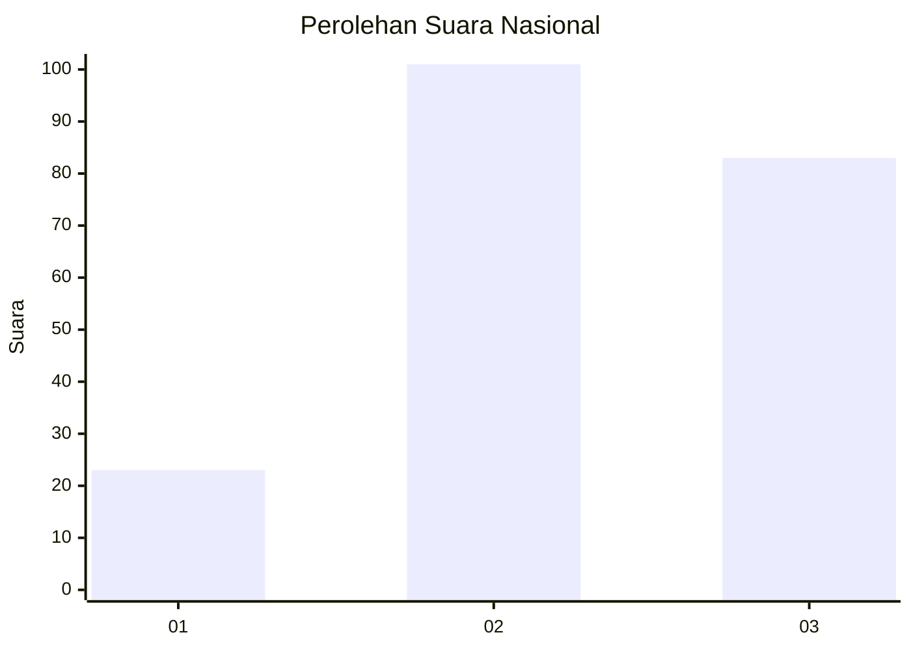
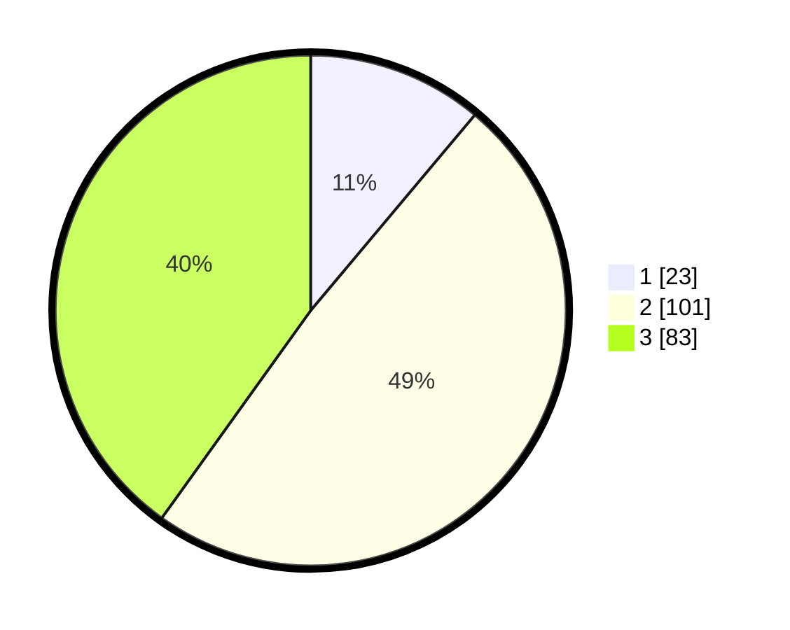

# Hasil

## Grafik

## Tabel

| No. | Nama Paslon    | Suara | Suara (raw) | Persentase |
|:--- |:-------------- | -----:| -----------:| ----------:|
| 1   | ANIES MUHAIMIN | 23    | [23][p-1]   | 11,11      |
| 2   | PRABOWO GIBRAN | 101   | [101][p-2]  | 48,79      |
| 3   | GANJAR MAHFUD  | 83    | [83][p-3]   | 40,10      |

[p-1]: https://github.com/gigit-pemilu/pemilu-2024/blob/main/pilpres/hitung-suara/sub/53-nusa-tenggara-timur/sub/08-ende/sub/18-ende-utara/sub/1002-kota-ratu/sub/001-tps/sub/paslon-1.txt
[p-2]: https://github.com/gigit-pemilu/pemilu-2024/blob/main/pilpres/hitung-suara/sub/53-nusa-tenggara-timur/sub/08-ende/sub/18-ende-utara/sub/1002-kota-ratu/sub/001-tps/sub/paslon-2.txt
[p-3]: https://github.com/gigit-pemilu/pemilu-2024/blob/main/pilpres/hitung-suara/sub/53-nusa-tenggara-timur/sub/08-ende/sub/18-ende-utara/sub/1002-kota-ratu/sub/001-tps/sub/paslon-3.txt

## Foto C Plano

https://sirekap-obj-formc.kpu.go.id/f554/pemilu/ppwp/53/08/18/10/02/5308181002001-20240215-065400--54d586e4-624d-4e6d-ae29-f875f8af4525.jpg

https://sirekap-obj-formc.kpu.go.id/f554/pemilu/ppwp/53/08/18/10/02/5308181002001-20240215-065542--79b772ae-0dbf-41c8-8b3c-72b1a20ab1d6.jpg

https://sirekap-obj-formc.kpu.go.id/f554/pemilu/ppwp/53/08/18/10/02/5308181002001-20240215-065834--5b874408-7ba1-4db6-872c-c159eed0c092.jpg

## Metadata

| Key        | Value               |
| ---------- | ------------------- |
| Time Stamp | 2024-02-16 21:01:00 |

