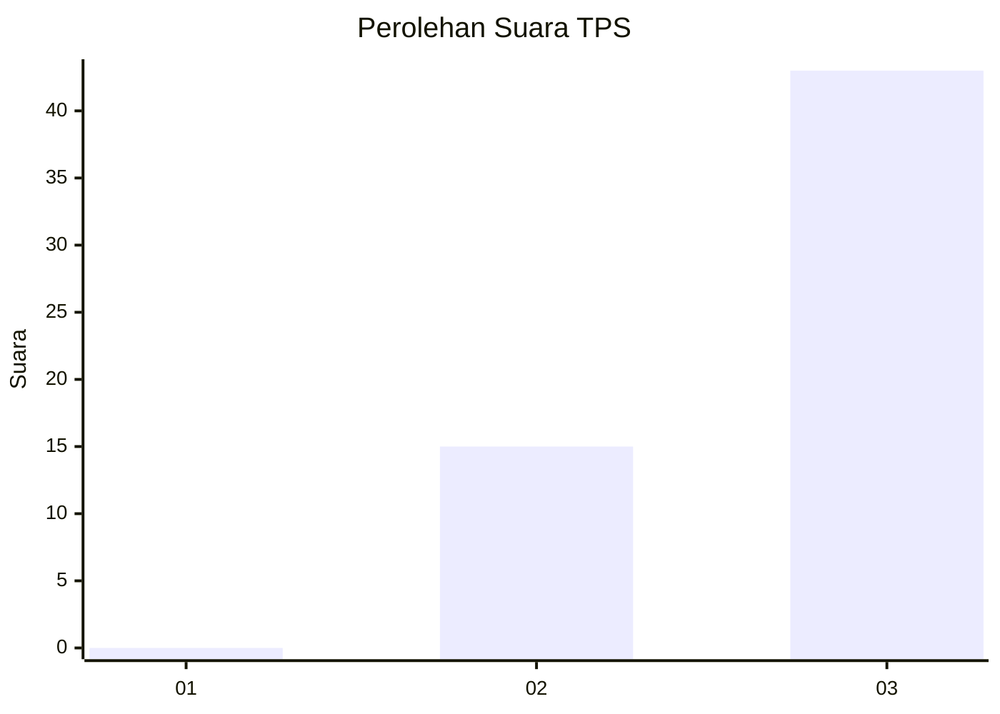
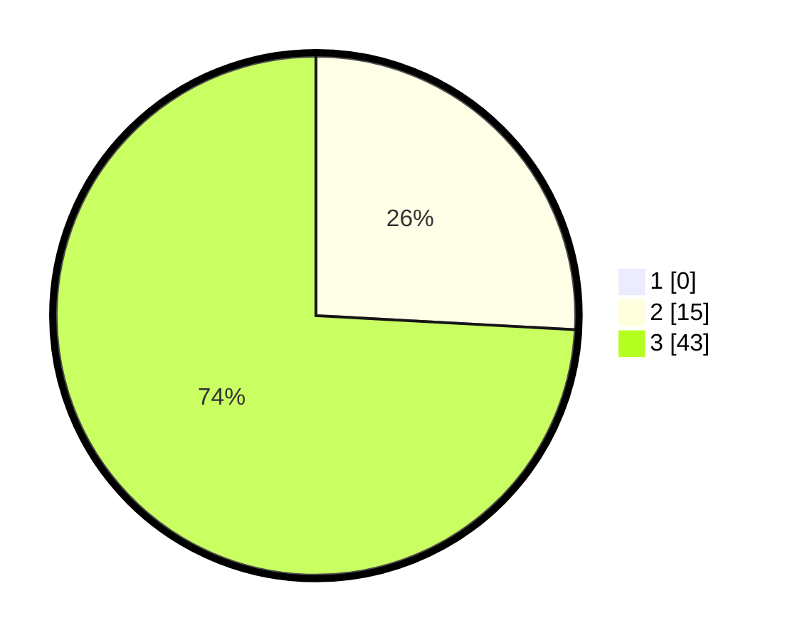

# Hasil

## Grafik

## Tabel

| No. | Nama Paslon    | Suara | Suara (raw) | Persentase |
|:--- |:-------------- | -----:| -----------:| ----------:|
| 1   | ANIES MUHAIMIN | 0     | [0][p-1]    | 0,00       |
| 2   | PRABOWO GIBRAN | 15    | [15][p-2]   | 25,86      |
| 3   | GANJAR MAHFUD  | 43    | [43][p-3]   | 74,14      |

[p-1]: https://github.com/gigit-pemilu/pemilu-2024-53-nusa-tenggara-timur/blob/main/pilpres/hitung-suara/sub/53-nusa-tenggara-timur/sub/08-ende/sub/18-ende-utara/sub/1003-roworena/sub/006-tps/sub/paslon-1.txt
[p-2]: https://github.com/gigit-pemilu/pemilu-2024-53-nusa-tenggara-timur/blob/main/pilpres/hitung-suara/sub/53-nusa-tenggara-timur/sub/08-ende/sub/18-ende-utara/sub/1003-roworena/sub/006-tps/sub/paslon-2.txt
[p-3]: https://github.com/gigit-pemilu/pemilu-2024-53-nusa-tenggara-timur/blob/main/pilpres/hitung-suara/sub/53-nusa-tenggara-timur/sub/08-ende/sub/18-ende-utara/sub/1003-roworena/sub/006-tps/sub/paslon-3.txt

## Foto C Plano

https://sirekap-obj-formc.kpu.go.id/0a0e/pemilu/ppwp/53/08/18/10/03/5308181003006-20240214-225508--744442cd-b655-4f64-8ea4-bb75cb01a28e.jpg

https://sirekap-obj-formc.kpu.go.id/0a0e/pemilu/ppwp/53/08/18/10/03/5308181003006-20240214-225751--2ec67c7f-f84a-4131-adb3-e190fe54aec5.jpg

https://sirekap-obj-formc.kpu.go.id/0a0e/pemilu/ppwp/53/08/18/10/03/5308181003006-20240214-225944--8f09432b-a351-44cd-8c6c-99c42341e30d.jpg

## Metadata

| Key        | Value               |
| ---------- | ------------------- |
| Time Stamp | 2024-02-16 21:01:00 |

