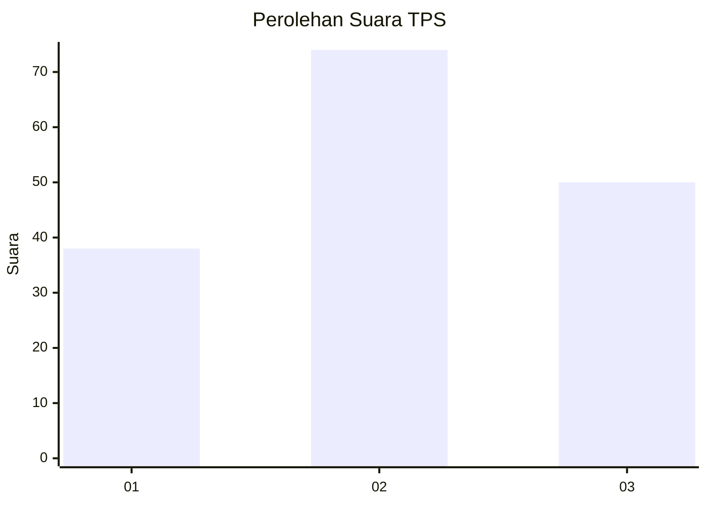
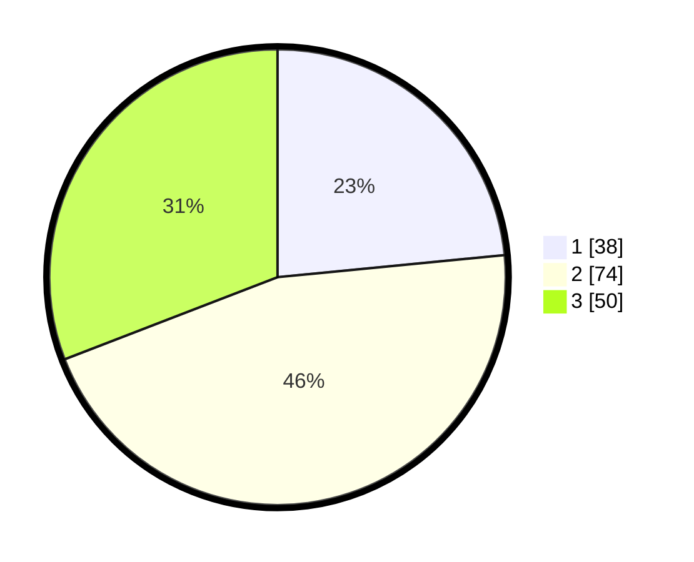

# Hasil

## Grafik

## Tabel

| No. | Nama Paslon    | Suara | Suara (raw) | Persentase |
|:--- |:-------------- | -----:| -----------:| ----------:|
| 1   | ANIES MUHAIMIN | 38    | [38][p-1]   | 23,46      |
| 2   | PRABOWO GIBRAN | 74    | [74][p-2]   | 45,68      |
| 3   | GANJAR MAHFUD  | 50    | [50][p-3]   | 30,86      |

[p-1]: https://github.com/gigit-pemilu/pemilu-2024-53-nusa-tenggara-timur/blob/main/pilpres/hitung-suara/sub/53-nusa-tenggara-timur/sub/08-ende/sub/19-ende-tengah/sub/1001-potulando/sub/001-tps/sub/paslon-1.txt
[p-2]: https://github.com/gigit-pemilu/pemilu-2024-53-nusa-tenggara-timur/blob/main/pilpres/hitung-suara/sub/53-nusa-tenggara-timur/sub/08-ende/sub/19-ende-tengah/sub/1001-potulando/sub/001-tps/sub/paslon-2.txt
[p-3]: https://github.com/gigit-pemilu/pemilu-2024-53-nusa-tenggara-timur/blob/main/pilpres/hitung-suara/sub/53-nusa-tenggara-timur/sub/08-ende/sub/19-ende-tengah/sub/1001-potulando/sub/001-tps/sub/paslon-3.txt

## Foto C Plano

https://sirekap-obj-formc.kpu.go.id/6a35/pemilu/ppwp/53/08/19/10/01/5308191001001-20240215-085038--9fc467b1-dbb8-4715-b432-bcc2c643f771.jpg

https://sirekap-obj-formc.kpu.go.id/6a35/pemilu/ppwp/53/08/19/10/01/5308191001001-20240214-231453--f5d4cbd8-9c54-43f7-aa64-b5cae649eaf9.jpg

https://sirekap-obj-formc.kpu.go.id/6a35/pemilu/ppwp/53/08/19/10/01/5308191001001-20240215-085430--0956a230-650f-4ffe-a149-987824d4b0c6.jpg

## Metadata

| Key        | Value               |
| ---------- | ------------------- |
| Time Stamp | 2024-02-15 15:00:29 |

