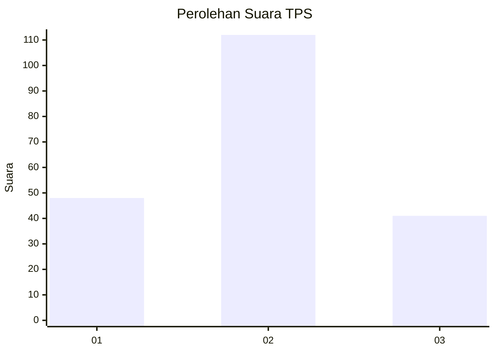
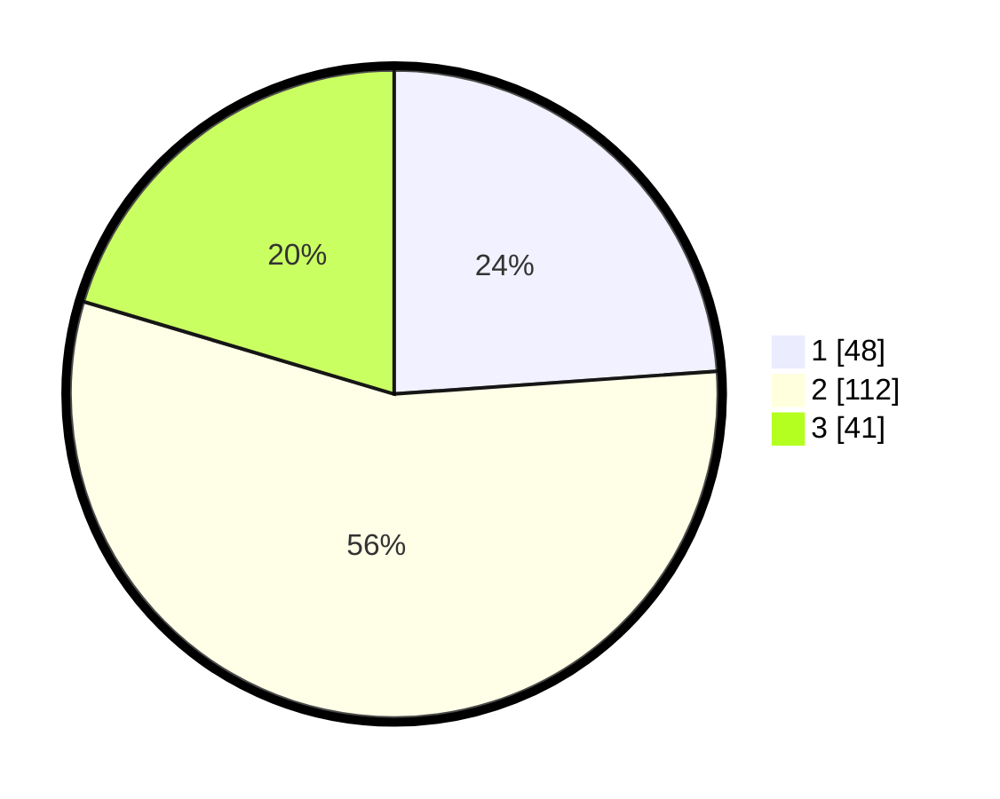

# Hasil

## Grafik

## Tabel

| No. | Nama Paslon    | Suara | Suara (raw) | Persentase |
|:--- |:-------------- | -----:| -----------:| ----------:|
| 1   | ANIES MUHAIMIN | 48    | [48][p-1]   | 23,88      |
| 2   | PRABOWO GIBRAN | 112   | [112][p-2]  | 55,72      |
| 3   | GANJAR MAHFUD  | 41    | [41][p-3]   | 20,40      |

[p-1]: https://github.com/gigit-pemilu/pemilu-2024-53-nusa-tenggara-timur/blob/main/pilpres/hitung-suara/sub/53-nusa-tenggara-timur/sub/08-ende/sub/20-ende-timur/sub/1001-mautapaga/sub/001-tps/sub/paslon-1.txt
[p-2]: https://github.com/gigit-pemilu/pemilu-2024-53-nusa-tenggara-timur/blob/main/pilpres/hitung-suara/sub/53-nusa-tenggara-timur/sub/08-ende/sub/20-ende-timur/sub/1001-mautapaga/sub/001-tps/sub/paslon-2.txt
[p-3]: https://github.com/gigit-pemilu/pemilu-2024-53-nusa-tenggara-timur/blob/main/pilpres/hitung-suara/sub/53-nusa-tenggara-timur/sub/08-ende/sub/20-ende-timur/sub/1001-mautapaga/sub/001-tps/sub/paslon-3.txt

## Foto C Plano

https://sirekap-obj-formc.kpu.go.id/58d7/pemilu/ppwp/53/08/20/10/01/5308201001001-20240215-095703--1415b519-02f4-4f29-aefb-875761fe8c8b.jpg

https://sirekap-obj-formc.kpu.go.id/58d7/pemilu/ppwp/53/08/20/10/01/5308201001001-20240215-095819--3149c984-6f53-4cb4-aa5c-fbb184634b85.jpg

https://sirekap-obj-formc.kpu.go.id/58d7/pemilu/ppwp/53/08/20/10/01/5308201001001-20240215-100922--a7eaf108-9712-41b9-8cc5-b27db94879a9.jpg

## Metadata

| Key        | Value               |
| ---------- | ------------------- |
| Time Stamp | 2024-02-15 15:30:25 |

