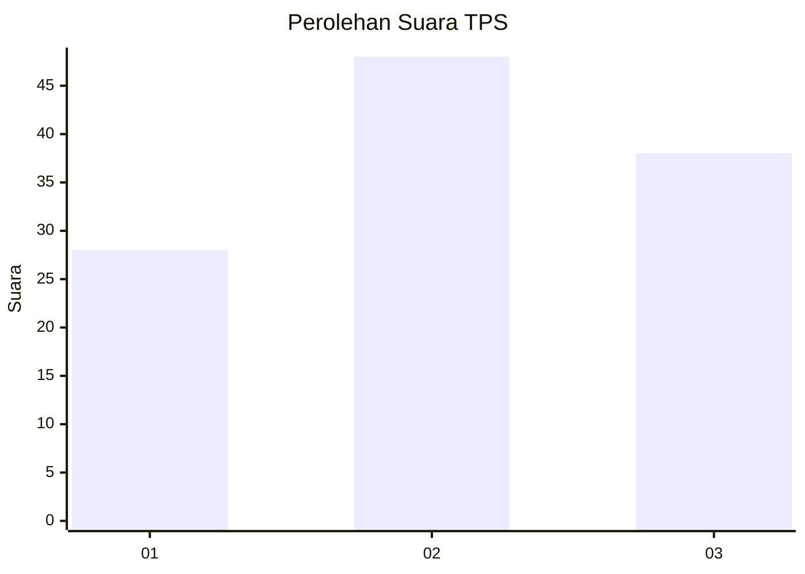
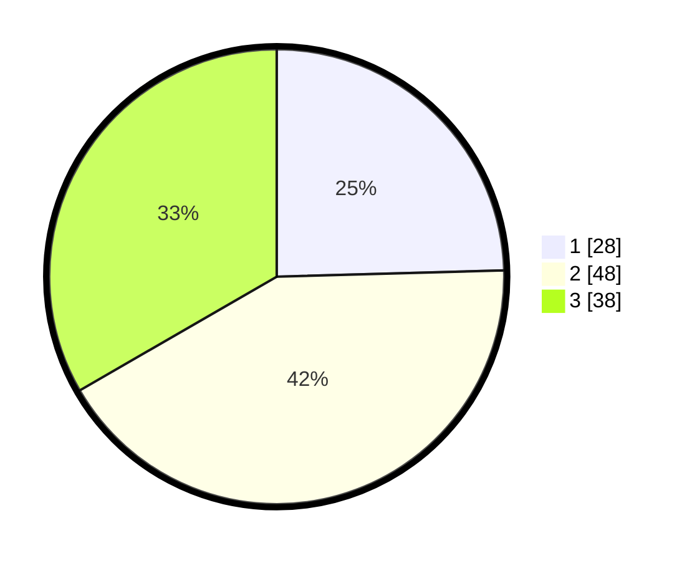

# Hasil

## Grafik

## Tabel

| No. | Nama Paslon    | Suara | Suara (raw) | Persentase |
|:--- |:-------------- | -----:| -----------:| ----------:|
| 1   | ANIES MUHAIMIN | 28    | [28][p-1]   | 24,56      |
| 2   | PRABOWO GIBRAN | 48    | [48][p-2]   | 42,11      |
| 3   | GANJAR MAHFUD  | 38    | [38][p-3]   | 33,33      |

[p-1]: https://github.com/gigit-pemilu/pemilu-2024-53-nusa-tenggara-timur/blob/main/pilpres/hitung-suara/sub/53-nusa-tenggara-timur/sub/08-ende/sub/20-ende-timur/sub/1001-mautapaga/sub/004-tps/sub/paslon-1.txt
[p-2]: https://github.com/gigit-pemilu/pemilu-2024-53-nusa-tenggara-timur/blob/main/pilpres/hitung-suara/sub/53-nusa-tenggara-timur/sub/08-ende/sub/20-ende-timur/sub/1001-mautapaga/sub/004-tps/sub/paslon-2.txt
[p-3]: https://github.com/gigit-pemilu/pemilu-2024-53-nusa-tenggara-timur/blob/main/pilpres/hitung-suara/sub/53-nusa-tenggara-timur/sub/08-ende/sub/20-ende-timur/sub/1001-mautapaga/sub/004-tps/sub/paslon-3.txt

## Foto C Plano

https://sirekap-obj-formc.kpu.go.id/3d90/pemilu/ppwp/53/08/20/10/01/5308201001004-20240214-234239--b6ade147-14ed-4906-bff5-34e3fc6f5940.jpg

https://sirekap-obj-formc.kpu.go.id/3d90/pemilu/ppwp/53/08/20/10/01/5308201001004-20240214-234405--497cffbc-3355-4769-a875-f02bf7b88856.jpg

https://sirekap-obj-formc.kpu.go.id/3d90/pemilu/ppwp/53/08/20/10/01/5308201001004-20240214-234506--e372da16-42f8-4c80-8754-fb6454b3d2e2.jpg

## Metadata

| Key        | Value               |
| ---------- | ------------------- |
| Time Stamp | 2024-02-16 16:25:10 |

