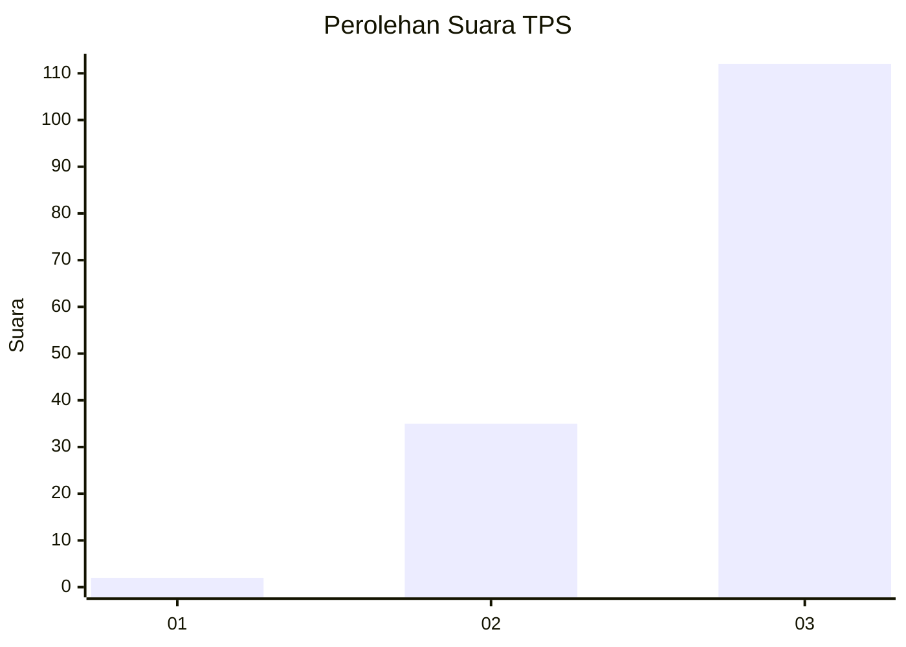
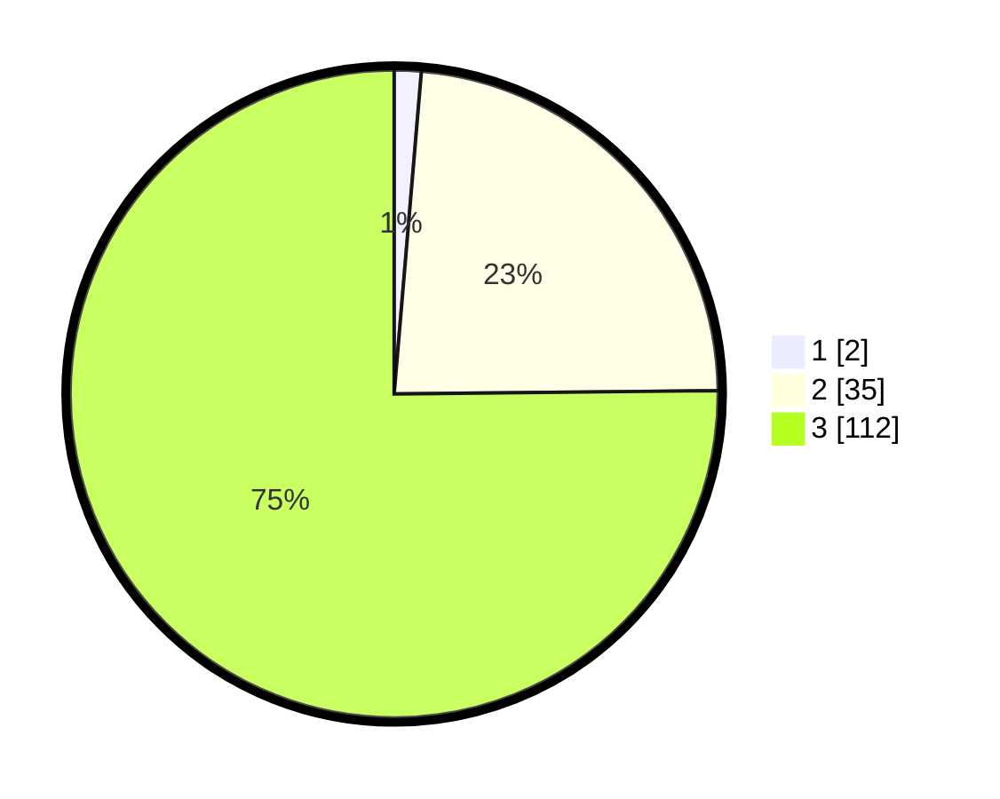

# Hasil

## Grafik

## Tabel

| No. | Nama Paslon    | Suara | Suara (raw) | Persentase |
|:--- |:-------------- | -----:| -----------:| ----------:|
| 1   | ANIES MUHAIMIN | 2     | [2][p-1]    | 1,34       |
| 2   | PRABOWO GIBRAN | 35    | [35][p-2]   | 23,49      |
| 3   | GANJAR MAHFUD  | 112   | [112][p-3]  | 75,17      |

[p-1]: https://github.com/gigit-pemilu/pemilu-2024-53-nusa-tenggara-timur/blob/main/pilpres/hitung-suara/sub/53-nusa-tenggara-timur/sub/08-ende/sub/20-ende-timur/sub/2003-kedebodu/sub/002-tps/sub/paslon-1.txt
[p-2]: https://github.com/gigit-pemilu/pemilu-2024-53-nusa-tenggara-timur/blob/main/pilpres/hitung-suara/sub/53-nusa-tenggara-timur/sub/08-ende/sub/20-ende-timur/sub/2003-kedebodu/sub/002-tps/sub/paslon-2.txt
[p-3]: https://github.com/gigit-pemilu/pemilu-2024-53-nusa-tenggara-timur/blob/main/pilpres/hitung-suara/sub/53-nusa-tenggara-timur/sub/08-ende/sub/20-ende-timur/sub/2003-kedebodu/sub/002-tps/sub/paslon-3.txt

## Foto C Plano

https://sirekap-obj-formc.kpu.go.id/e9d2/pemilu/ppwp/53/08/20/20/03/5308202003002-20240215-185236--ee812a9d-c21c-4644-bfa1-7b7d205b6bb4.jpg

https://sirekap-obj-formc.kpu.go.id/e9d2/pemilu/ppwp/53/08/20/20/03/5308202003002-20240215-185251--9896c00c-bbb4-45c1-8862-8759a7e0edbc.jpg

https://sirekap-obj-formc.kpu.go.id/e9d2/pemilu/ppwp/53/08/20/20/03/5308202003002-20240215-185311--8f87ce93-844f-4560-9114-3f8bfbcef08c.jpg

## Metadata

| Key        | Value               |
| ---------- | ------------------- |
| Time Stamp | 2024-02-25 16:00:00 |

