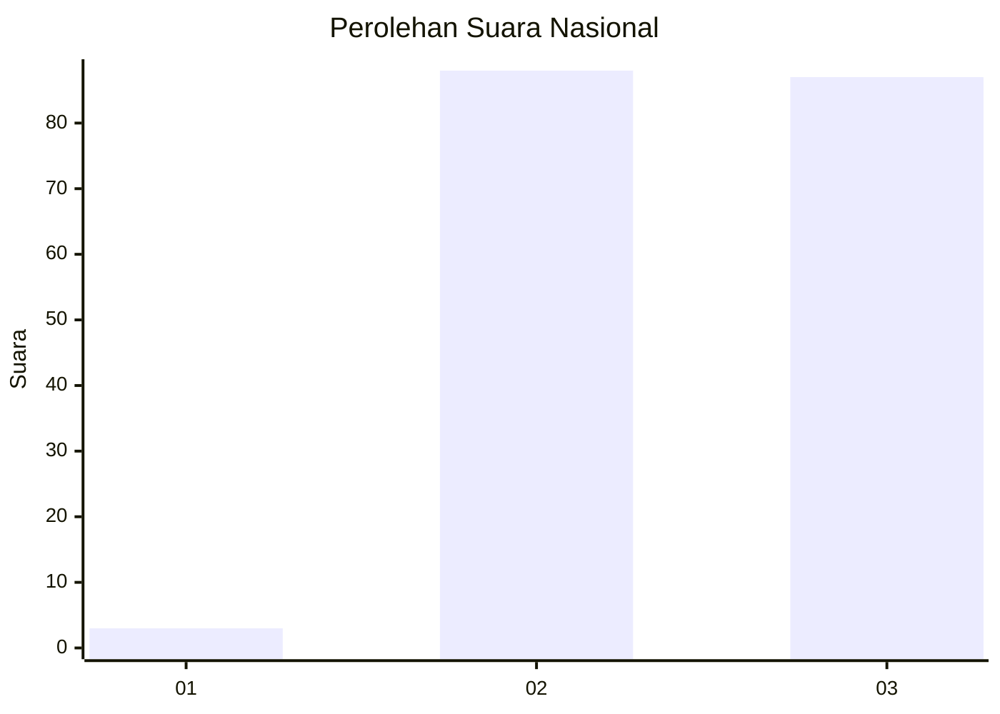
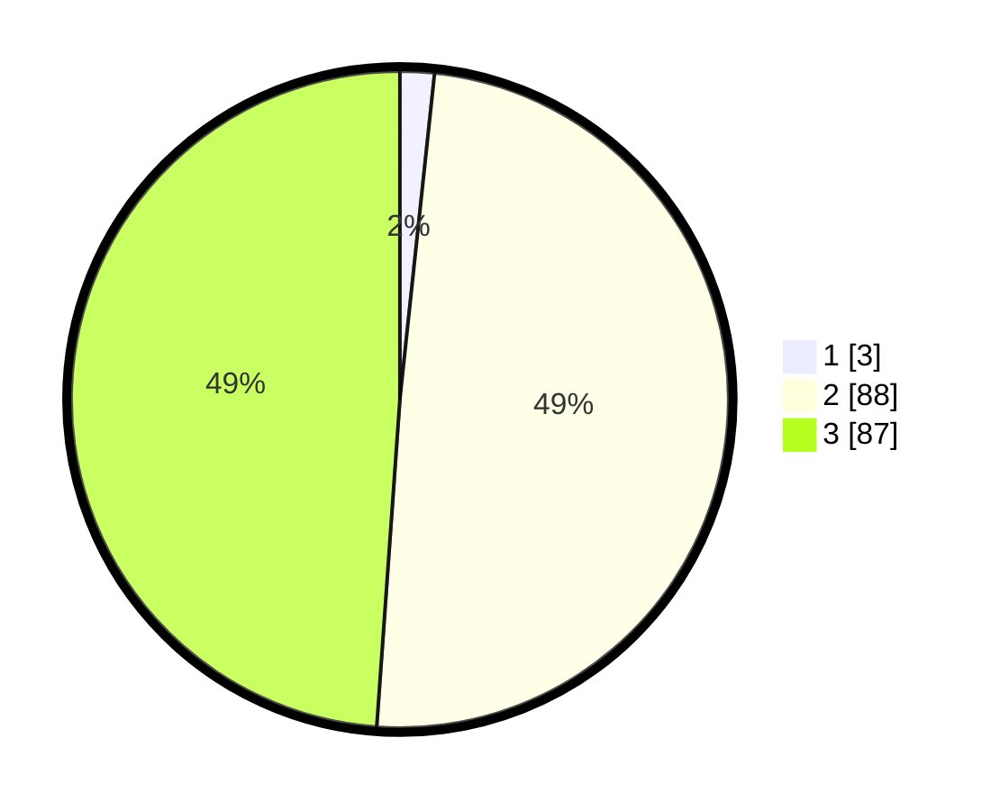

# Hasil

## Grafik

## Tabel

| No. | Nama Paslon    | Suara | Suara (raw) | Persentase |
|:--- |:-------------- | -----:| -----------:| ----------:|
| 1   | ANIES MUHAIMIN | 3     | [3][p-1]    | 1,69       |
| 2   | PRABOWO GIBRAN | 88    | [88][p-2]   | 49,44      |
| 3   | GANJAR MAHFUD  | 87    | [87][p-3]   | 48,88      |

[p-1]: https://github.com/gigit-pemilu/pemilu-2024/blob/main/pilpres/hitung-suara/sub/53-nusa-tenggara-timur/sub/08-ende/sub/21-lepembusu-kelisoke/sub/2002-mukureku/sub/001-tps/sub/paslon-1.txt
[p-2]: https://github.com/gigit-pemilu/pemilu-2024/blob/main/pilpres/hitung-suara/sub/53-nusa-tenggara-timur/sub/08-ende/sub/21-lepembusu-kelisoke/sub/2002-mukureku/sub/001-tps/sub/paslon-2.txt
[p-3]: https://github.com/gigit-pemilu/pemilu-2024/blob/main/pilpres/hitung-suara/sub/53-nusa-tenggara-timur/sub/08-ende/sub/21-lepembusu-kelisoke/sub/2002-mukureku/sub/001-tps/sub/paslon-3.txt

## Foto C Plano

https://sirekap-obj-formc.kpu.go.id/2603/pemilu/ppwp/53/08/21/20/02/5308212002001-20240220-121504--5ee74caa-3bf0-481c-ac44-88b7be892b92.jpg

https://sirekap-obj-formc.kpu.go.id/2603/pemilu/ppwp/53/08/21/20/02/5308212002001-20240220-121554--47e1692d-ad39-415b-ab7d-dfb3da57d700.jpg

https://sirekap-obj-formc.kpu.go.id/2603/pemilu/ppwp/53/08/21/20/02/5308212002001-20240220-121631--d3b130de-9c52-43ae-bbbd-a59b5b213594.jpg

## Metadata

| Key        | Value               |
| ---------- | ------------------- |
| Time Stamp | 2024-02-25 12:00:00 |

