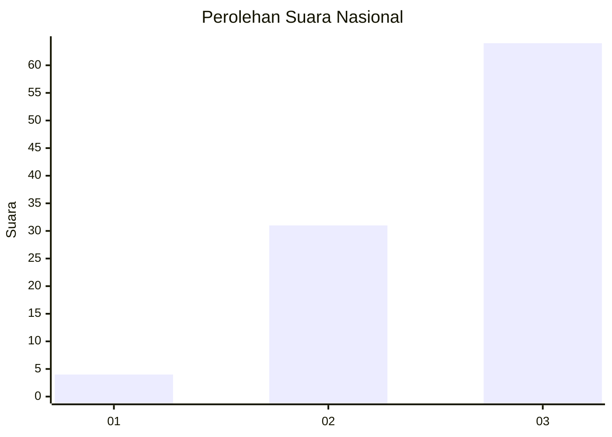
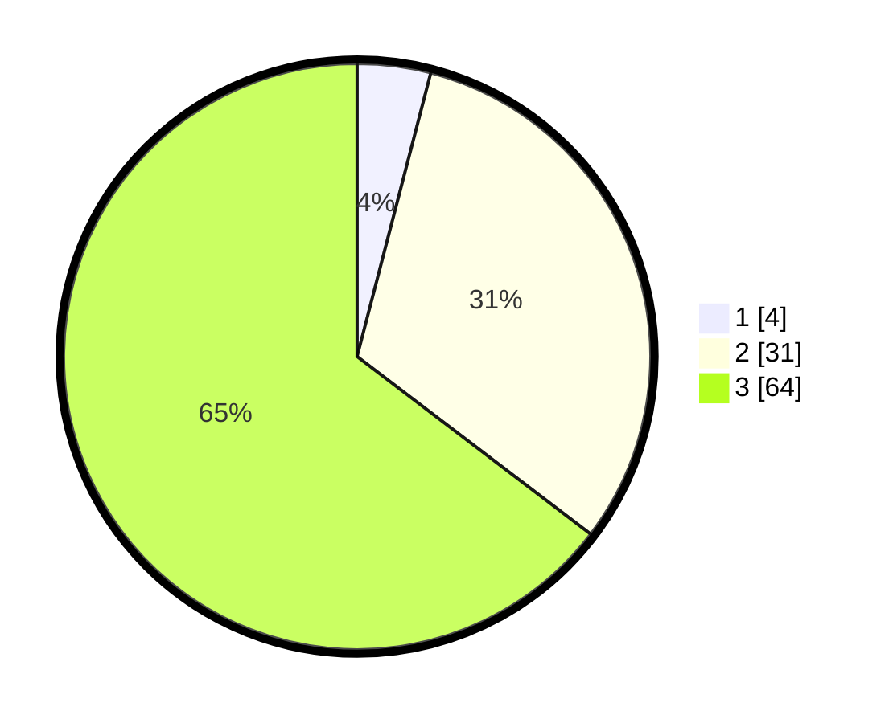

# Hasil

## Grafik

## Tabel

| No. | Nama Paslon    | Suara | Suara (raw) | Persentase |
|:--- |:-------------- | -----:| -----------:| ----------:|
| 1   | ANIES MUHAIMIN | 4     | [4][p-1]    | 4,04       |
| 2   | PRABOWO GIBRAN | 31    | [31][p-2]   | 31,31      |
| 3   | GANJAR MAHFUD  | 64    | [64][p-3]   | 64,65      |

[p-1]: https://github.com/gigit-pemilu/pemilu-2024/blob/main/pilpres/hitung-suara/sub/53-nusa-tenggara-timur/sub/08-ende/sub/21-lepembusu-kelisoke/sub/2003-wologai-timur/sub/002-tps/sub/paslon-1.txt
[p-2]: https://github.com/gigit-pemilu/pemilu-2024/blob/main/pilpres/hitung-suara/sub/53-nusa-tenggara-timur/sub/08-ende/sub/21-lepembusu-kelisoke/sub/2003-wologai-timur/sub/002-tps/sub/paslon-2.txt
[p-3]: https://github.com/gigit-pemilu/pemilu-2024/blob/main/pilpres/hitung-suara/sub/53-nusa-tenggara-timur/sub/08-ende/sub/21-lepembusu-kelisoke/sub/2003-wologai-timur/sub/002-tps/sub/paslon-3.txt

## Foto C Plano

https://sirekap-obj-formc.kpu.go.id/1304/pemilu/ppwp/53/08/21/20/03/5308212003002-20240214-222008--d2d1ef19-ee45-4bfa-9352-84ff165ee3c9.jpg

https://sirekap-obj-formc.kpu.go.id/1304/pemilu/ppwp/53/08/21/20/03/5308212003002-20240215-071940--b14f0247-c3fc-483f-b9d9-e2e856bb974a.jpg

https://sirekap-obj-formc.kpu.go.id/1304/pemilu/ppwp/53/08/21/20/03/5308212003002-20240215-072811--31547e64-bbd6-4f38-967f-72ef0b574620.jpg

## Metadata

| Key        | Value               |
| ---------- | ------------------- |
| Time Stamp | 2024-02-16 16:25:10 |

