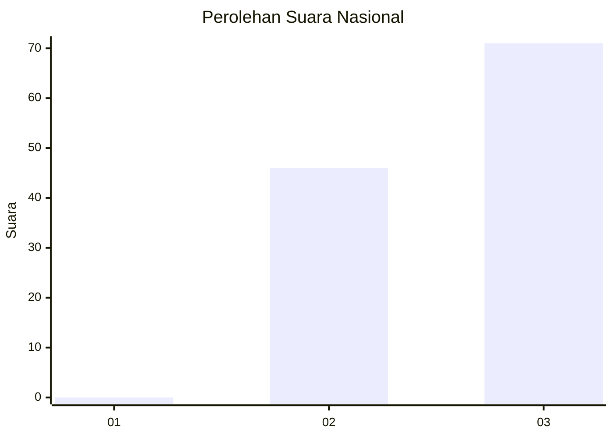
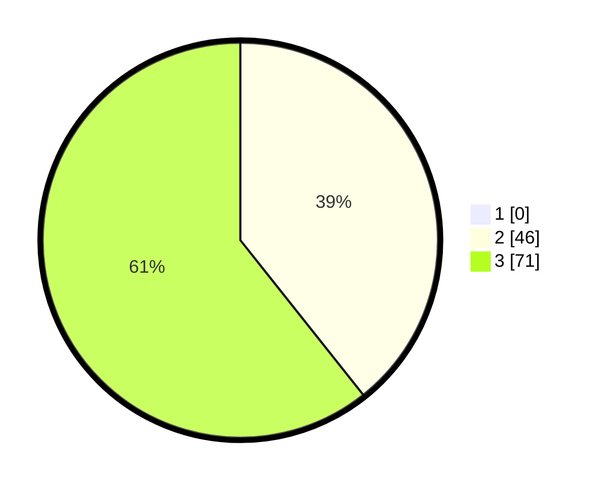

# Hasil

## Grafik

## Tabel

| No. | Nama Paslon    | Suara | Suara (raw) | Persentase |
|:--- |:-------------- | -----:| -----------:| ----------:|
| 1   | ANIES MUHAIMIN | 0     | [0][p-1]    | 0,00       |
| 2   | PRABOWO GIBRAN | 46    | [46][p-2]   | 39,32      |
| 3   | GANJAR MAHFUD  | 71    | [71][p-3]   | 60,68      |

[p-1]: https://github.com/gigit-pemilu/pemilu-2024/blob/main/pilpres/hitung-suara/sub/53-nusa-tenggara-timur/sub/08-ende/sub/21-lepembusu-kelisoke/sub/2004-kuru/sub/002-tps/sub/paslon-1.txt
[p-2]: https://github.com/gigit-pemilu/pemilu-2024/blob/main/pilpres/hitung-suara/sub/53-nusa-tenggara-timur/sub/08-ende/sub/21-lepembusu-kelisoke/sub/2004-kuru/sub/002-tps/sub/paslon-2.txt
[p-3]: https://github.com/gigit-pemilu/pemilu-2024/blob/main/pilpres/hitung-suara/sub/53-nusa-tenggara-timur/sub/08-ende/sub/21-lepembusu-kelisoke/sub/2004-kuru/sub/002-tps/sub/paslon-3.txt

## Foto C Plano

https://sirekap-obj-formc.kpu.go.id/df48/pemilu/ppwp/53/08/21/20/04/5308212004002-20240215-154658--96d1c7f9-80c4-4a65-9899-aa06a32e1723.jpg

https://sirekap-obj-formc.kpu.go.id/df48/pemilu/ppwp/53/08/21/20/04/5308212004002-20240215-155151--6ca97fd1-2de6-4d35-963b-012903974d81.jpg

https://sirekap-obj-formc.kpu.go.id/df48/pemilu/ppwp/53/08/21/20/04/5308212004002-20240215-111126--c454883c-36e4-41f2-9a74-c74010d02c08.jpg

## Metadata

| Key        | Value               |
| ---------- | ------------------- |
| Time Stamp | 2024-02-16 22:30:00 |

