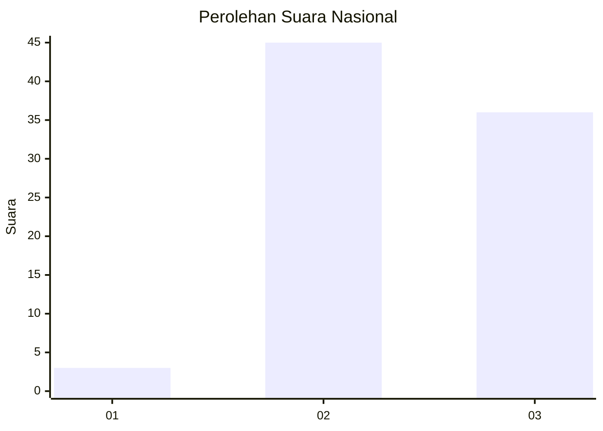
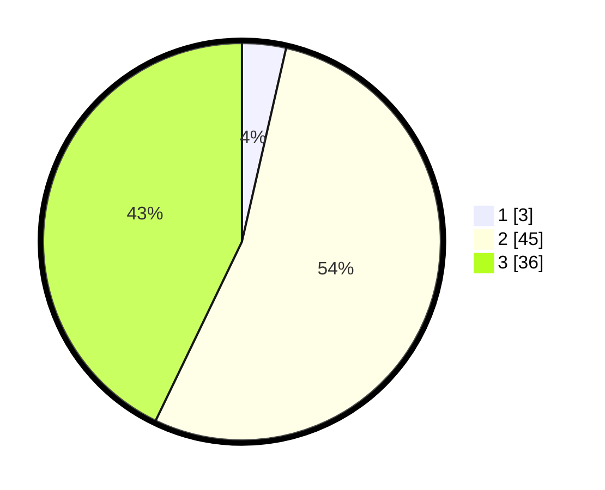

# Hasil

## Grafik

## Tabel

| No. | Nama Paslon    | Suara | Suara (raw) | Persentase |
|:--- |:-------------- | -----:| -----------:| ----------:|
| 1   | ANIES MUHAIMIN | 3     | [3][p-1]    | 3,57       |
| 2   | PRABOWO GIBRAN | 45    | [45][p-2]   | 53,57      |
| 3   | GANJAR MAHFUD  | 36    | [36][p-3]   | 42,86      |

[p-1]: https://github.com/gigit-pemilu/pemilu-2024/blob/main/pilpres/hitung-suara/sub/53-nusa-tenggara-timur/sub/08-ende/sub/21-lepembusu-kelisoke/sub/2005-ndenggarongge/sub/002-tps/sub/paslon-1.txt
[p-2]: https://github.com/gigit-pemilu/pemilu-2024/blob/main/pilpres/hitung-suara/sub/53-nusa-tenggara-timur/sub/08-ende/sub/21-lepembusu-kelisoke/sub/2005-ndenggarongge/sub/002-tps/sub/paslon-2.txt
[p-3]: https://github.com/gigit-pemilu/pemilu-2024/blob/main/pilpres/hitung-suara/sub/53-nusa-tenggara-timur/sub/08-ende/sub/21-lepembusu-kelisoke/sub/2005-ndenggarongge/sub/002-tps/sub/paslon-3.txt

## Foto C Plano

https://sirekap-obj-formc.kpu.go.id/cd7b/pemilu/ppwp/53/08/21/20/05/5308212005002-20240215-124923--14c7af4d-dd77-40fb-a615-110ffb214601.jpg

https://sirekap-obj-formc.kpu.go.id/cd7b/pemilu/ppwp/53/08/21/20/05/5308212005002-20240215-125133--c9270167-9e68-4f8d-88c9-da92a56867c6.jpg

https://sirekap-obj-formc.kpu.go.id/cd7b/pemilu/ppwp/53/08/21/20/05/5308212005002-20240215-125316--ac69c1cd-7dce-410e-a598-a39ef2047fb6.jpg

## Metadata

| Key        | Value               |
| ---------- | ------------------- |
| Time Stamp | 2024-02-16 14:30:33 |

