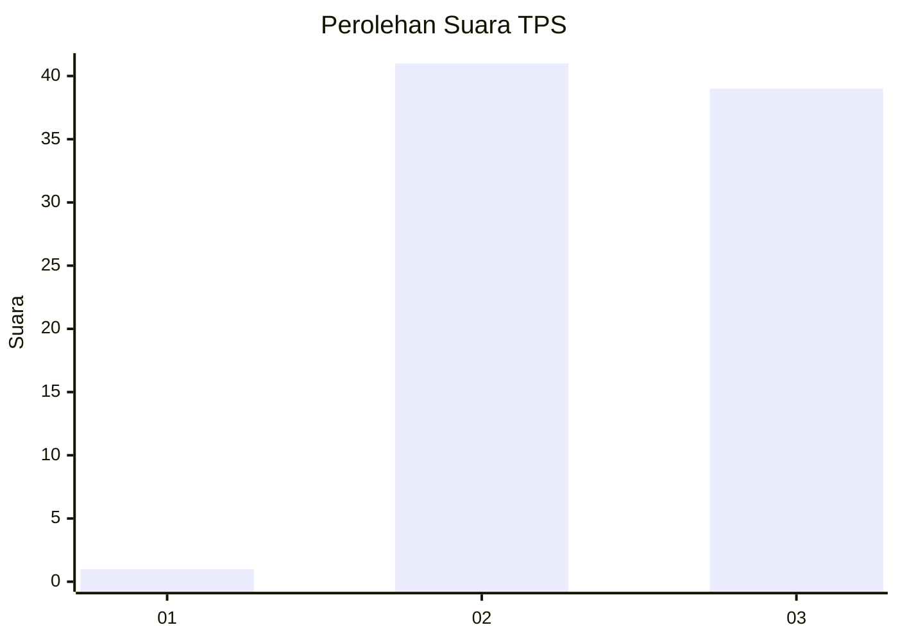
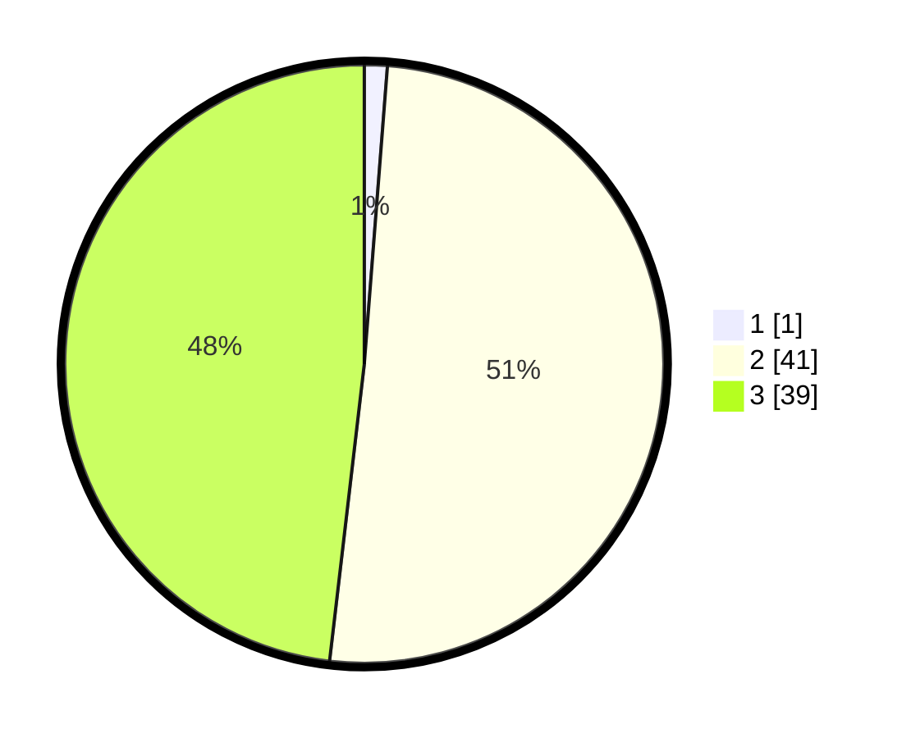

# Hasil

## Grafik

## Tabel

| No. | Nama Paslon    | Suara | Suara (raw) | Persentase |
|:--- |:-------------- | -----:| -----------:| ----------:|
| 1   | ANIES MUHAIMIN | 1     | [1][p-1]    | 1,23       |
| 2   | PRABOWO GIBRAN | 41    | [41][p-2]   | 50,62      |
| 3   | GANJAR MAHFUD  | 39    | [39][p-3]   | 48,15      |

[p-1]: https://github.com/gigit-pemilu/pemilu-2024-53-nusa-tenggara-timur/blob/main/pilpres/hitung-suara/sub/53-nusa-tenggara-timur/sub/08-ende/sub/21-lepembusu-kelisoke/sub/2007-taniwoda/sub/002-tps/sub/paslon-1.txt
[p-2]: https://github.com/gigit-pemilu/pemilu-2024-53-nusa-tenggara-timur/blob/main/pilpres/hitung-suara/sub/53-nusa-tenggara-timur/sub/08-ende/sub/21-lepembusu-kelisoke/sub/2007-taniwoda/sub/002-tps/sub/paslon-2.txt
[p-3]: https://github.com/gigit-pemilu/pemilu-2024-53-nusa-tenggara-timur/blob/main/pilpres/hitung-suara/sub/53-nusa-tenggara-timur/sub/08-ende/sub/21-lepembusu-kelisoke/sub/2007-taniwoda/sub/002-tps/sub/paslon-3.txt

## Foto C Plano

https://sirekap-obj-formc.kpu.go.id/f14b/pemilu/ppwp/53/08/21/20/07/5308212007002-20240221-195853--4dd0dc2e-0e72-41db-9933-160992a99a2b.jpg

https://sirekap-obj-formc.kpu.go.id/f14b/pemilu/ppwp/53/08/21/20/07/5308212007002-20240221-195947--2f9d15ae-560f-4ba1-9e54-b044e743b7a9.jpg

https://sirekap-obj-formc.kpu.go.id/f14b/pemilu/ppwp/53/08/21/20/07/5308212007002-20240221-202853--7de90ada-ab33-4d86-9f6c-69bda2da81c8.jpg

## Metadata

| Key        | Value               |
| ---------- | ------------------- |
| Time Stamp | 2024-02-25 21:00:00 |

