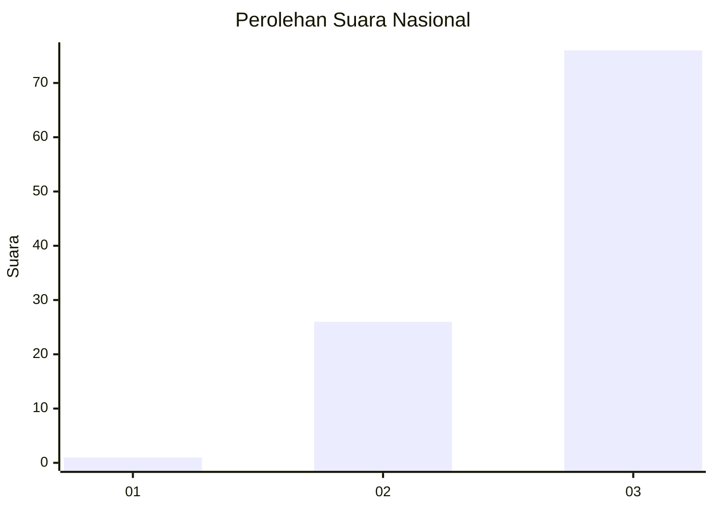
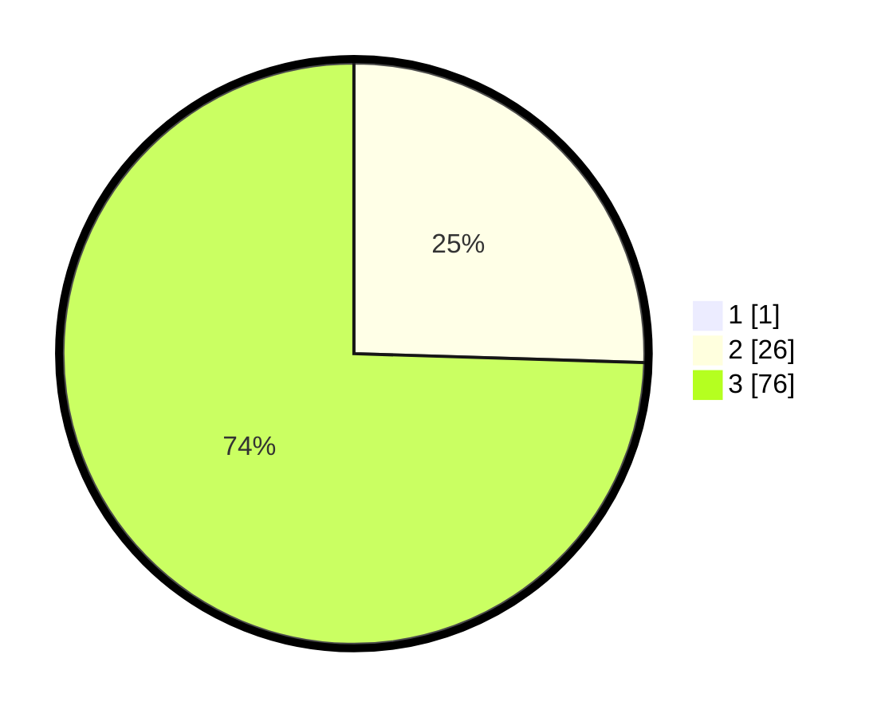

# Hasil

## Grafik

## Tabel

| No. | Nama Paslon    | Suara | Suara (raw) | Persentase |
|:--- |:-------------- | -----:| -----------:| ----------:|
| 1   | ANIES MUHAIMIN | 1     | [1][p-1]    | 0,97       |
| 2   | PRABOWO GIBRAN | 26    | [26][p-2]   | 25,24      |
| 3   | GANJAR MAHFUD  | 76    | [76][p-3]   | 73,79      |

[p-1]: https://github.com/gigit-pemilu/pemilu-2024/blob/main/pilpres/hitung-suara/sub/53-nusa-tenggara-timur/sub/08-ende/sub/21-lepembusu-kelisoke/sub/2010-tiwusora/sub/001-tps/sub/paslon-1.txt
[p-2]: https://github.com/gigit-pemilu/pemilu-2024/blob/main/pilpres/hitung-suara/sub/53-nusa-tenggara-timur/sub/08-ende/sub/21-lepembusu-kelisoke/sub/2010-tiwusora/sub/001-tps/sub/paslon-2.txt
[p-3]: https://github.com/gigit-pemilu/pemilu-2024/blob/main/pilpres/hitung-suara/sub/53-nusa-tenggara-timur/sub/08-ende/sub/21-lepembusu-kelisoke/sub/2010-tiwusora/sub/001-tps/sub/paslon-3.txt

## Foto C Plano

https://sirekap-obj-formc.kpu.go.id/8521/pemilu/ppwp/53/08/21/20/10/5308212010001-20240220-192741--6372654a-8a0e-49af-8fc1-54263f113c41.jpg

https://sirekap-obj-formc.kpu.go.id/8521/pemilu/ppwp/53/08/21/20/10/5308212010001-20240220-180816--652d2318-e92f-4656-8412-60ad828f5650.jpg

https://sirekap-obj-formc.kpu.go.id/8521/pemilu/ppwp/53/08/21/20/10/5308212010001-20240220-192910--eefd7cac-04cc-4ba5-8d59-91b66655642b.jpg

## Metadata

| Key        | Value               |
| ---------- | ------------------- |
| Time Stamp | 2024-02-25 13:00:00 |

