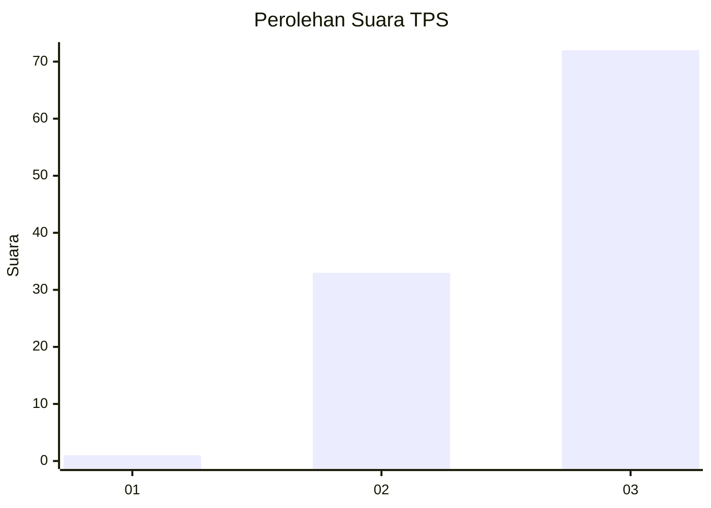
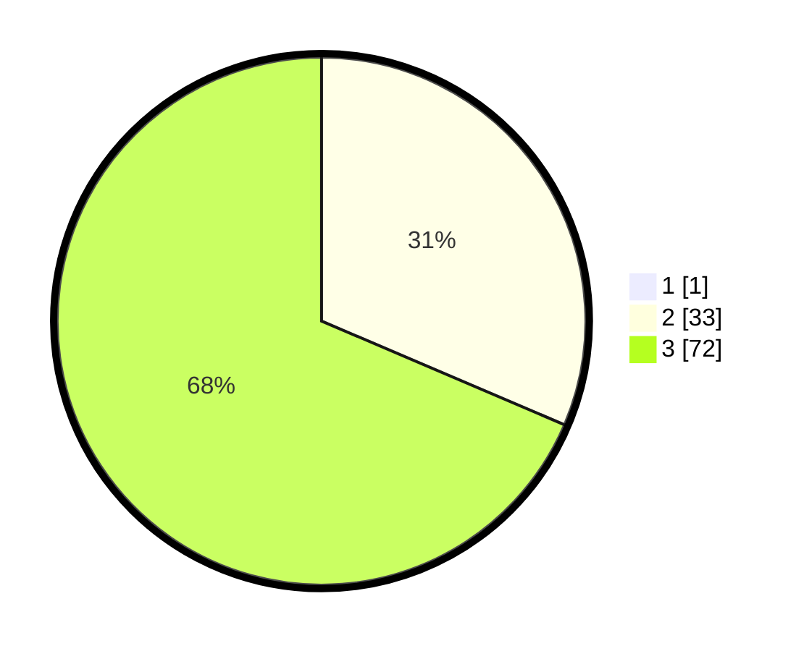

# Hasil

## Grafik

## Tabel

| No. | Nama Paslon    | Suara | Suara (raw) | Persentase |
|:--- |:-------------- | -----:| -----------:| ----------:|
| 1   | ANIES MUHAIMIN | 1     | [1][p-1]    | 0,94       |
| 2   | PRABOWO GIBRAN | 33    | [33][p-2]   | 31,13      |
| 3   | GANJAR MAHFUD  | 72    | [72][p-3]   | 67,92      |

[p-1]: https://github.com/gigit-pemilu/pemilu-2024-53-nusa-tenggara-timur/blob/main/pilpres/hitung-suara/sub/53-nusa-tenggara-timur/sub/08-ende/sub/21-lepembusu-kelisoke/sub/2010-tiwusora/sub/002-tps/sub/paslon-1.txt
[p-2]: https://github.com/gigit-pemilu/pemilu-2024-53-nusa-tenggara-timur/blob/main/pilpres/hitung-suara/sub/53-nusa-tenggara-timur/sub/08-ende/sub/21-lepembusu-kelisoke/sub/2010-tiwusora/sub/002-tps/sub/paslon-2.txt
[p-3]: https://github.com/gigit-pemilu/pemilu-2024-53-nusa-tenggara-timur/blob/main/pilpres/hitung-suara/sub/53-nusa-tenggara-timur/sub/08-ende/sub/21-lepembusu-kelisoke/sub/2010-tiwusora/sub/002-tps/sub/paslon-3.txt

## Foto C Plano

https://sirekap-obj-formc.kpu.go.id/dab1/pemilu/ppwp/53/08/21/20/10/5308212010002-20240221-094734--dafe02d8-a7cb-4c98-af85-af7e109770f4.jpg

https://sirekap-obj-formc.kpu.go.id/dab1/pemilu/ppwp/53/08/21/20/10/5308212010002-20240221-094841--51f30c5e-258c-49cf-8203-1533c9c4fe88.jpg

https://sirekap-obj-formc.kpu.go.id/dab1/pemilu/ppwp/53/08/21/20/10/5308212010002-20240221-094934--4598d33f-6e0a-4dad-a7a4-5631187848b5.jpg

## Metadata

| Key        | Value               |
| ---------- | ------------------- |
| Time Stamp | 2024-02-25 16:00:00 |

