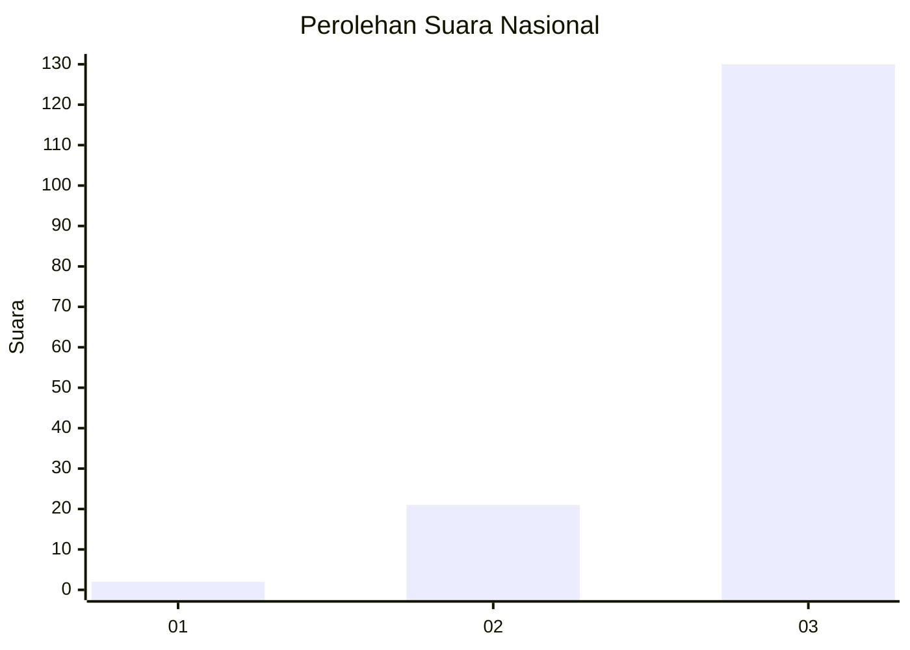
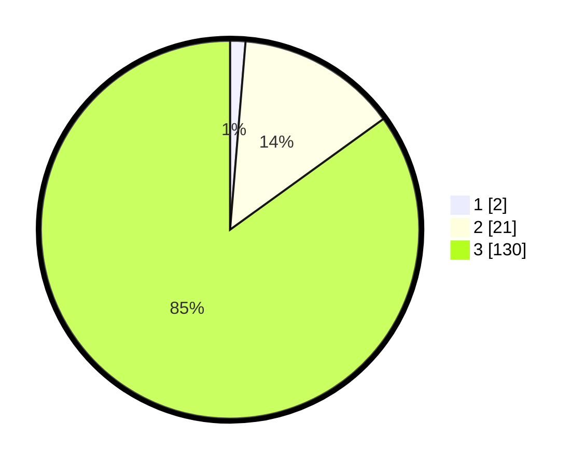

# Hasil

## Grafik

## Tabel

| No. | Nama Paslon    | Suara | Suara (raw) | Persentase |
|:--- |:-------------- | -----:| -----------:| ----------:|
| 1   | ANIES MUHAIMIN | 2     | [2][p-1]    | 1,31       |
| 2   | PRABOWO GIBRAN | 21    | [21][p-2]   | 13,73      |
| 3   | GANJAR MAHFUD  | 130   | [130][p-3]  | 84,97      |

[p-1]: https://github.com/gigit-pemilu/pemilu-2024/blob/main/pilpres/hitung-suara/sub/53-nusa-tenggara-timur/sub/08-ende/sub/21-lepembusu-kelisoke/sub/2012-rutujeja/sub/001-tps/sub/paslon-1.txt
[p-2]: https://github.com/gigit-pemilu/pemilu-2024/blob/main/pilpres/hitung-suara/sub/53-nusa-tenggara-timur/sub/08-ende/sub/21-lepembusu-kelisoke/sub/2012-rutujeja/sub/001-tps/sub/paslon-2.txt
[p-3]: https://github.com/gigit-pemilu/pemilu-2024/blob/main/pilpres/hitung-suara/sub/53-nusa-tenggara-timur/sub/08-ende/sub/21-lepembusu-kelisoke/sub/2012-rutujeja/sub/001-tps/sub/paslon-3.txt

## Foto C Plano

https://sirekap-obj-formc.kpu.go.id/53fd/pemilu/ppwp/53/08/21/20/12/5308212012001-20240221-125910--246eddf1-8c01-462c-af67-b4b06affe871.jpg

https://sirekap-obj-formc.kpu.go.id/53fd/pemilu/ppwp/53/08/21/20/12/5308212012001-20240221-130106--7fa73c92-6d4f-446b-9ab1-a3ac9edcea16.jpg

https://sirekap-obj-formc.kpu.go.id/53fd/pemilu/ppwp/53/08/21/20/12/5308212012001-20240221-130224--22e1681e-1aa3-464e-b944-84ab033adb5d.jpg

## Metadata

| Key        | Value               |
| ---------- | ------------------- |
| Time Stamp | 2024-02-24 22:31:28 |

