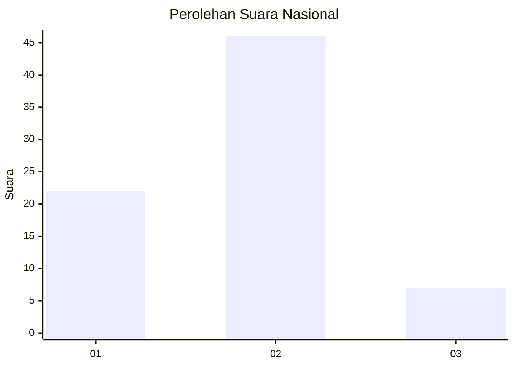
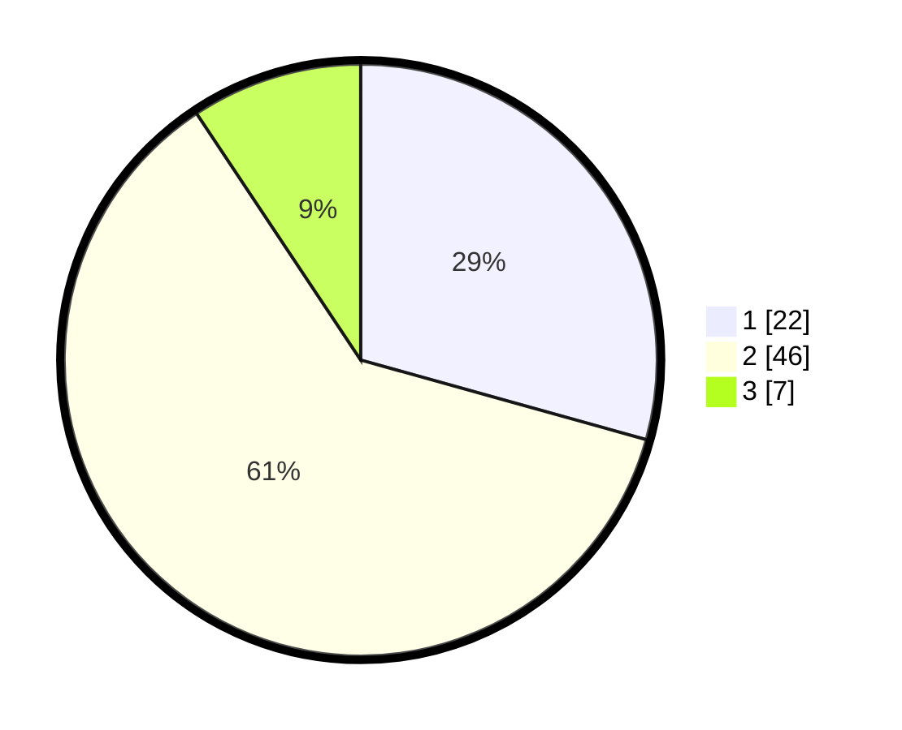

# Hasil

## Grafik

## Tabel

| No. | Nama Paslon    | Suara | Suara (raw) | Persentase |
|:--- |:-------------- | -----:| -----------:| ----------:|
| 1   | ANIES MUHAIMIN | 22    | [22][p-1]   | 29,33      |
| 2   | PRABOWO GIBRAN | 46    | [46][p-2]   | 61,33      |
| 3   | GANJAR MAHFUD  | 7     | [7][p-3]    | 9,33       |

[p-1]: https://github.com/gigit-pemilu/pemilu-2024/blob/main/pilpres/hitung-suara/sub/53-nusa-tenggara-timur/sub/08-ende/sub/21-lepembusu-kelisoke/sub/2014-kurusare/sub/002-tps/sub/paslon-1.txt
[p-2]: https://github.com/gigit-pemilu/pemilu-2024/blob/main/pilpres/hitung-suara/sub/53-nusa-tenggara-timur/sub/08-ende/sub/21-lepembusu-kelisoke/sub/2014-kurusare/sub/002-tps/sub/paslon-2.txt
[p-3]: https://github.com/gigit-pemilu/pemilu-2024/blob/main/pilpres/hitung-suara/sub/53-nusa-tenggara-timur/sub/08-ende/sub/21-lepembusu-kelisoke/sub/2014-kurusare/sub/002-tps/sub/paslon-3.txt

## Foto C Plano

https://sirekap-obj-formc.kpu.go.id/7b58/pemilu/ppwp/53/08/21/20/14/5308212014002-20240215-172851--20078530-6f54-4b7d-ab2d-231a178f54cd.jpg

https://sirekap-obj-formc.kpu.go.id/7b58/pemilu/ppwp/53/08/21/20/14/5308212014002-20240215-173015--d2e20559-c349-4516-b1be-4f546fb6a3a8.jpg

https://sirekap-obj-formc.kpu.go.id/7b58/pemilu/ppwp/53/08/21/20/14/5308212014002-20240215-173228--dfcbd624-4904-4155-9982-d11c0da56d09.jpg

## Metadata

| Key        | Value               |
| ---------- | ------------------- |
| Time Stamp | 2024-02-17 16:00:02 |

