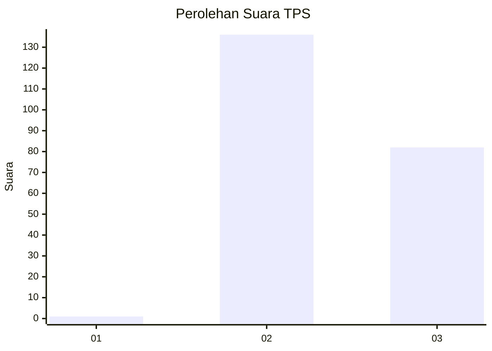
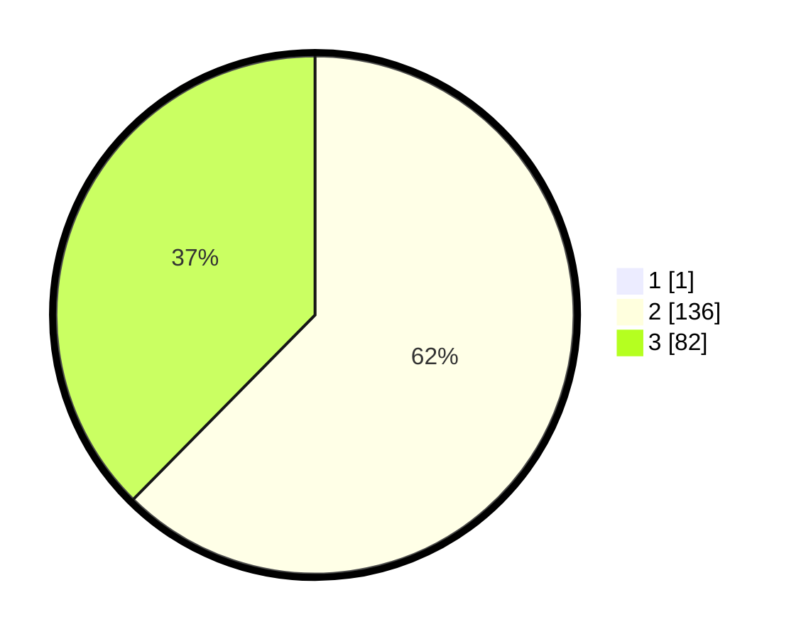

# Hasil

## Grafik

## Tabel

| No. | Nama Paslon    | Suara | Suara (raw) | Persentase |
|:--- |:-------------- | -----:| -----------:| ----------:|
| 1   | ANIES MUHAIMIN | 1     | [1][p-1]    | 0,46       |
| 2   | PRABOWO GIBRAN | 136   | [136][p-2]  | 62,10      |
| 3   | GANJAR MAHFUD  | 82    | [82][p-3]   | 37,44      |

[p-1]: https://github.com/gigit-pemilu/pemilu-2024-53-nusa-tenggara-timur/blob/main/pilpres/hitung-suara/sub/53-nusa-tenggara-timur/sub/10-manggarai/sub/01-wae-rii/sub/2002-lalong/sub/003-tps/sub/paslon-1.txt
[p-2]: https://github.com/gigit-pemilu/pemilu-2024-53-nusa-tenggara-timur/blob/main/pilpres/hitung-suara/sub/53-nusa-tenggara-timur/sub/10-manggarai/sub/01-wae-rii/sub/2002-lalong/sub/003-tps/sub/paslon-2.txt
[p-3]: https://github.com/gigit-pemilu/pemilu-2024-53-nusa-tenggara-timur/blob/main/pilpres/hitung-suara/sub/53-nusa-tenggara-timur/sub/10-manggarai/sub/01-wae-rii/sub/2002-lalong/sub/003-tps/sub/paslon-3.txt

## Foto C Plano

https://sirekap-obj-formc.kpu.go.id/422c/pemilu/ppwp/53/10/01/20/02/5310012002003-20240215-094411--c1cd9e0b-8032-4c6b-b433-8c74dcc56d23.jpg

https://sirekap-obj-formc.kpu.go.id/422c/pemilu/ppwp/53/10/01/20/02/5310012002003-20240215-094627--7058e828-582b-4600-9bfe-6dec7891da57.jpg

https://sirekap-obj-formc.kpu.go.id/422c/pemilu/ppwp/53/10/01/20/02/5310012002003-20240215-094840--4e9eec8d-81cd-4ec5-9eb6-bee7a96d5972.jpg

## Metadata

| Key        | Value               |
| ---------- | ------------------- |
| Time Stamp | 2024-02-25 13:00:00 |

