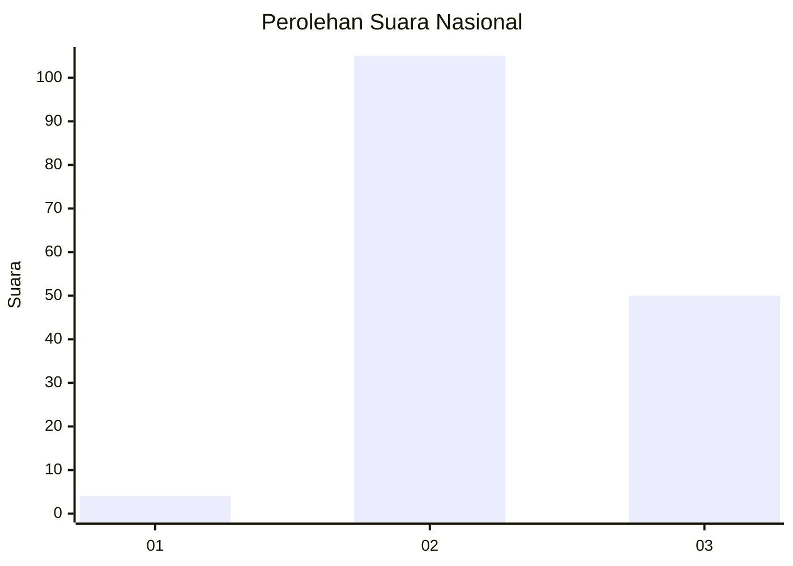
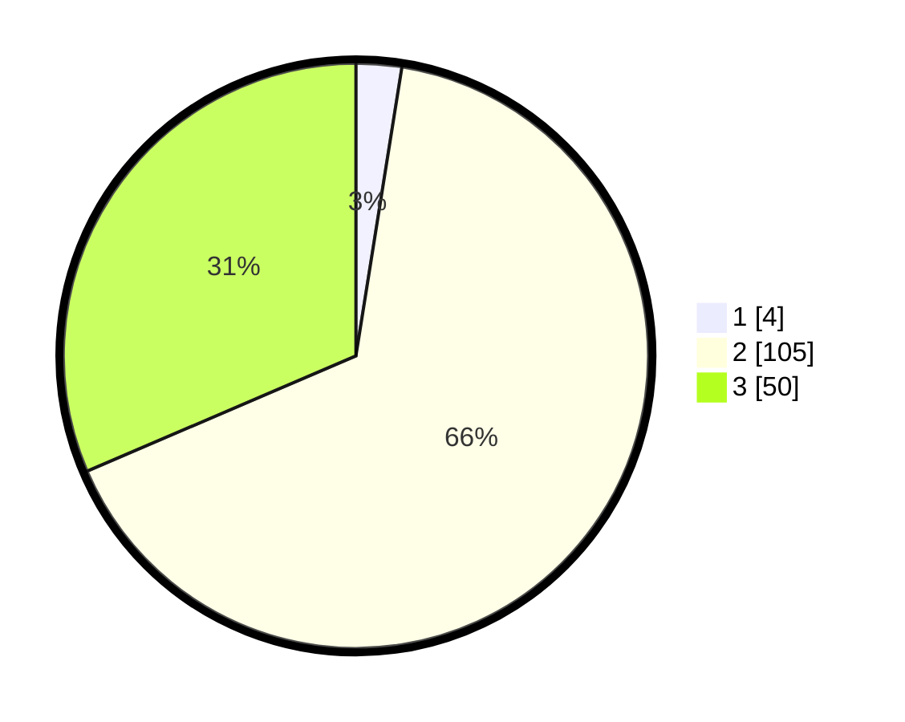

# Hasil

## Grafik

## Tabel

| No. | Nama Paslon    | Suara | Suara (raw) | Persentase |
|:--- |:-------------- | -----:| -----------:| ----------:|
| 1   | ANIES MUHAIMIN | 4     | [4][p-1]    | 2,52       |
| 2   | PRABOWO GIBRAN | 105   | [105][p-2]  | 66,04      |
| 3   | GANJAR MAHFUD  | 50    | [50][p-3]   | 31,45      |

[p-1]: https://github.com/gigit-pemilu/pemilu-2024/blob/main/pilpres/hitung-suara/sub/53-nusa-tenggara-timur/sub/10-manggarai/sub/03-ruteng/sub/1005-wae-belang/sub/003-tps/sub/paslon-1.txt
[p-2]: https://github.com/gigit-pemilu/pemilu-2024/blob/main/pilpres/hitung-suara/sub/53-nusa-tenggara-timur/sub/10-manggarai/sub/03-ruteng/sub/1005-wae-belang/sub/003-tps/sub/paslon-2.txt
[p-3]: https://github.com/gigit-pemilu/pemilu-2024/blob/main/pilpres/hitung-suara/sub/53-nusa-tenggara-timur/sub/10-manggarai/sub/03-ruteng/sub/1005-wae-belang/sub/003-tps/sub/paslon-3.txt

## Foto C Plano

https://sirekap-obj-formc.kpu.go.id/89b9/pemilu/ppwp/53/10/03/10/05/5310031005003-20240215-101201--9bf46e33-6bbb-49ef-9646-104d13bffb84.jpg

https://sirekap-obj-formc.kpu.go.id/89b9/pemilu/ppwp/53/10/03/10/05/5310031005003-20240215-101415--401cebc7-f745-4699-85d4-2f91d6ef9d60.jpg

https://sirekap-obj-formc.kpu.go.id/89b9/pemilu/ppwp/53/10/03/10/05/5310031005003-20240215-101544--b73cd44d-e021-46ec-aa94-4c9d0abe6e76.jpg

## Metadata

| Key        | Value               |
| ---------- | ------------------- |
| Time Stamp | 2024-02-25 15:00:00 |

