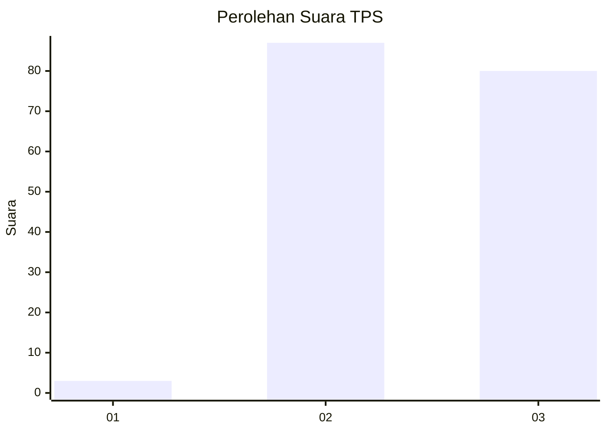
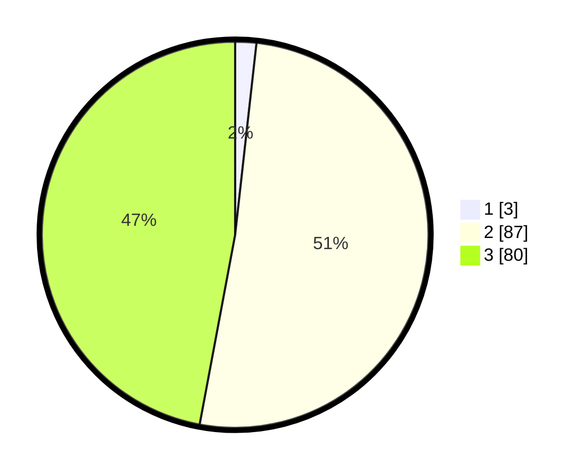

# Hasil

## Grafik

## Tabel

| No. | Nama Paslon    | Suara | Suara (raw) | Persentase |
|:--- |:-------------- | -----:| -----------:| ----------:|
| 1   | ANIES MUHAIMIN | 3     | [3][p-1]    | 1,76       |
| 2   | PRABOWO GIBRAN | 87    | [87][p-2]   | 51,18      |
| 3   | GANJAR MAHFUD  | 80    | [80][p-3]   | 47,06      |

[p-1]: https://github.com/gigit-pemilu/pemilu-2024-53-nusa-tenggara-timur/blob/main/pilpres/hitung-suara/sub/53-nusa-tenggara-timur/sub/10-manggarai/sub/05-satar-mese/sub/2003-jaong/sub/001-tps/sub/paslon-1.txt
[p-2]: https://github.com/gigit-pemilu/pemilu-2024-53-nusa-tenggara-timur/blob/main/pilpres/hitung-suara/sub/53-nusa-tenggara-timur/sub/10-manggarai/sub/05-satar-mese/sub/2003-jaong/sub/001-tps/sub/paslon-2.txt
[p-3]: https://github.com/gigit-pemilu/pemilu-2024-53-nusa-tenggara-timur/blob/main/pilpres/hitung-suara/sub/53-nusa-tenggara-timur/sub/10-manggarai/sub/05-satar-mese/sub/2003-jaong/sub/001-tps/sub/paslon-3.txt

## Foto C Plano

https://sirekap-obj-formc.kpu.go.id/d905/pemilu/ppwp/53/10/05/20/03/5310052003001-20240215-093749--0ab8dca0-d8e1-4b05-9fe7-37ebbe871b5d.jpg

https://sirekap-obj-formc.kpu.go.id/d905/pemilu/ppwp/53/10/05/20/03/5310052003001-20240215-095551--d4d528d1-7a64-4785-9d40-5704bdd97b3c.jpg

https://sirekap-obj-formc.kpu.go.id/d905/pemilu/ppwp/53/10/05/20/03/5310052003001-20240215-095824--aff83a2e-6f72-417d-bf6e-84288d6fa351.jpg

## Metadata

| Key        | Value               |
| ---------- | ------------------- |
| Time Stamp | 2024-02-15 16:30:25 |

