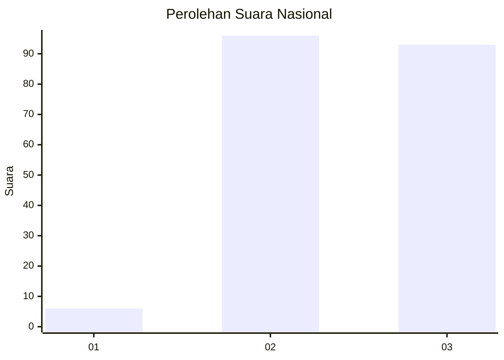
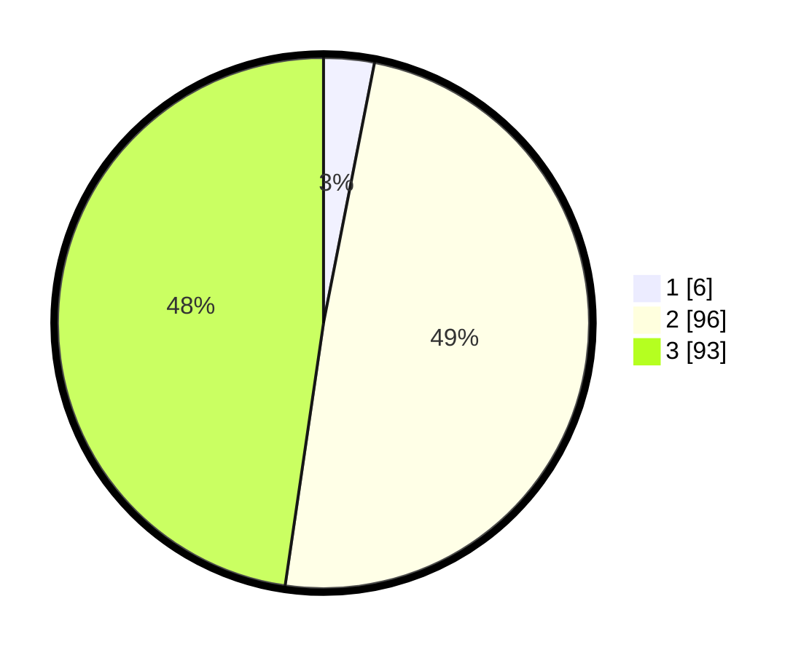

# Hasil

## Grafik

## Tabel

| No. | Nama Paslon    | Suara | Suara (raw) | Persentase |
|:--- |:-------------- | -----:| -----------:| ----------:|
| 1   | ANIES MUHAIMIN | 6     | [6][p-1]    | 3,08       |
| 2   | PRABOWO GIBRAN | 96    | [96][p-2]   | 49,23      |
| 3   | GANJAR MAHFUD  | 93    | [93][p-3]   | 47,69      |

[p-1]: https://github.com/gigit-pemilu/pemilu-2024/blob/main/pilpres/hitung-suara/sub/53-nusa-tenggara-timur/sub/10-manggarai/sub/05-satar-mese/sub/2003-jaong/sub/002-tps/sub/paslon-1.txt
[p-2]: https://github.com/gigit-pemilu/pemilu-2024/blob/main/pilpres/hitung-suara/sub/53-nusa-tenggara-timur/sub/10-manggarai/sub/05-satar-mese/sub/2003-jaong/sub/002-tps/sub/paslon-2.txt
[p-3]: https://github.com/gigit-pemilu/pemilu-2024/blob/main/pilpres/hitung-suara/sub/53-nusa-tenggara-timur/sub/10-manggarai/sub/05-satar-mese/sub/2003-jaong/sub/002-tps/sub/paslon-3.txt

## Foto C Plano

https://sirekap-obj-formc.kpu.go.id/bdd9/pemilu/ppwp/53/10/05/20/03/5310052003002-20240215-095828--6f839f3a-2bf6-4d32-9c04-fba635feb5a5.jpg

https://sirekap-obj-formc.kpu.go.id/bdd9/pemilu/ppwp/53/10/05/20/03/5310052003002-20240215-100250--12841efc-9adc-46e4-b593-5875bb915906.jpg

https://sirekap-obj-formc.kpu.go.id/bdd9/pemilu/ppwp/53/10/05/20/03/5310052003002-20240215-101308--f56d09f7-8289-40a2-b7ec-34705b9153da.jpg

## Metadata

| Key        | Value               |
| ---------- | ------------------- |
| Time Stamp | 2024-02-25 12:00:00 |

