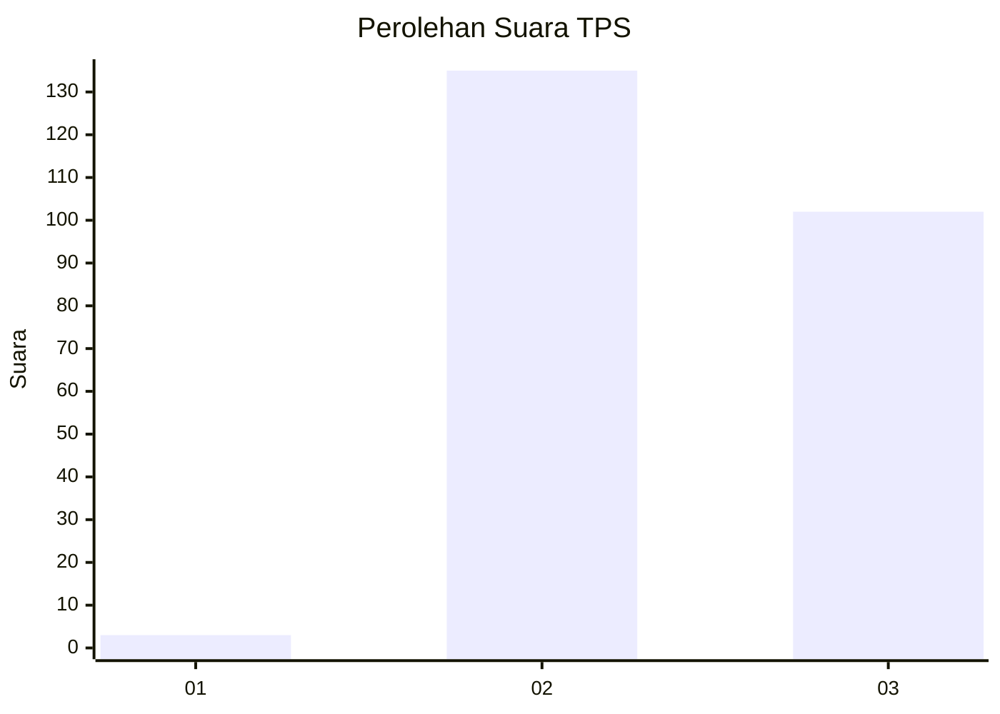
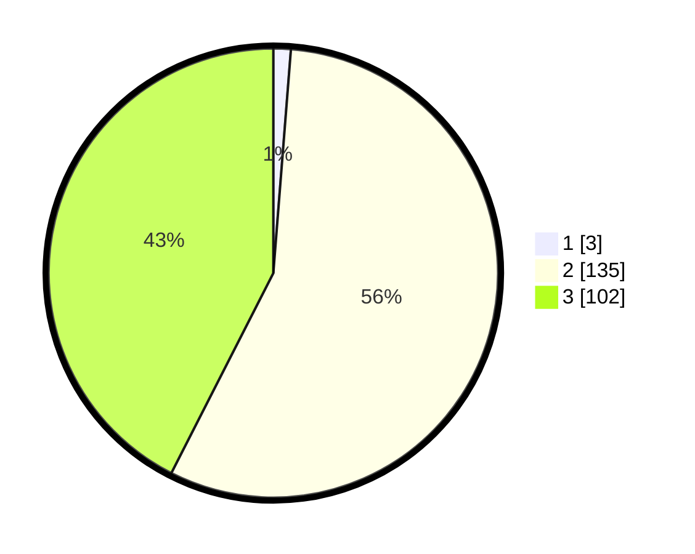

# Hasil

## Grafik

## Tabel

| No. | Nama Paslon    | Suara | Suara (raw) | Persentase |
|:--- |:-------------- | -----:| -----------:| ----------:|
| 1   | ANIES MUHAIMIN | 3     | [3][p-1]    | 1,25       |
| 2   | PRABOWO GIBRAN | 135   | [135][p-2]  | 56,25      |
| 3   | GANJAR MAHFUD  | 102   | [102][p-3]  | 42,50      |

[p-1]: https://github.com/gigit-pemilu/pemilu-2024-53-nusa-tenggara-timur/blob/main/pilpres/hitung-suara/sub/53-nusa-tenggara-timur/sub/10-manggarai/sub/12-langke-rembong/sub/1001-golo-dukal/sub/004-tps/sub/paslon-1.txt
[p-2]: https://github.com/gigit-pemilu/pemilu-2024-53-nusa-tenggara-timur/blob/main/pilpres/hitung-suara/sub/53-nusa-tenggara-timur/sub/10-manggarai/sub/12-langke-rembong/sub/1001-golo-dukal/sub/004-tps/sub/paslon-2.txt
[p-3]: https://github.com/gigit-pemilu/pemilu-2024-53-nusa-tenggara-timur/blob/main/pilpres/hitung-suara/sub/53-nusa-tenggara-timur/sub/10-manggarai/sub/12-langke-rembong/sub/1001-golo-dukal/sub/004-tps/sub/paslon-3.txt

## Foto C Plano

https://sirekap-obj-formc.kpu.go.id/f520/pemilu/ppwp/53/10/12/10/01/5310121001004-20240214-231725--a576b760-b3ea-439b-8b77-40daaf3b3211.jpg

https://sirekap-obj-formc.kpu.go.id/f520/pemilu/ppwp/53/10/12/10/01/5310121001004-20240214-231611--0b0f4718-01c8-46bf-974b-9d06814d7343.jpg

https://sirekap-obj-formc.kpu.go.id/f520/pemilu/ppwp/53/10/12/10/01/5310121001004-20240214-231954--94fbcb37-f72b-4500-8324-314f20de6dfa.jpg

## Metadata

| Key        | Value               |
| ---------- | ------------------- |
| Time Stamp | 2024-02-24 22:31:28 |

