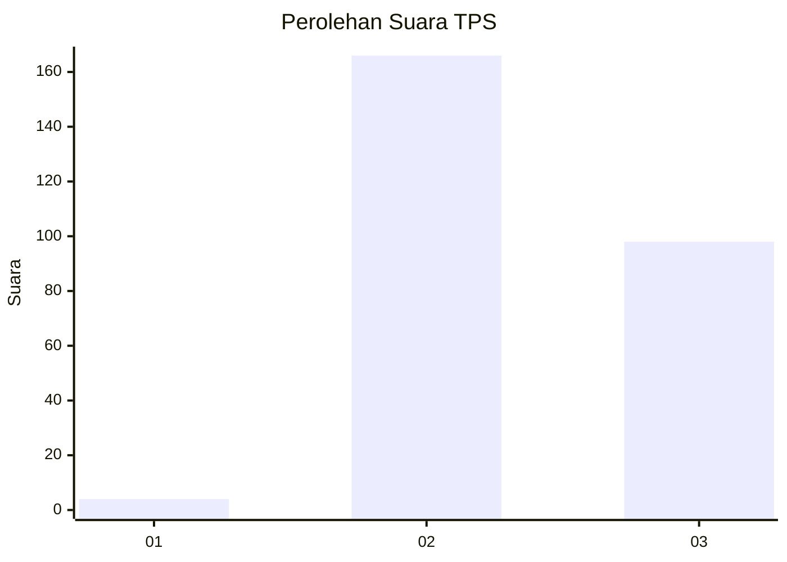
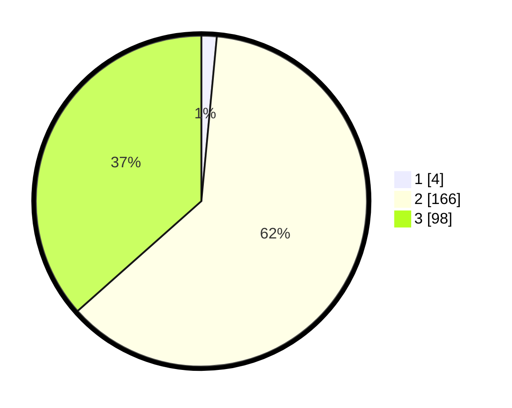

# Hasil

## Grafik

## Tabel

| No. | Nama Paslon    | Suara | Suara (raw) | Persentase |
|:--- |:-------------- | -----:| -----------:| ----------:|
| 1   | ANIES MUHAIMIN | 4     | [4][p-1]    | 1,49       |
| 2   | PRABOWO GIBRAN | 166   | [166][p-2]  | 61,94      |
| 3   | GANJAR MAHFUD  | 98    | [98][p-3]   | 36,57      |

[p-1]: https://github.com/gigit-pemilu/pemilu-2024-53-nusa-tenggara-timur/blob/main/pilpres/hitung-suara/sub/53-nusa-tenggara-timur/sub/10-manggarai/sub/12-langke-rembong/sub/1006-pau/sub/014-tps/sub/paslon-1.txt
[p-2]: https://github.com/gigit-pemilu/pemilu-2024-53-nusa-tenggara-timur/blob/main/pilpres/hitung-suara/sub/53-nusa-tenggara-timur/sub/10-manggarai/sub/12-langke-rembong/sub/1006-pau/sub/014-tps/sub/paslon-2.txt
[p-3]: https://github.com/gigit-pemilu/pemilu-2024-53-nusa-tenggara-timur/blob/main/pilpres/hitung-suara/sub/53-nusa-tenggara-timur/sub/10-manggarai/sub/12-langke-rembong/sub/1006-pau/sub/014-tps/sub/paslon-3.txt

## Foto C Plano

https://sirekap-obj-formc.kpu.go.id/2f62/pemilu/ppwp/53/10/12/10/06/5310121006014-20240215-121929--2fb1386c-af0b-4bd2-86ed-759795f80f42.jpg

https://sirekap-obj-formc.kpu.go.id/2f62/pemilu/ppwp/53/10/12/10/06/5310121006014-20240215-090856--19e74f8a-6638-4483-b28f-3be5df781649.jpg

https://sirekap-obj-formc.kpu.go.id/2f62/pemilu/ppwp/53/10/12/10/06/5310121006014-20240215-090952--bfe91d5c-54d1-49ca-a1ef-784202a8e02f.jpg

## Metadata

| Key        | Value               |
| ---------- | ------------------- |
| Time Stamp | 2024-02-25 21:00:00 |

