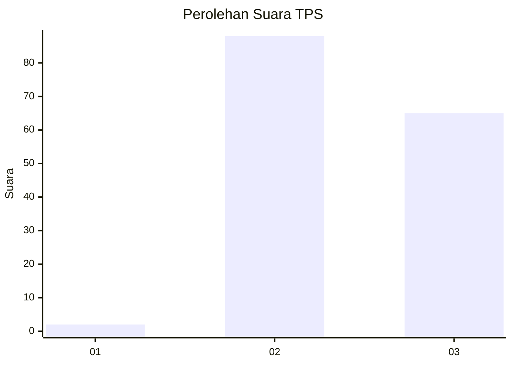
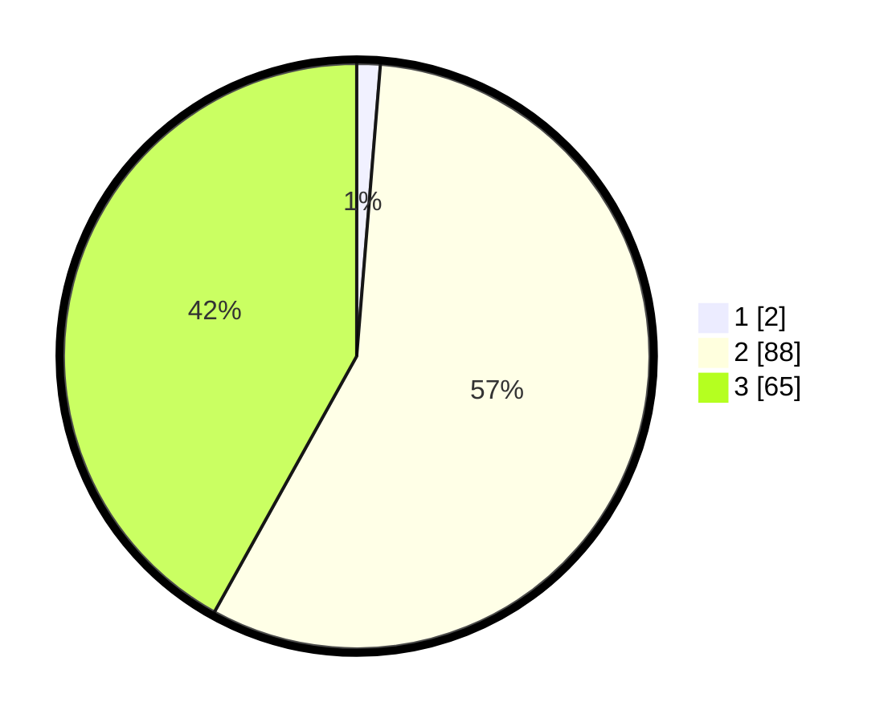

# Hasil

## Grafik

## Tabel

| No. | Nama Paslon    | Suara | Suara (raw) | Persentase |
|:--- |:-------------- | -----:| -----------:| ----------:|
| 1   | ANIES MUHAIMIN | 2     | [2][p-1]    | 1,29       |
| 2   | PRABOWO GIBRAN | 88    | [88][p-2]   | 56,77      |
| 3   | GANJAR MAHFUD  | 65    | [65][p-3]   | 41,94      |

[p-1]: https://github.com/gigit-pemilu/pemilu-2024-53-nusa-tenggara-timur/blob/main/pilpres/hitung-suara/sub/53-nusa-tenggara-timur/sub/10-manggarai/sub/13-satar-mese-barat/sub/2002-hilihintir/sub/002-tps/sub/paslon-1.txt
[p-2]: https://github.com/gigit-pemilu/pemilu-2024-53-nusa-tenggara-timur/blob/main/pilpres/hitung-suara/sub/53-nusa-tenggara-timur/sub/10-manggarai/sub/13-satar-mese-barat/sub/2002-hilihintir/sub/002-tps/sub/paslon-2.txt
[p-3]: https://github.com/gigit-pemilu/pemilu-2024-53-nusa-tenggara-timur/blob/main/pilpres/hitung-suara/sub/53-nusa-tenggara-timur/sub/10-manggarai/sub/13-satar-mese-barat/sub/2002-hilihintir/sub/002-tps/sub/paslon-3.txt

## Foto C Plano

https://sirekap-obj-formc.kpu.go.id/95f2/pemilu/ppwp/53/10/13/20/02/5310132002002-20240214-221555--736de30c-63a9-4732-b29f-41fb9b010ecc.jpg

https://sirekap-obj-formc.kpu.go.id/95f2/pemilu/ppwp/53/10/13/20/02/5310132002002-20240214-221702--89912a29-493e-4559-9d51-00af4c487bca.jpg

https://sirekap-obj-formc.kpu.go.id/95f2/pemilu/ppwp/53/10/13/20/02/5310132002002-20240214-221758--10de35be-781e-41ef-99c7-d38d836074a8.jpg

## Metadata

| Key        | Value               |
| ---------- | ------------------- |
| Time Stamp | 2024-02-24 22:31:28 |

