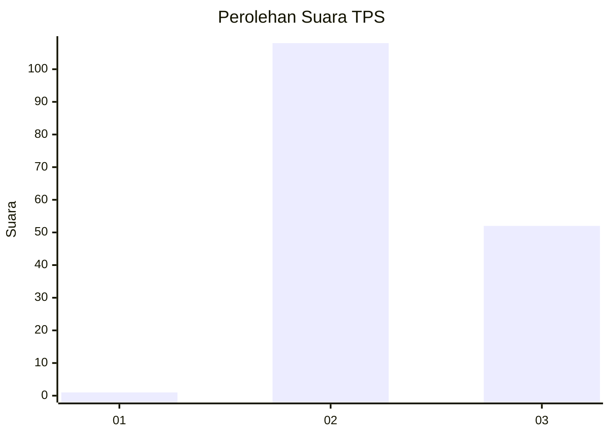
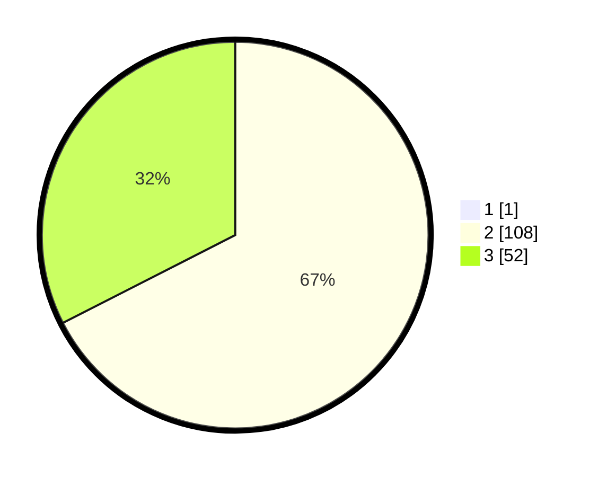

# Hasil

## Grafik

## Tabel

| No. | Nama Paslon    | Suara | Suara (raw) | Persentase |
|:--- |:-------------- | -----:| -----------:| ----------:|
| 1   | ANIES MUHAIMIN | 1     | [1][p-1]    | 0,62       |
| 2   | PRABOWO GIBRAN | 108   | [108][p-2]  | 67,08      |
| 3   | GANJAR MAHFUD  | 52    | [52][p-3]   | 32,30      |

[p-1]: https://github.com/gigit-pemilu/pemilu-2024-53-nusa-tenggara-timur/blob/main/pilpres/hitung-suara/sub/53-nusa-tenggara-timur/sub/10-manggarai/sub/13-satar-mese-barat/sub/2002-hilihintir/sub/003-tps/sub/paslon-1.txt
[p-2]: https://github.com/gigit-pemilu/pemilu-2024-53-nusa-tenggara-timur/blob/main/pilpres/hitung-suara/sub/53-nusa-tenggara-timur/sub/10-manggarai/sub/13-satar-mese-barat/sub/2002-hilihintir/sub/003-tps/sub/paslon-2.txt
[p-3]: https://github.com/gigit-pemilu/pemilu-2024-53-nusa-tenggara-timur/blob/main/pilpres/hitung-suara/sub/53-nusa-tenggara-timur/sub/10-manggarai/sub/13-satar-mese-barat/sub/2002-hilihintir/sub/003-tps/sub/paslon-3.txt

## Foto C Plano

https://sirekap-obj-formc.kpu.go.id/9730/pemilu/ppwp/53/10/13/20/02/5310132002003-20240214-140939--26e83d84-1b3c-4816-b630-5c885dbe0aab.jpg

https://sirekap-obj-formc.kpu.go.id/9730/pemilu/ppwp/53/10/13/20/02/5310132002003-20240214-141158--7b836dbb-be6b-4a2e-b1f5-810cef5f32c9.jpg

https://sirekap-obj-formc.kpu.go.id/9730/pemilu/ppwp/53/10/13/20/02/5310132002003-20240215-081418--dc5f3740-5292-4a52-9f84-1787e0ebd00f.jpg

## Metadata

| Key        | Value               |
| ---------- | ------------------- |
| Time Stamp | 2024-02-15 15:00:29 |

