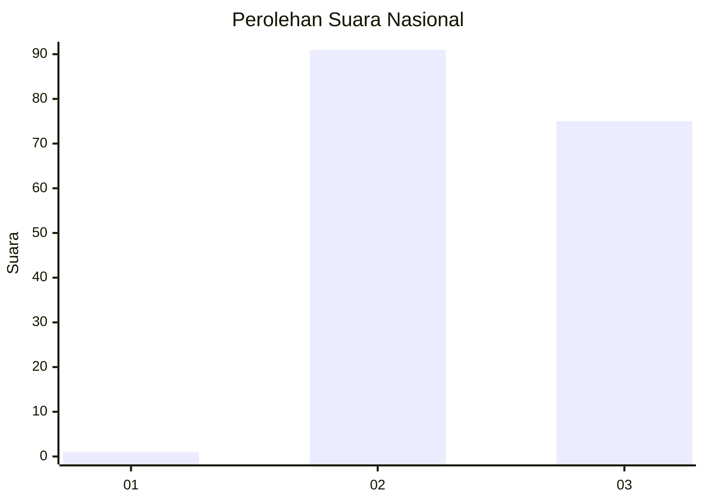
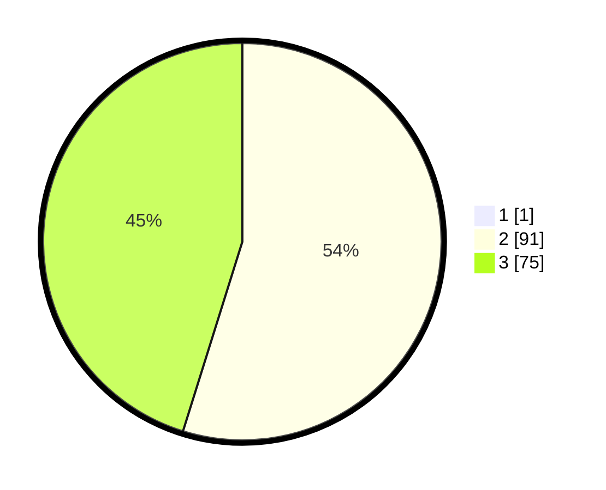

# Hasil

## Grafik

## Tabel

| No. | Nama Paslon    | Suara | Suara (raw) | Persentase |
|:--- |:-------------- | -----:| -----------:| ----------:|
| 1   | ANIES MUHAIMIN | 1     | [1][p-1]    | 0,60       |
| 2   | PRABOWO GIBRAN | 91    | [91][p-2]   | 54,49      |
| 3   | GANJAR MAHFUD  | 75    | [75][p-3]   | 44,91      |

[p-1]: https://github.com/gigit-pemilu/pemilu-2024/blob/main/pilpres/hitung-suara/sub/53-nusa-tenggara-timur/sub/10-manggarai/sub/13-satar-mese-barat/sub/2002-hilihintir/sub/004-tps/sub/paslon-1.txt
[p-2]: https://github.com/gigit-pemilu/pemilu-2024/blob/main/pilpres/hitung-suara/sub/53-nusa-tenggara-timur/sub/10-manggarai/sub/13-satar-mese-barat/sub/2002-hilihintir/sub/004-tps/sub/paslon-2.txt
[p-3]: https://github.com/gigit-pemilu/pemilu-2024/blob/main/pilpres/hitung-suara/sub/53-nusa-tenggara-timur/sub/10-manggarai/sub/13-satar-mese-barat/sub/2002-hilihintir/sub/004-tps/sub/paslon-3.txt

## Foto C Plano

https://sirekap-obj-formc.kpu.go.id/5d31/pemilu/ppwp/53/10/13/20/02/5310132002004-20240215-072947--ac2a1787-ce3e-45f6-8a55-0cf4d64c9745.jpg

https://sirekap-obj-formc.kpu.go.id/5d31/pemilu/ppwp/53/10/13/20/02/5310132002004-20240215-081337--cb10d3bf-b3cc-44dd-9a0e-6d05808b3e83.jpg

https://sirekap-obj-formc.kpu.go.id/5d31/pemilu/ppwp/53/10/13/20/02/5310132002004-20240215-073504--0919b3b7-74d7-47e5-8b5d-0a20938efd65.jpg

## Metadata

| Key        | Value               |
| ---------- | ------------------- |
| Time Stamp | 2024-02-25 18:00:00 |

