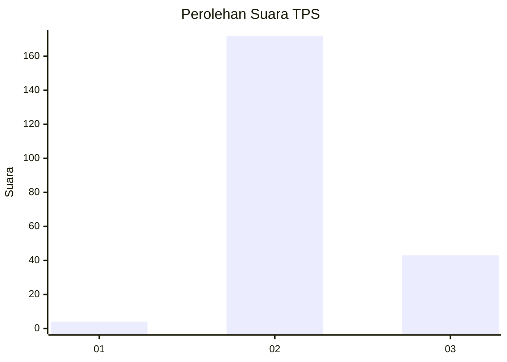

# Hasil

## Grafik

## Tabel

| No. | Nama Paslon    | Suara | Suara (raw) | Persentase |
|:--- |:-------------- | -----:| -----------:| ----------:|
| 1   | ANIES MUHAIMIN | 4     | [4][p-1]    | 1,83       |
| 2   | PRABOWO GIBRAN | 172   | [172][p-2]  | 78,54      |
| 3   | GANJAR MAHFUD  | 43    | [43][p-3]   | 19,63      |

[p-1]: https://github.com/gigit-pemilu/pemilu-2024-53-nusa-tenggara-timur/blob/main/pilpres/hitung-suara/sub/53-nusa-tenggara-timur/sub/10-manggarai/sub/14-rahong-utara/sub/2001-buar/sub/003-tps/sub/paslon-1.txt
[p-2]: https://github.com/gigit-pemilu/pemilu-2024-53-nusa-tenggara-timur/blob/main/pilpres/hitung-suara/sub/53-nusa-tenggara-timur/sub/10-manggarai/sub/14-rahong-utara/sub/2001-buar/sub/003-tps/sub/paslon-2.txt
[p-3]: https://github.com/gigit-pemilu/pemilu-2024-53-nusa-tenggara-timur/blob/main/pilpres/hitung-suara/sub/53-nusa-tenggara-timur/sub/10-manggarai/sub/14-rahong-utara/sub/2001-buar/sub/003-tps/sub/paslon-3.txt

## Foto C Plano

https://sirekap-obj-formc.kpu.go.id/9167/pemilu/ppwp/53/10/14/20/01/5310142001003-20240215-125640--1341dc88-0d0f-4785-8451-34056e62fa94.jpg

https://sirekap-obj-formc.kpu.go.id/9167/pemilu/ppwp/53/10/14/20/01/5310142001003-20240215-130522--cb8c7a7c-cd5e-49de-9e58-d2d1e520b4be.jpg

https://sirekap-obj-formc.kpu.go.id/9167/pemilu/ppwp/53/10/14/20/01/5310142001003-20240215-130804--299d2965-32da-4e0b-b0be-1fc3d2faadbc.jpg

## Metadata

| Key        | Value               |
| ---------- | ------------------- |
| Time Stamp | 2024-02-25 15:00:00 |

