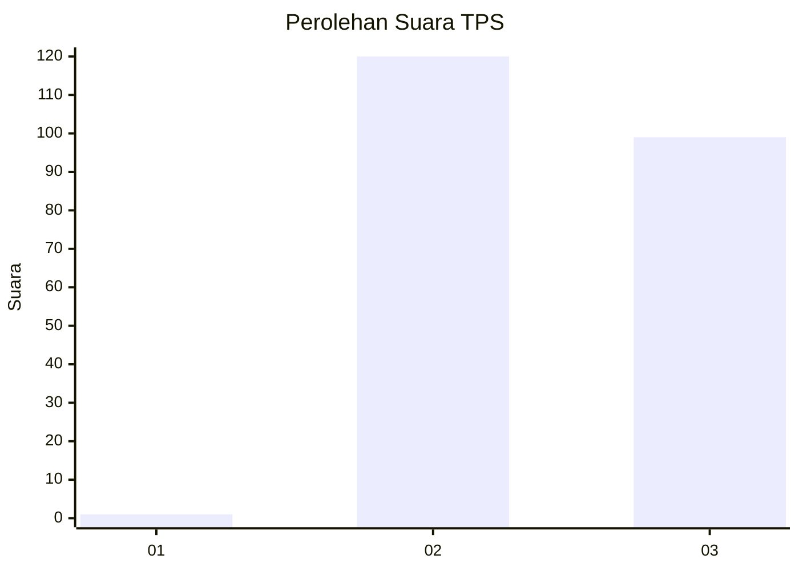
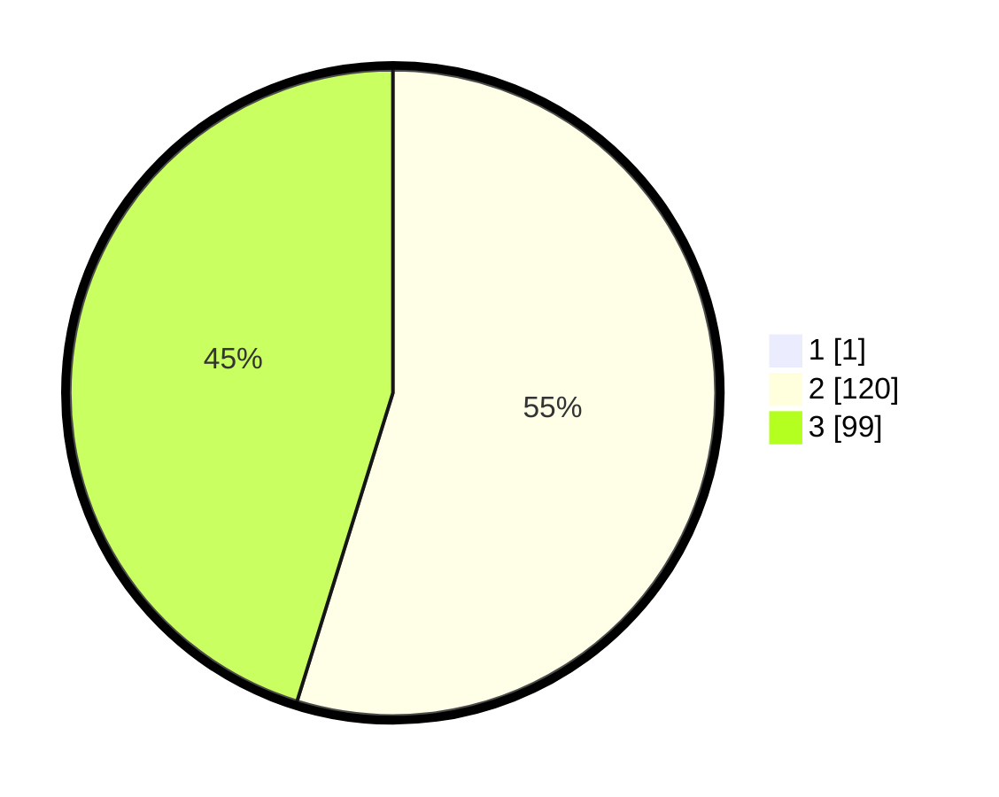

# Hasil

## Grafik

## Tabel

| No. | Nama Paslon    | Suara | Suara (raw) | Persentase |
|:--- |:-------------- | -----:| -----------:| ----------:|
| 1   | ANIES MUHAIMIN | 1     | [1][p-1]    | 0,45       |
| 2   | PRABOWO GIBRAN | 120   | [120][p-2]  | 54,55      |
| 3   | GANJAR MAHFUD  | 99    | [99][p-3]   | 45,00      |

[p-1]: https://github.com/gigit-pemilu/pemilu-2024-53-nusa-tenggara-timur/blob/main/pilpres/hitung-suara/sub/53-nusa-tenggara-timur/sub/10-manggarai/sub/15-lelak/sub/2001-bangka-lelak/sub/005-tps/sub/paslon-1.txt
[p-2]: https://github.com/gigit-pemilu/pemilu-2024-53-nusa-tenggara-timur/blob/main/pilpres/hitung-suara/sub/53-nusa-tenggara-timur/sub/10-manggarai/sub/15-lelak/sub/2001-bangka-lelak/sub/005-tps/sub/paslon-2.txt
[p-3]: https://github.com/gigit-pemilu/pemilu-2024-53-nusa-tenggara-timur/blob/main/pilpres/hitung-suara/sub/53-nusa-tenggara-timur/sub/10-manggarai/sub/15-lelak/sub/2001-bangka-lelak/sub/005-tps/sub/paslon-3.txt

## Foto C Plano

https://sirekap-obj-formc.kpu.go.id/11a0/pemilu/ppwp/53/10/15/20/01/5310152001005-20240215-135700--11580323-1ae7-4649-8f21-e36485742408.jpg

https://sirekap-obj-formc.kpu.go.id/11a0/pemilu/ppwp/53/10/15/20/01/5310152001005-20240215-124414--636f58ec-aaa4-49d7-ba41-1c0542ec2189.jpg

https://sirekap-obj-formc.kpu.go.id/11a0/pemilu/ppwp/53/10/15/20/01/5310152001005-20240215-072856--09ca435c-12fe-46c3-b1a9-16ff2ff942db.jpg

## Metadata

| Key        | Value               |
| ---------- | ------------------- |
| Time Stamp | 2024-02-24 23:00:00 |

