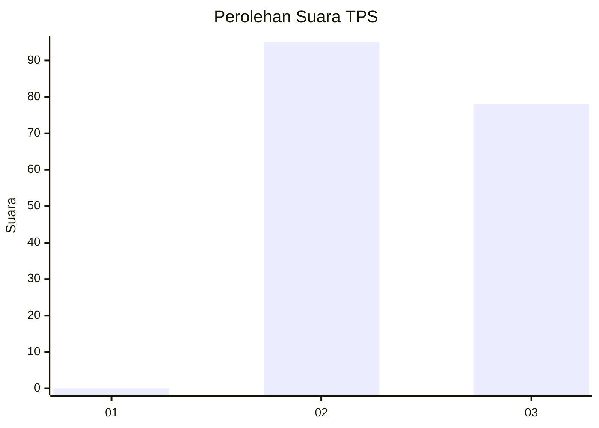
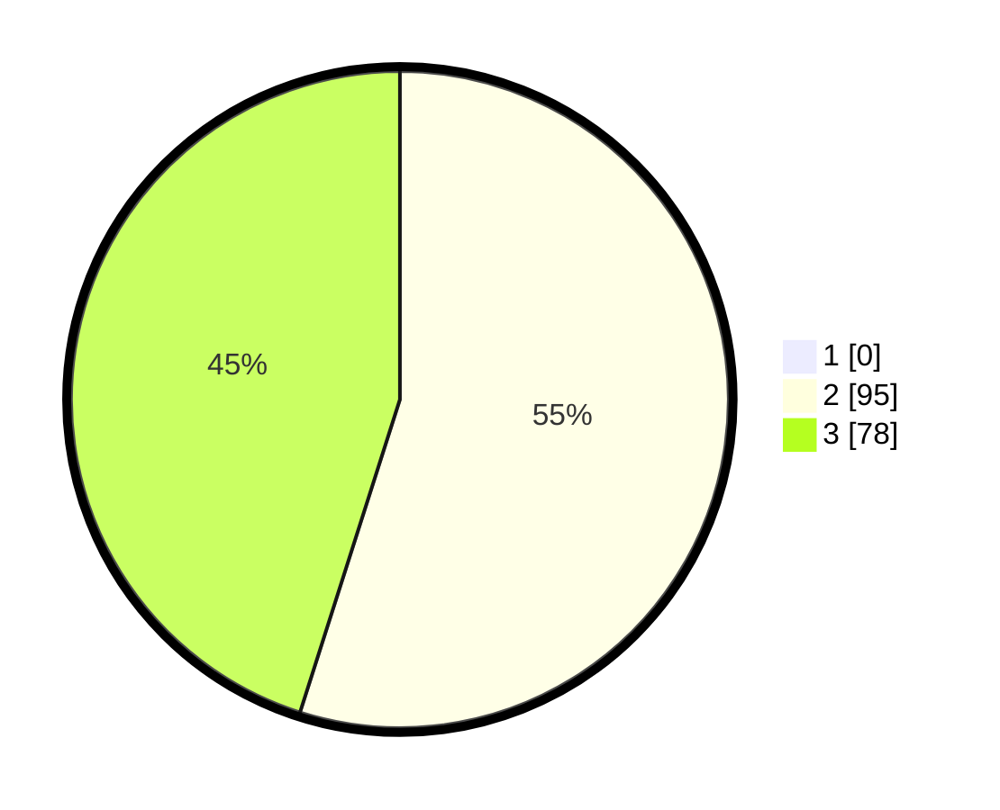

# Hasil

## Grafik

## Tabel

| No. | Nama Paslon    | Suara | Suara (raw) | Persentase |
|:--- |:-------------- | -----:| -----------:| ----------:|
| 1   | ANIES MUHAIMIN | 0     | [0][p-1]    | 0,00       |
| 2   | PRABOWO GIBRAN | 95    | [95][p-2]   | 54,91      |
| 3   | GANJAR MAHFUD  | 78    | [78][p-3]   | 45,09      |

[p-1]: https://github.com/gigit-pemilu/pemilu-2024-53-nusa-tenggara-timur/blob/main/pilpres/hitung-suara/sub/53-nusa-tenggara-timur/sub/10-manggarai/sub/18-satar-mese-utara/sub/2001-renda/sub/001-tps/sub/paslon-1.txt
[p-2]: https://github.com/gigit-pemilu/pemilu-2024-53-nusa-tenggara-timur/blob/main/pilpres/hitung-suara/sub/53-nusa-tenggara-timur/sub/10-manggarai/sub/18-satar-mese-utara/sub/2001-renda/sub/001-tps/sub/paslon-2.txt
[p-3]: https://github.com/gigit-pemilu/pemilu-2024-53-nusa-tenggara-timur/blob/main/pilpres/hitung-suara/sub/53-nusa-tenggara-timur/sub/10-manggarai/sub/18-satar-mese-utara/sub/2001-renda/sub/001-tps/sub/paslon-3.txt

## Foto C Plano

https://sirekap-obj-formc.kpu.go.id/ea1f/pemilu/ppwp/53/10/18/20/01/5310182001001-20240215-151435--a8c5761b-c11e-4db5-87fb-171b6883d061.jpg

https://sirekap-obj-formc.kpu.go.id/ea1f/pemilu/ppwp/53/10/18/20/01/5310182001001-20240215-151644--59a4bab4-c5d3-4662-b605-8b673b433b35.jpg

https://sirekap-obj-formc.kpu.go.id/ea1f/pemilu/ppwp/53/10/18/20/01/5310182001001-20240215-073044--5840f511-b545-4c94-ad8b-c22c0e4c5b6d.jpg

## Metadata

| Key        | Value               |
| ---------- | ------------------- |
| Time Stamp | 2024-02-15 17:30:25 |

