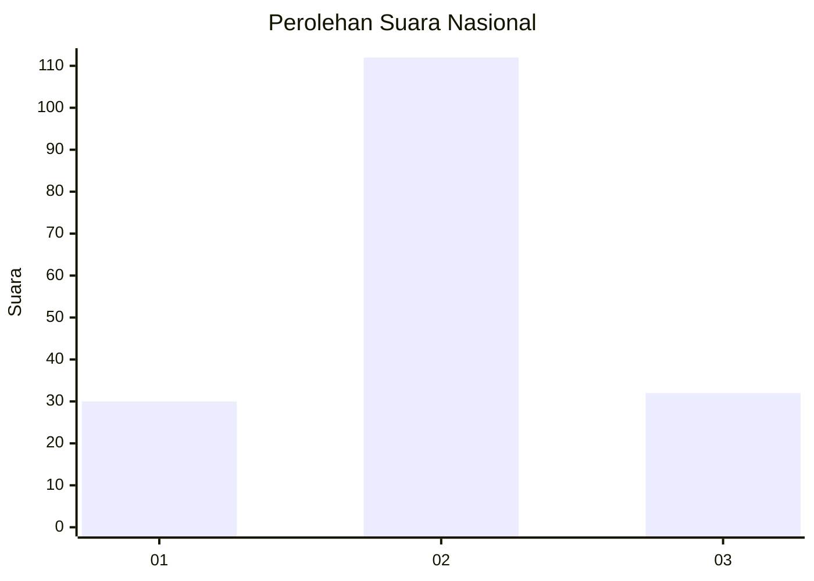
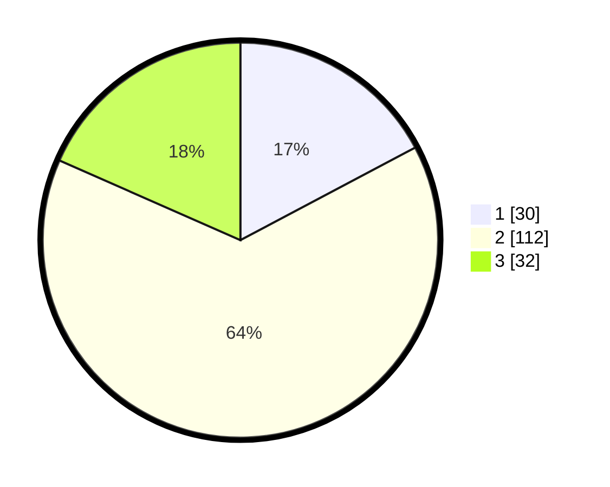

# Hasil

## Grafik

## Tabel

| No. | Nama Paslon    | Suara | Suara (raw) | Persentase |
|:--- |:-------------- | -----:| -----------:| ----------:|
| 1   | ANIES MUHAIMIN | 30    | [30][p-1]   | 17,24      |
| 2   | PRABOWO GIBRAN | 112   | [112][p-2]  | 64,37      |
| 3   | GANJAR MAHFUD  | 32    | [32][p-3]   | 18,39      |

[p-1]: https://github.com/gigit-pemilu/pemilu-2024/blob/main/pilpres/hitung-suara/sub/53-nusa-tenggara-timur/sub/11-sumba-timur/sub/01-kota-waingapu/sub/1001-kambajawa/sub/002-tps/sub/paslon-1.txt
[p-2]: https://github.com/gigit-pemilu/pemilu-2024/blob/main/pilpres/hitung-suara/sub/53-nusa-tenggara-timur/sub/11-sumba-timur/sub/01-kota-waingapu/sub/1001-kambajawa/sub/002-tps/sub/paslon-2.txt
[p-3]: https://github.com/gigit-pemilu/pemilu-2024/blob/main/pilpres/hitung-suara/sub/53-nusa-tenggara-timur/sub/11-sumba-timur/sub/01-kota-waingapu/sub/1001-kambajawa/sub/002-tps/sub/paslon-3.txt

## Foto C Plano

https://sirekap-obj-formc.kpu.go.id/4cde/pemilu/ppwp/53/11/01/10/01/5311011001002-20240215-191133--efc0706f-4007-4bd5-bd9b-790b1990ec1c.jpg

https://sirekap-obj-formc.kpu.go.id/4cde/pemilu/ppwp/53/11/01/10/01/5311011001002-20240223-124656--8c6be61b-fb40-4015-b204-cd379ee2398b.jpg

https://sirekap-obj-formc.kpu.go.id/4cde/pemilu/ppwp/53/11/01/10/01/5311011001002-20240223-125002--d69086b9-5856-44af-9a28-b7100918e5b2.jpg

## Metadata

| Key        | Value               |
| ---------- | ------------------- |
| Time Stamp | 2024-02-24 22:31:28 |

