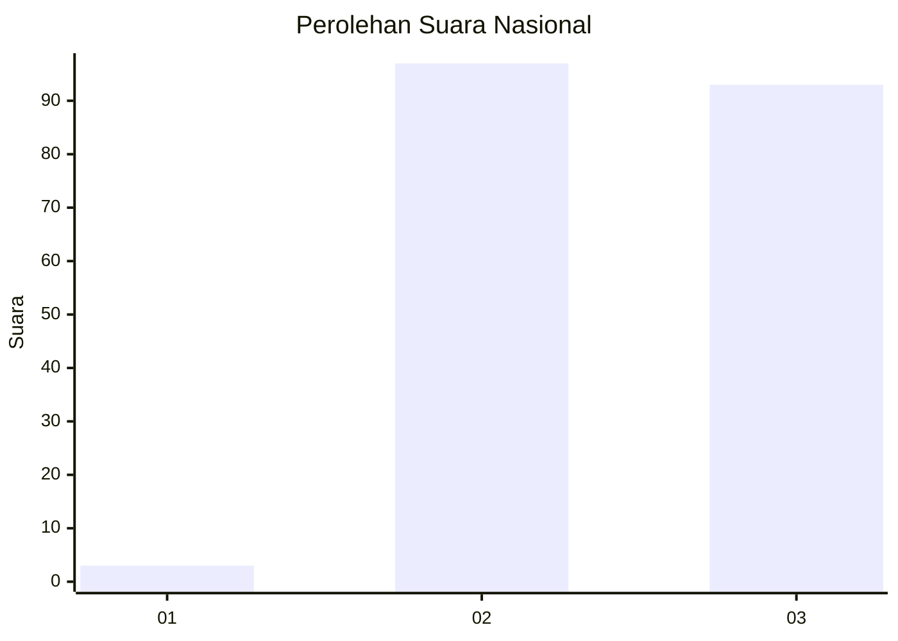
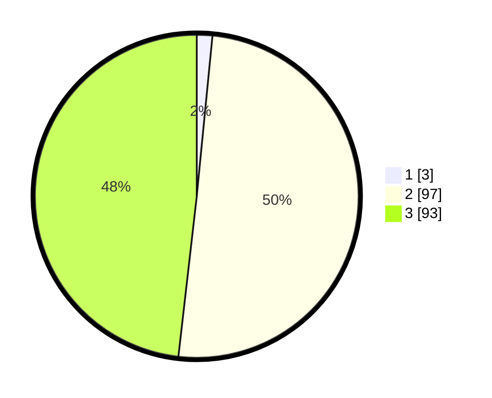

# Hasil

## Grafik

## Tabel

| No. | Nama Paslon    | Suara | Suara (raw) | Persentase |
|:--- |:-------------- | -----:| -----------:| ----------:|
| 1   | ANIES MUHAIMIN | 3     | [3][p-1]    | 1,55       |
| 2   | PRABOWO GIBRAN | 97    | [97][p-2]   | 50,26      |
| 3   | GANJAR MAHFUD  | 93    | [93][p-3]   | 48,19      |

[p-1]: https://github.com/gigit-pemilu/pemilu-2024/blob/main/pilpres/hitung-suara/sub/53-nusa-tenggara-timur/sub/11-sumba-timur/sub/03-lewa/sub/1001-lewa-paku/sub/001-tps/sub/paslon-1.txt
[p-2]: https://github.com/gigit-pemilu/pemilu-2024/blob/main/pilpres/hitung-suara/sub/53-nusa-tenggara-timur/sub/11-sumba-timur/sub/03-lewa/sub/1001-lewa-paku/sub/001-tps/sub/paslon-2.txt
[p-3]: https://github.com/gigit-pemilu/pemilu-2024/blob/main/pilpres/hitung-suara/sub/53-nusa-tenggara-timur/sub/11-sumba-timur/sub/03-lewa/sub/1001-lewa-paku/sub/001-tps/sub/paslon-3.txt

## Foto C Plano

https://sirekap-obj-formc.kpu.go.id/3698/pemilu/ppwp/53/11/03/10/01/5311031001001-20240215-092245--e414ecb7-bb41-4080-bb87-255ba67f33e5.jpg

https://sirekap-obj-formc.kpu.go.id/3698/pemilu/ppwp/53/11/03/10/01/5311031001001-20240215-092456--7a6e0f20-24a3-418a-884c-4aabda0e3f57.jpg

https://sirekap-obj-formc.kpu.go.id/3698/pemilu/ppwp/53/11/03/10/01/5311031001001-20240215-092615--c08a2d6c-04f1-499a-9c12-d181374832a6.jpg

## Metadata

| Key        | Value               |
| ---------- | ------------------- |
| Time Stamp | 2024-02-16 10:00:28 |

