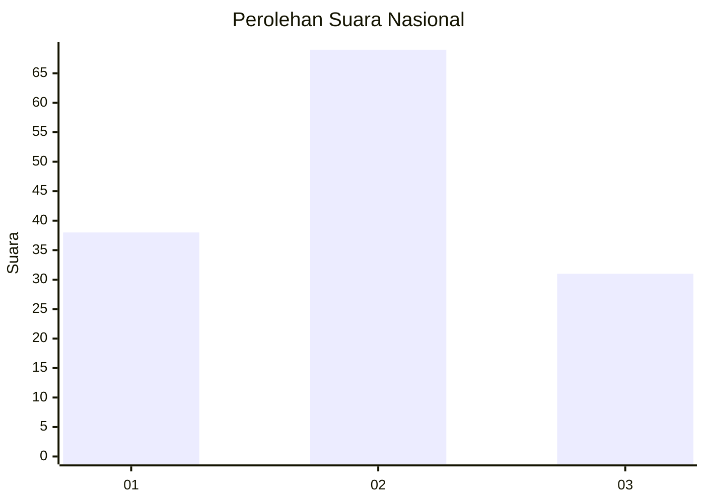
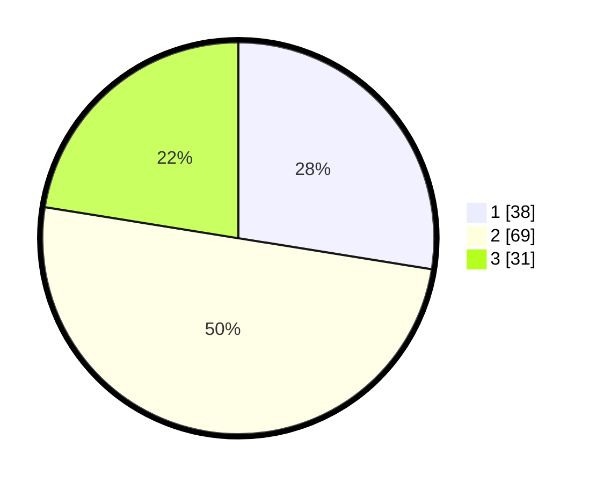

# Hasil

## Grafik

## Tabel

| No. | Nama Paslon    | Suara | Suara (raw) | Persentase |
|:--- |:-------------- | -----:| -----------:| ----------:|
| 1   | ANIES MUHAIMIN | 38    | [38][p-1]   | 27,54      |
| 2   | PRABOWO GIBRAN | 69    | [69][p-2]   | 50,00      |
| 3   | GANJAR MAHFUD  | 31    | [31][p-3]   | 22,46      |

[p-1]: https://github.com/gigit-pemilu/pemilu-2024/blob/main/pilpres/hitung-suara/sub/53-nusa-tenggara-timur/sub/11-sumba-timur/sub/03-lewa/sub/1001-lewa-paku/sub/004-tps/sub/paslon-1.txt
[p-2]: https://github.com/gigit-pemilu/pemilu-2024/blob/main/pilpres/hitung-suara/sub/53-nusa-tenggara-timur/sub/11-sumba-timur/sub/03-lewa/sub/1001-lewa-paku/sub/004-tps/sub/paslon-2.txt
[p-3]: https://github.com/gigit-pemilu/pemilu-2024/blob/main/pilpres/hitung-suara/sub/53-nusa-tenggara-timur/sub/11-sumba-timur/sub/03-lewa/sub/1001-lewa-paku/sub/004-tps/sub/paslon-3.txt

## Foto C Plano

https://sirekap-obj-formc.kpu.go.id/b4c2/pemilu/ppwp/53/11/03/10/01/5311031001004-20240215-080910--3c9ad56d-f988-4153-8dcb-10caceb32313.jpg

https://sirekap-obj-formc.kpu.go.id/b4c2/pemilu/ppwp/53/11/03/10/01/5311031001004-20240215-081712--1feb8b3c-7be2-4b32-8821-b74bcaaa3f00.jpg

https://sirekap-obj-formc.kpu.go.id/b4c2/pemilu/ppwp/53/11/03/10/01/5311031001004-20240215-150703--dc9b5146-3d1d-48a6-aea1-79fe05c5427b.jpg

## Metadata

| Key        | Value               |
| ---------- | ------------------- |
| Time Stamp | 2024-02-25 13:00:00 |

