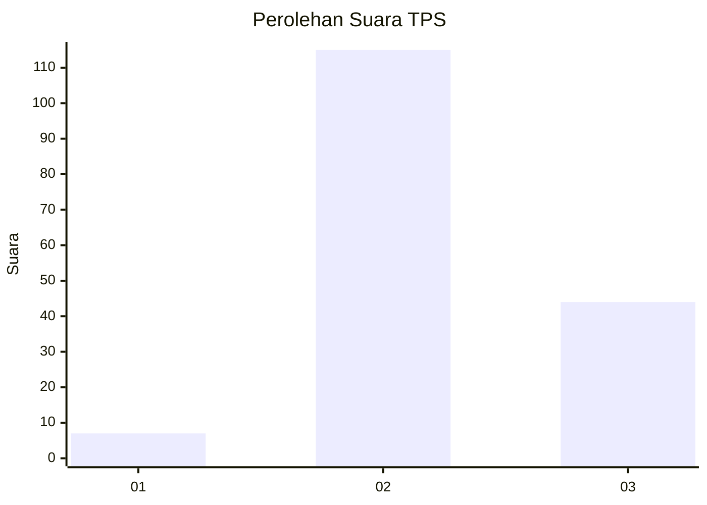

# Hasil

## Grafik

## Tabel

| No. | Nama Paslon    | Suara | Suara (raw) | Persentase |
|:--- |:-------------- | -----:| -----------:| ----------:|
| 1   | ANIES MUHAIMIN | 7     | [7][p-1]    | 4,22       |
| 2   | PRABOWO GIBRAN | 115   | [115][p-2]  | 69,28      |
| 3   | GANJAR MAHFUD  | 44    | [44][p-3]   | 26,51      |

[p-1]: https://github.com/gigit-pemilu/pemilu-2024-53-nusa-tenggara-timur/blob/main/pilpres/hitung-suara/sub/53-nusa-tenggara-timur/sub/11-sumba-timur/sub/04-nggaha-ori-angu/sub/2001-makamenggit/sub/001-tps/sub/paslon-1.txt
[p-2]: https://github.com/gigit-pemilu/pemilu-2024-53-nusa-tenggara-timur/blob/main/pilpres/hitung-suara/sub/53-nusa-tenggara-timur/sub/11-sumba-timur/sub/04-nggaha-ori-angu/sub/2001-makamenggit/sub/001-tps/sub/paslon-2.txt
[p-3]: https://github.com/gigit-pemilu/pemilu-2024-53-nusa-tenggara-timur/blob/main/pilpres/hitung-suara/sub/53-nusa-tenggara-timur/sub/11-sumba-timur/sub/04-nggaha-ori-angu/sub/2001-makamenggit/sub/001-tps/sub/paslon-3.txt

## Foto C Plano

https://sirekap-obj-formc.kpu.go.id/11e6/pemilu/ppwp/53/11/04/20/01/5311042001001-20240215-152105--1f8be88d-757d-4ea0-b5d6-c3cee5dcdb88.jpg

https://sirekap-obj-formc.kpu.go.id/11e6/pemilu/ppwp/53/11/04/20/01/5311042001001-20240215-152452--2e93fad7-d516-4a8b-9423-b7e349744f9f.jpg

https://sirekap-obj-formc.kpu.go.id/11e6/pemilu/ppwp/53/11/04/20/01/5311042001001-20240215-152623--03817c43-31ee-4ecd-9ce6-6c39418119b0.jpg

## Metadata

| Key        | Value               |
| ---------- | ------------------- |
| Time Stamp | 2024-02-26 15:00:00 |

