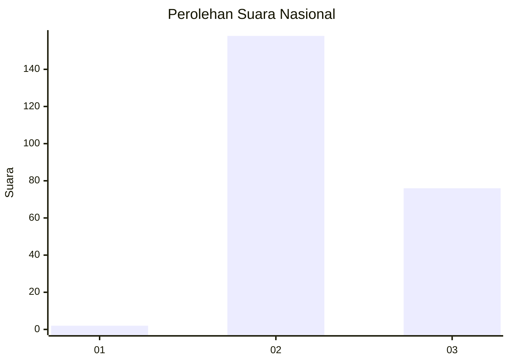
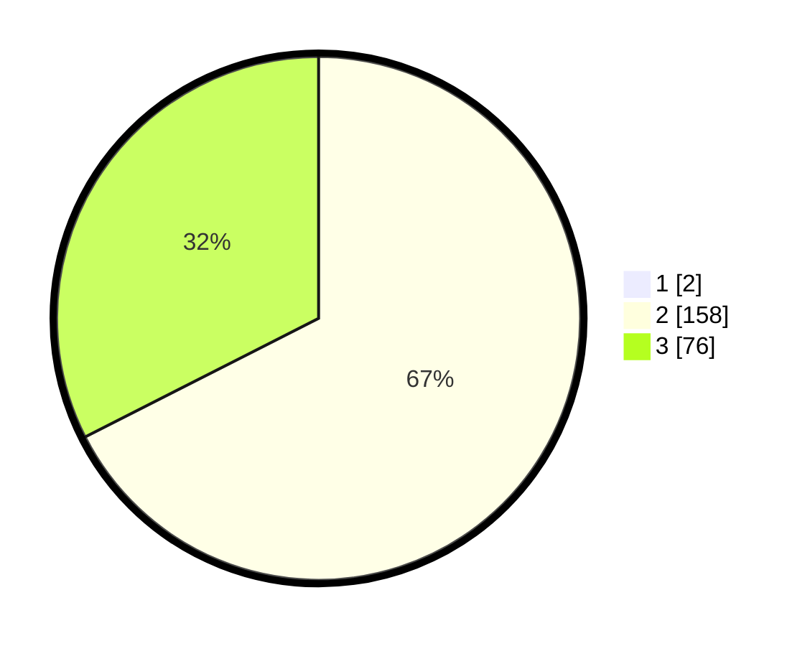

# Hasil

## Grafik

## Tabel

| No. | Nama Paslon    | Suara | Suara (raw) | Persentase |
|:--- |:-------------- | -----:| -----------:| ----------:|
| 1   | ANIES MUHAIMIN | 2     | [2][p-1]    | 0,85       |
| 2   | PRABOWO GIBRAN | 158   | [158][p-2]  | 66,95      |
| 3   | GANJAR MAHFUD  | 76    | [76][p-3]   | 32,20      |

[p-1]: https://github.com/gigit-pemilu/pemilu-2024/blob/main/pilpres/hitung-suara/sub/53-nusa-tenggara-timur/sub/11-sumba-timur/sub/04-nggaha-ori-angu/sub/2004-praihambuli/sub/003-tps/sub/paslon-1.txt
[p-2]: https://github.com/gigit-pemilu/pemilu-2024/blob/main/pilpres/hitung-suara/sub/53-nusa-tenggara-timur/sub/11-sumba-timur/sub/04-nggaha-ori-angu/sub/2004-praihambuli/sub/003-tps/sub/paslon-2.txt
[p-3]: https://github.com/gigit-pemilu/pemilu-2024/blob/main/pilpres/hitung-suara/sub/53-nusa-tenggara-timur/sub/11-sumba-timur/sub/04-nggaha-ori-angu/sub/2004-praihambuli/sub/003-tps/sub/paslon-3.txt

## Foto C Plano

https://sirekap-obj-formc.kpu.go.id/45c7/pemilu/ppwp/53/11/04/20/04/5311042004003-20240215-074921--817f9ac2-7f96-43ef-aafd-60eb7c67fac3.jpg

https://sirekap-obj-formc.kpu.go.id/45c7/pemilu/ppwp/53/11/04/20/04/5311042004003-20240215-105415--43448efb-777e-413c-be5c-8df0f65678e5.jpg

https://sirekap-obj-formc.kpu.go.id/45c7/pemilu/ppwp/53/11/04/20/04/5311042004003-20240215-105750--24ba433f-8d78-433a-9320-de45e17c3e9f.jpg

## Metadata

| Key        | Value               |
| ---------- | ------------------- |
| Time Stamp | 2024-02-25 09:00:00 |

