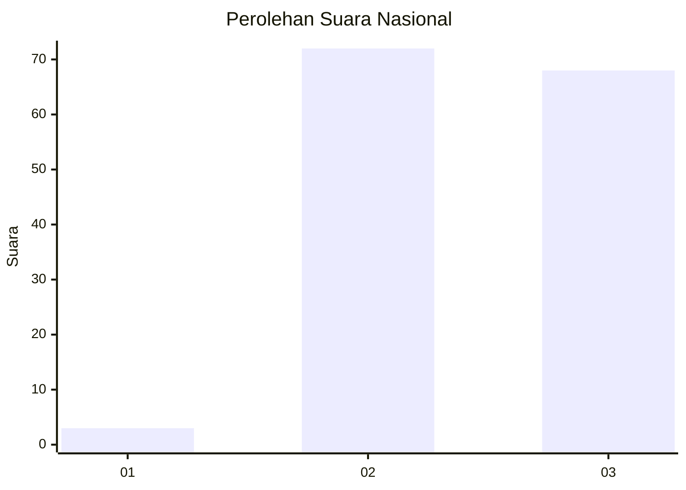
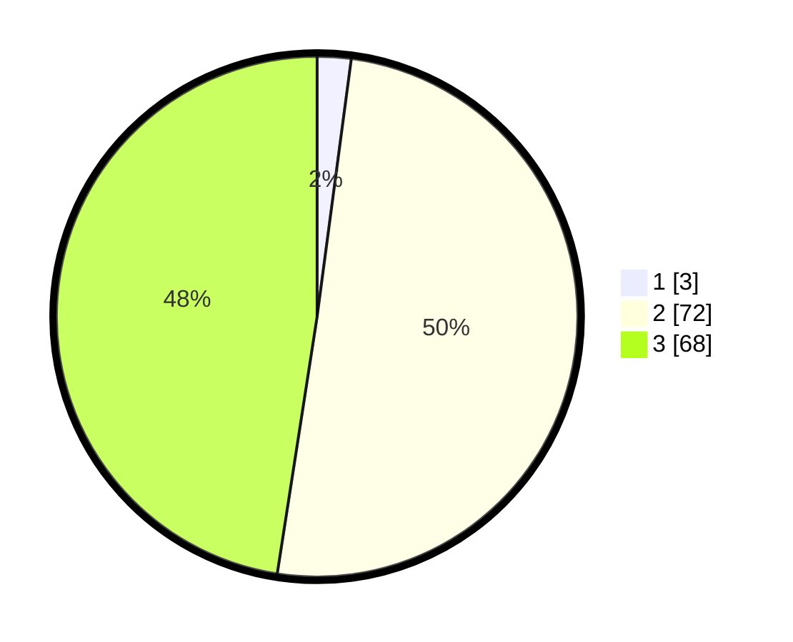

# Hasil

## Grafik

## Tabel

| No. | Nama Paslon    | Suara | Suara (raw) | Persentase |
|:--- |:-------------- | -----:| -----------:| ----------:|
| 1   | ANIES MUHAIMIN | 3     | [3][p-1]    | 2,10       |
| 2   | PRABOWO GIBRAN | 72    | [72][p-2]   | 50,35      |
| 3   | GANJAR MAHFUD  | 68    | [68][p-3]   | 47,55      |

[p-1]: https://github.com/gigit-pemilu/pemilu-2024/blob/main/pilpres/hitung-suara/sub/53-nusa-tenggara-timur/sub/11-sumba-timur/sub/05-tabundung/sub/2001-billa/sub/004-tps/sub/paslon-1.txt
[p-2]: https://github.com/gigit-pemilu/pemilu-2024/blob/main/pilpres/hitung-suara/sub/53-nusa-tenggara-timur/sub/11-sumba-timur/sub/05-tabundung/sub/2001-billa/sub/004-tps/sub/paslon-2.txt
[p-3]: https://github.com/gigit-pemilu/pemilu-2024/blob/main/pilpres/hitung-suara/sub/53-nusa-tenggara-timur/sub/11-sumba-timur/sub/05-tabundung/sub/2001-billa/sub/004-tps/sub/paslon-3.txt

## Foto C Plano

https://sirekap-obj-formc.kpu.go.id/ab2f/pemilu/ppwp/53/11/05/20/01/5311052001004-20240215-003648--1e0e6a6f-dfda-407d-86b9-76a3a468f567.jpg

https://sirekap-obj-formc.kpu.go.id/ab2f/pemilu/ppwp/53/11/05/20/01/5311052001004-20240215-003842--0a67f7b4-d39b-4fb2-a9e8-3767186fb35d.jpg

https://sirekap-obj-formc.kpu.go.id/ab2f/pemilu/ppwp/53/11/05/20/01/5311052001004-20240215-004107--70b9f741-ec83-4211-8732-1e845111219a.jpg

## Metadata

| Key        | Value               |
| ---------- | ------------------- |
| Time Stamp | 2024-02-24 22:31:28 |

