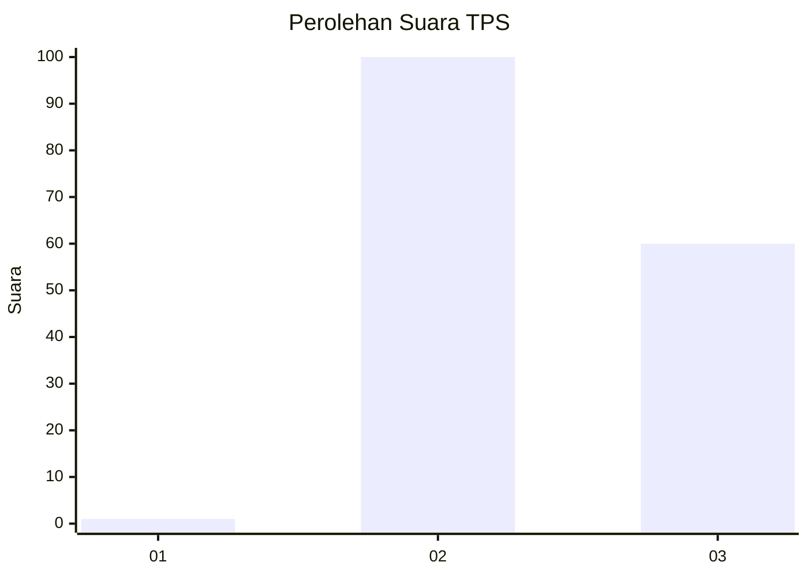
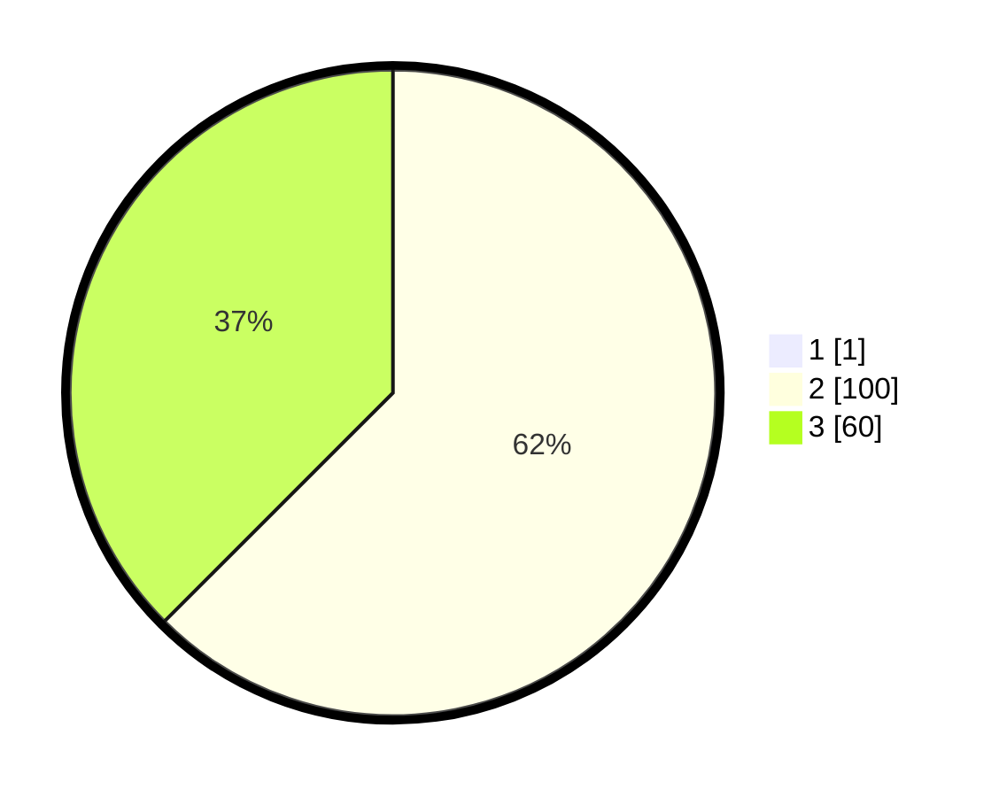

# Hasil

## Grafik

## Tabel

| No. | Nama Paslon    | Suara | Suara (raw) | Persentase |
|:--- |:-------------- | -----:| -----------:| ----------:|
| 1   | ANIES MUHAIMIN | 1     | [1][p-1]    | 0,62       |
| 2   | PRABOWO GIBRAN | 100   | [100][p-2]  | 62,11      |
| 3   | GANJAR MAHFUD  | 60    | [60][p-3]   | 37,27      |

[p-1]: https://github.com/gigit-pemilu/pemilu-2024-53-nusa-tenggara-timur/blob/main/pilpres/hitung-suara/sub/53-nusa-tenggara-timur/sub/11-sumba-timur/sub/06-pinu-pahar/sub/2002-wangga-mbewa/sub/001-tps/sub/paslon-1.txt
[p-2]: https://github.com/gigit-pemilu/pemilu-2024-53-nusa-tenggara-timur/blob/main/pilpres/hitung-suara/sub/53-nusa-tenggara-timur/sub/11-sumba-timur/sub/06-pinu-pahar/sub/2002-wangga-mbewa/sub/001-tps/sub/paslon-2.txt
[p-3]: https://github.com/gigit-pemilu/pemilu-2024-53-nusa-tenggara-timur/blob/main/pilpres/hitung-suara/sub/53-nusa-tenggara-timur/sub/11-sumba-timur/sub/06-pinu-pahar/sub/2002-wangga-mbewa/sub/001-tps/sub/paslon-3.txt

## Foto C Plano

https://sirekap-obj-formc.kpu.go.id/d767/pemilu/ppwp/53/11/06/20/02/5311062002001-20240214-224843--10a94794-c45e-4873-89cd-d43463ef78c9.jpg

https://sirekap-obj-formc.kpu.go.id/d767/pemilu/ppwp/53/11/06/20/02/5311062002001-20240214-225017--a830f59a-9551-4089-ac95-a9d83ed59616.jpg

https://sirekap-obj-formc.kpu.go.id/d767/pemilu/ppwp/53/11/06/20/02/5311062002001-20240214-225810--e6f70ae5-bd7f-4804-9de6-b86a85bfda4d.jpg

## Metadata

| Key        | Value               |
| ---------- | ------------------- |
| Time Stamp | 2024-02-24 22:31:28 |

