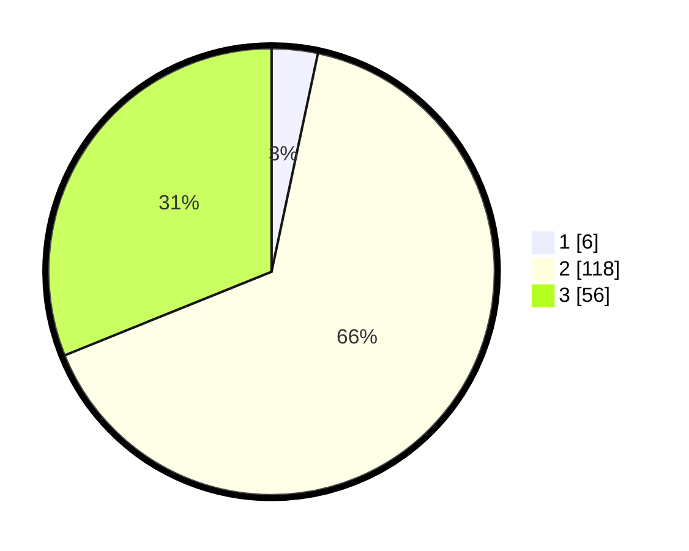

# Hasil

## Grafik

## Tabel

| No. | Nama Paslon    | Suara | Suara (raw) | Persentase |
|:--- |:-------------- | -----:| -----------:| ----------:|
| 1   | ANIES MUHAIMIN | 6     | [6][p-1]    | 3,33       |
| 2   | PRABOWO GIBRAN | 118   | [118][p-2]  | 65,56      |
| 3   | GANJAR MAHFUD  | 56    | [56][p-3]   | 31,11      |

[p-1]: https://github.com/gigit-pemilu/pemilu-2024-53-nusa-tenggara-timur/blob/main/pilpres/hitung-suara/sub/53-nusa-tenggara-timur/sub/11-sumba-timur/sub/06-pinu-pahar/sub/2003-lailunggi/sub/005-tps/sub/paslon-1.txt
[p-2]: https://github.com/gigit-pemilu/pemilu-2024-53-nusa-tenggara-timur/blob/main/pilpres/hitung-suara/sub/53-nusa-tenggara-timur/sub/11-sumba-timur/sub/06-pinu-pahar/sub/2003-lailunggi/sub/005-tps/sub/paslon-2.txt
[p-3]: https://github.com/gigit-pemilu/pemilu-2024-53-nusa-tenggara-timur/blob/main/pilpres/hitung-suara/sub/53-nusa-tenggara-timur/sub/11-sumba-timur/sub/06-pinu-pahar/sub/2003-lailunggi/sub/005-tps/sub/paslon-3.txt

## Foto C Plano

https://sirekap-obj-formc.kpu.go.id/a9fa/pemilu/ppwp/53/11/06/20/03/5311062003005-20240214-235119--1d06f795-7e84-47c4-bf20-618ab1d60082.jpg

https://sirekap-obj-formc.kpu.go.id/a9fa/pemilu/ppwp/53/11/06/20/03/5311062003005-20240214-235847--178eb30a-fe1d-4668-8673-80480d24e45e.jpg

https://sirekap-obj-formc.kpu.go.id/a9fa/pemilu/ppwp/53/11/06/20/03/5311062003005-20240214-235825--8cea7c5c-a63e-4365-b908-652ecc54ca0a.jpg

## Metadata

| Key        | Value               |
| ---------- | ------------------- |
| Time Stamp | 2024-02-24 22:31:28 |

