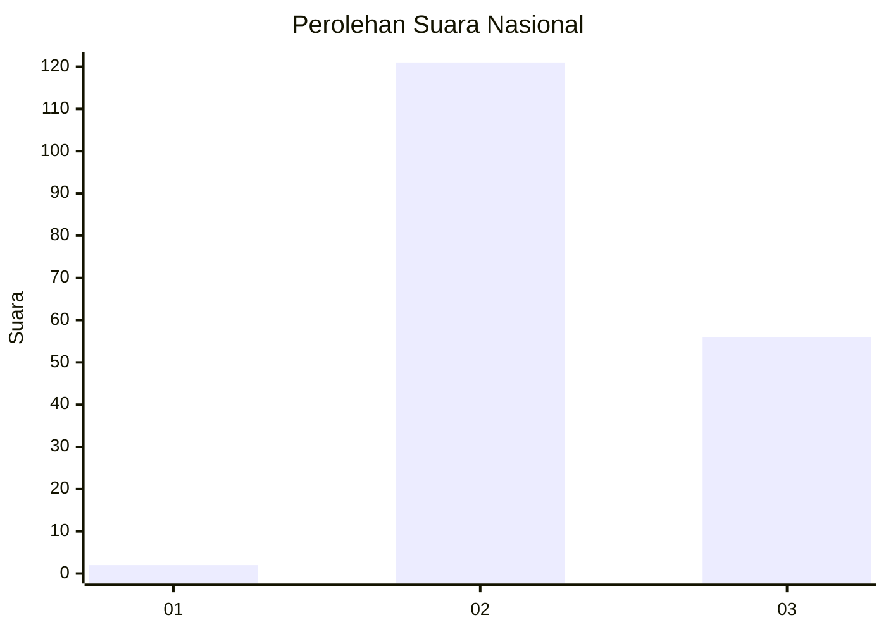
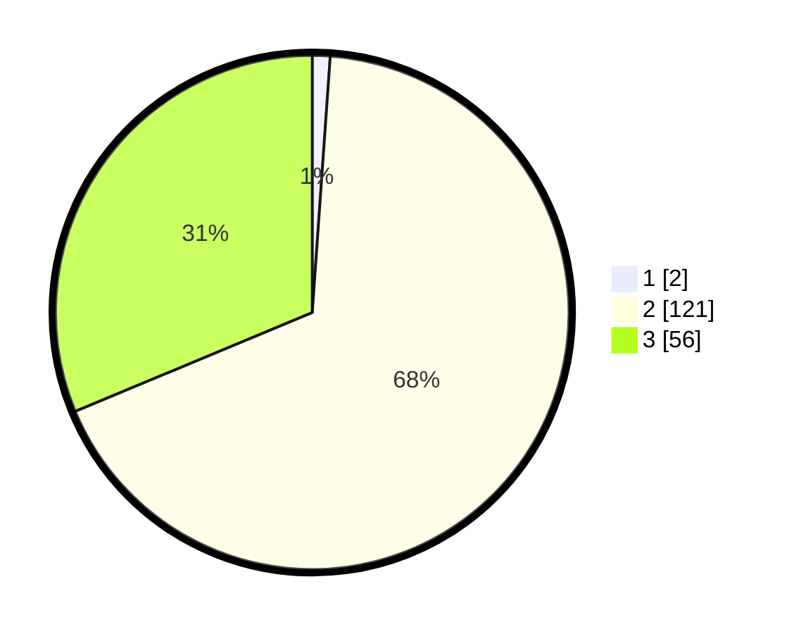

# Hasil

## Grafik

## Tabel

| No. | Nama Paslon    | Suara | Suara (raw) | Persentase |
|:--- |:-------------- | -----:| -----------:| ----------:|
| 1   | ANIES MUHAIMIN | 2     | [2][p-1]    | 1,12       |
| 2   | PRABOWO GIBRAN | 121   | [121][p-2]  | 67,60      |
| 3   | GANJAR MAHFUD  | 56    | [56][p-3]   | 31,28      |

[p-1]: https://github.com/gigit-pemilu/pemilu-2024/blob/main/pilpres/hitung-suara/sub/53-nusa-tenggara-timur/sub/11-sumba-timur/sub/07-pandawai/sub/1001-kawangu/sub/002-tps/sub/paslon-1.txt
[p-2]: https://github.com/gigit-pemilu/pemilu-2024/blob/main/pilpres/hitung-suara/sub/53-nusa-tenggara-timur/sub/11-sumba-timur/sub/07-pandawai/sub/1001-kawangu/sub/002-tps/sub/paslon-2.txt
[p-3]: https://github.com/gigit-pemilu/pemilu-2024/blob/main/pilpres/hitung-suara/sub/53-nusa-tenggara-timur/sub/11-sumba-timur/sub/07-pandawai/sub/1001-kawangu/sub/002-tps/sub/paslon-3.txt

## Foto C Plano

https://sirekap-obj-formc.kpu.go.id/54f8/pemilu/ppwp/53/11/07/10/01/5311071001002-20240215-092422--0a6eafd9-5e45-4ded-abdb-ae0ded967a11.jpg

https://sirekap-obj-formc.kpu.go.id/54f8/pemilu/ppwp/53/11/07/10/01/5311071001002-20240215-092939--9b45a297-79aa-4680-bacb-c223b36d9f2b.jpg

https://sirekap-obj-formc.kpu.go.id/54f8/pemilu/ppwp/53/11/07/10/01/5311071001002-20240215-092108--0d0d976a-0fae-4e5a-8e53-7d57a9d3624b.jpg

## Metadata

| Key        | Value               |
| ---------- | ------------------- |
| Time Stamp | 2024-02-25 20:00:00 |

