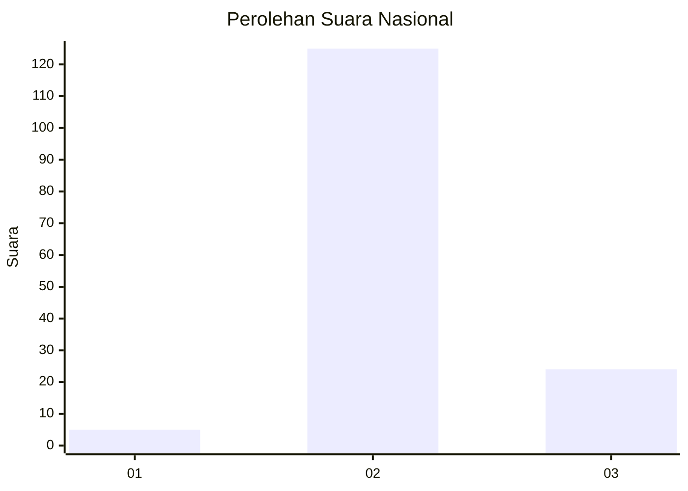
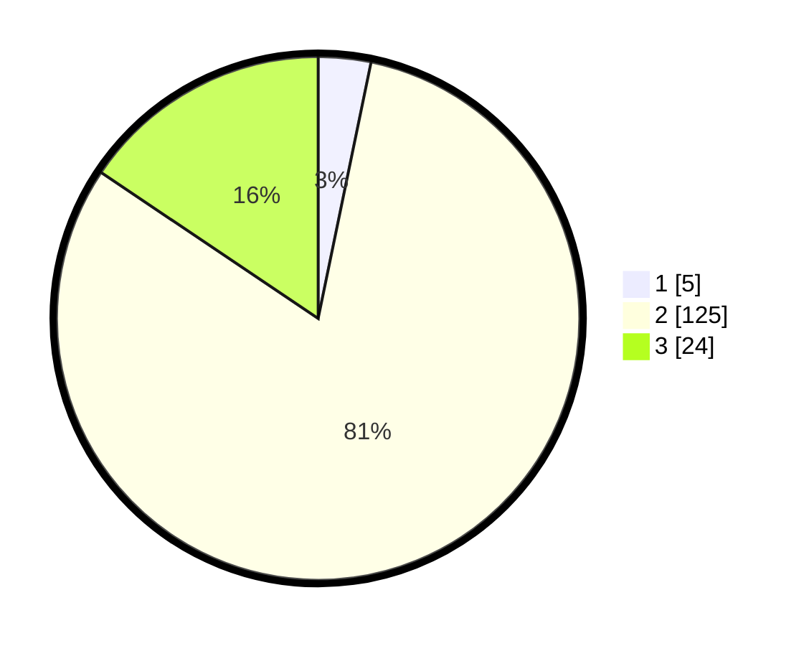

# Hasil

## Grafik

## Tabel

| No. | Nama Paslon    | Suara | Suara (raw) | Persentase |
|:--- |:-------------- | -----:| -----------:| ----------:|
| 1   | ANIES MUHAIMIN | 5     | [5][p-1]    | 3,25       |
| 2   | PRABOWO GIBRAN | 125   | [125][p-2]  | 81,17      |
| 3   | GANJAR MAHFUD  | 24    | [24][p-3]   | 15,58      |

[p-1]: https://github.com/gigit-pemilu/pemilu-2024/blob/main/pilpres/hitung-suara/sub/53-nusa-tenggara-timur/sub/11-sumba-timur/sub/07-pandawai/sub/1001-kawangu/sub/005-tps/sub/paslon-1.txt
[p-2]: https://github.com/gigit-pemilu/pemilu-2024/blob/main/pilpres/hitung-suara/sub/53-nusa-tenggara-timur/sub/11-sumba-timur/sub/07-pandawai/sub/1001-kawangu/sub/005-tps/sub/paslon-2.txt
[p-3]: https://github.com/gigit-pemilu/pemilu-2024/blob/main/pilpres/hitung-suara/sub/53-nusa-tenggara-timur/sub/11-sumba-timur/sub/07-pandawai/sub/1001-kawangu/sub/005-tps/sub/paslon-3.txt

## Foto C Plano

https://sirekap-obj-formc.kpu.go.id/2dc3/pemilu/ppwp/53/11/07/10/01/5311071001005-20240215-061336--c44edd5a-64e3-43a7-b418-ba8fadb4ef63.jpg

https://sirekap-obj-formc.kpu.go.id/2dc3/pemilu/ppwp/53/11/07/10/01/5311071001005-20240215-061442--3beea3ff-5339-4ddf-9fe3-31d25e1d10a6.jpg

https://sirekap-obj-formc.kpu.go.id/2dc3/pemilu/ppwp/53/11/07/10/01/5311071001005-20240215-061820--bc2f884f-86f4-410c-9710-cee163f5fdfe.jpg

## Metadata

| Key        | Value               |
| ---------- | ------------------- |
| Time Stamp | 2024-02-25 13:00:00 |

