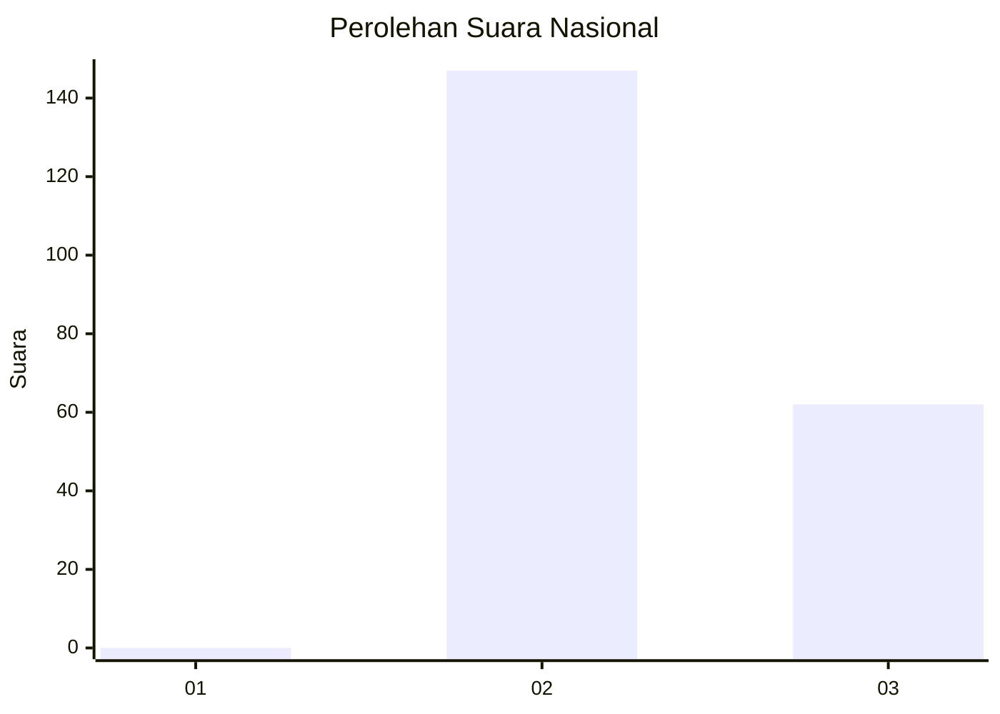
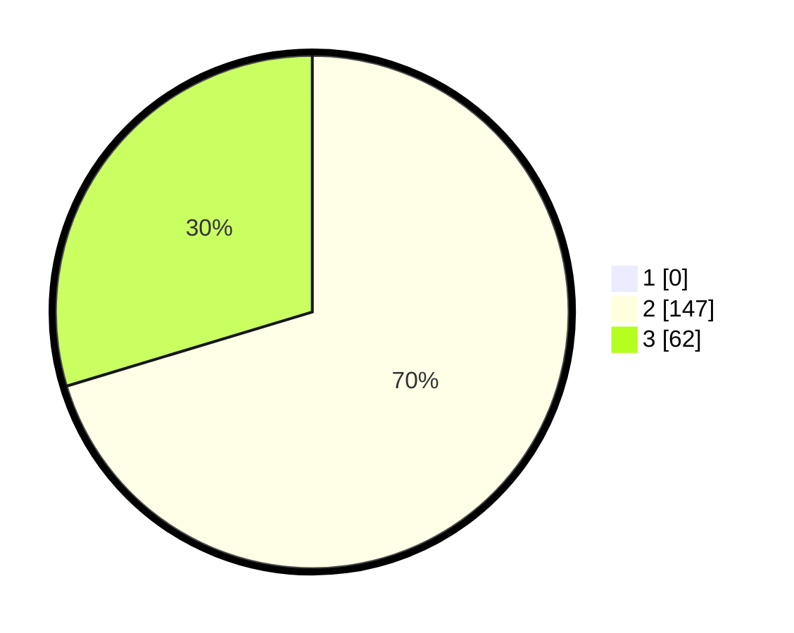

# Hasil

## Grafik

## Tabel

| No. | Nama Paslon    | Suara | Suara (raw) | Persentase |
|:--- |:-------------- | -----:| -----------:| ----------:|
| 1   | ANIES MUHAIMIN | 0     | [0][p-1]    | 0,00       |
| 2   | PRABOWO GIBRAN | 147   | [147][p-2]  | 70,33      |
| 3   | GANJAR MAHFUD  | 62    | [62][p-3]   | 29,67      |

[p-1]: https://github.com/gigit-pemilu/pemilu-2024/blob/main/pilpres/hitung-suara/sub/53-nusa-tenggara-timur/sub/11-sumba-timur/sub/07-pandawai/sub/1001-kawangu/sub/006-tps/sub/paslon-1.txt
[p-2]: https://github.com/gigit-pemilu/pemilu-2024/blob/main/pilpres/hitung-suara/sub/53-nusa-tenggara-timur/sub/11-sumba-timur/sub/07-pandawai/sub/1001-kawangu/sub/006-tps/sub/paslon-2.txt
[p-3]: https://github.com/gigit-pemilu/pemilu-2024/blob/main/pilpres/hitung-suara/sub/53-nusa-tenggara-timur/sub/11-sumba-timur/sub/07-pandawai/sub/1001-kawangu/sub/006-tps/sub/paslon-3.txt

## Foto C Plano

https://sirekap-obj-formc.kpu.go.id/542c/pemilu/ppwp/53/11/07/10/01/5311071001006-20240215-081834--5149e0e0-9f53-4402-a7d6-af1e94ca5462.jpg

https://sirekap-obj-formc.kpu.go.id/542c/pemilu/ppwp/53/11/07/10/01/5311071001006-20240215-082059--53b82476-3e1c-40b1-9fb1-82344e26f628.jpg

https://sirekap-obj-formc.kpu.go.id/542c/pemilu/ppwp/53/11/07/10/01/5311071001006-20240215-082551--a608e3ed-2a16-4c00-9999-2a32578d1fb0.jpg

## Metadata

| Key        | Value               |
| ---------- | ------------------- |
| Time Stamp | 2024-02-25 11:00:00 |

