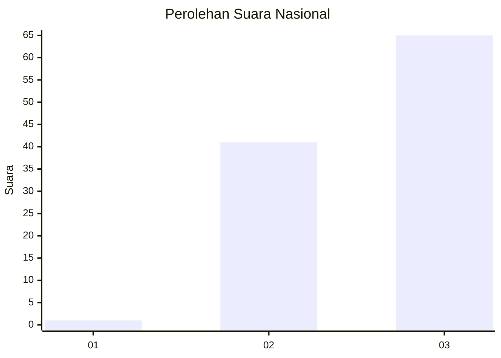
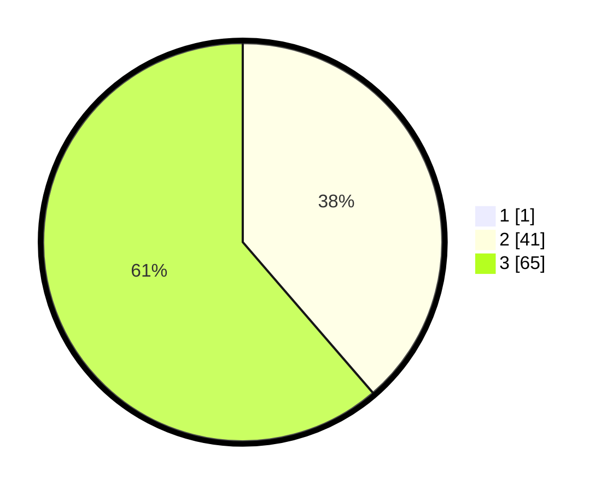

# Hasil

## Grafik

## Tabel

| No. | Nama Paslon    | Suara | Suara (raw) | Persentase |
|:--- |:-------------- | -----:| -----------:| ----------:|
| 1   | ANIES MUHAIMIN | 1     | [1][p-1]    | 0,93       |
| 2   | PRABOWO GIBRAN | 41    | [41][p-2]   | 38,32      |
| 3   | GANJAR MAHFUD  | 65    | [65][p-3]   | 60,75      |

[p-1]: https://github.com/gigit-pemilu/pemilu-2024/blob/main/pilpres/hitung-suara/sub/53-nusa-tenggara-timur/sub/11-sumba-timur/sub/07-pandawai/sub/2008-kadumbul/sub/003-tps/sub/paslon-1.txt
[p-2]: https://github.com/gigit-pemilu/pemilu-2024/blob/main/pilpres/hitung-suara/sub/53-nusa-tenggara-timur/sub/11-sumba-timur/sub/07-pandawai/sub/2008-kadumbul/sub/003-tps/sub/paslon-2.txt
[p-3]: https://github.com/gigit-pemilu/pemilu-2024/blob/main/pilpres/hitung-suara/sub/53-nusa-tenggara-timur/sub/11-sumba-timur/sub/07-pandawai/sub/2008-kadumbul/sub/003-tps/sub/paslon-3.txt

## Foto C Plano

https://sirekap-obj-formc.kpu.go.id/e1b5/pemilu/ppwp/53/11/07/20/08/5311072008003-20240215-063034--50108974-970a-41b5-a452-88d13ebf1484.jpg

https://sirekap-obj-formc.kpu.go.id/e1b5/pemilu/ppwp/53/11/07/20/08/5311072008003-20240215-142440--a28b5cad-d019-4b19-b66a-8510f93e4109.jpg

https://sirekap-obj-formc.kpu.go.id/e1b5/pemilu/ppwp/53/11/07/20/08/5311072008003-20240215-063548--6fd050f3-2b5d-445b-b508-af7d3702452c.jpg

## Metadata

| Key        | Value               |
| ---------- | ------------------- |
| Time Stamp | 2024-02-25 13:00:00 |

