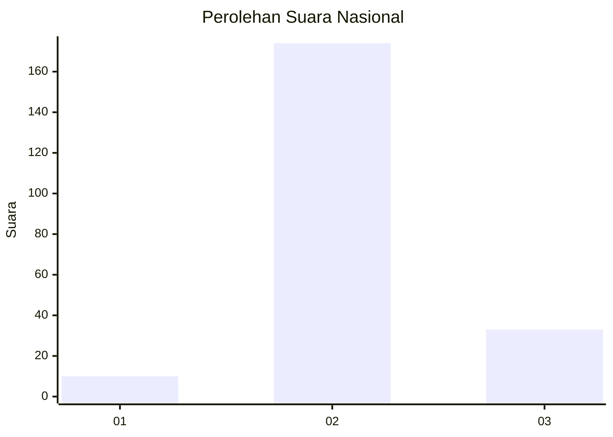

# Hasil

## Grafik

## Tabel

| No. | Nama Paslon    | Suara | Suara (raw) | Persentase |
|:--- |:-------------- | -----:| -----------:| ----------:|
| 1   | ANIES MUHAIMIN | 10    | [10][p-1]   | 4,61       |
| 2   | PRABOWO GIBRAN | 174   | [174][p-2]  | 80,18      |
| 3   | GANJAR MAHFUD  | 33    | [33][p-3]   | 15,21      |

[p-1]: https://github.com/gigit-pemilu/pemilu-2024/blob/main/pilpres/hitung-suara/sub/53-nusa-tenggara-timur/sub/11-sumba-timur/sub/09-rindi/sub/2001-rindi/sub/001-tps/sub/paslon-1.txt
[p-2]: https://github.com/gigit-pemilu/pemilu-2024/blob/main/pilpres/hitung-suara/sub/53-nusa-tenggara-timur/sub/11-sumba-timur/sub/09-rindi/sub/2001-rindi/sub/001-tps/sub/paslon-2.txt
[p-3]: https://github.com/gigit-pemilu/pemilu-2024/blob/main/pilpres/hitung-suara/sub/53-nusa-tenggara-timur/sub/11-sumba-timur/sub/09-rindi/sub/2001-rindi/sub/001-tps/sub/paslon-3.txt

## Foto C Plano

https://sirekap-obj-formc.kpu.go.id/eb7e/pemilu/ppwp/53/11/09/20/01/5311092001001-20240220-223641--2f851f4d-b2ac-4c9c-b75b-6fede3472450.jpg

https://sirekap-obj-formc.kpu.go.id/eb7e/pemilu/ppwp/53/11/09/20/01/5311092001001-20240220-223712--f468e91c-99f3-4d3d-8f25-de820d177a79.jpg

https://sirekap-obj-formc.kpu.go.id/eb7e/pemilu/ppwp/53/11/09/20/01/5311092001001-20240220-224039--7536d92f-1267-4a0c-90fc-464e5b25b9a8.jpg

## Metadata

| Key        | Value               |
| ---------- | ------------------- |
| Time Stamp | 2024-02-26 11:00:00 |

