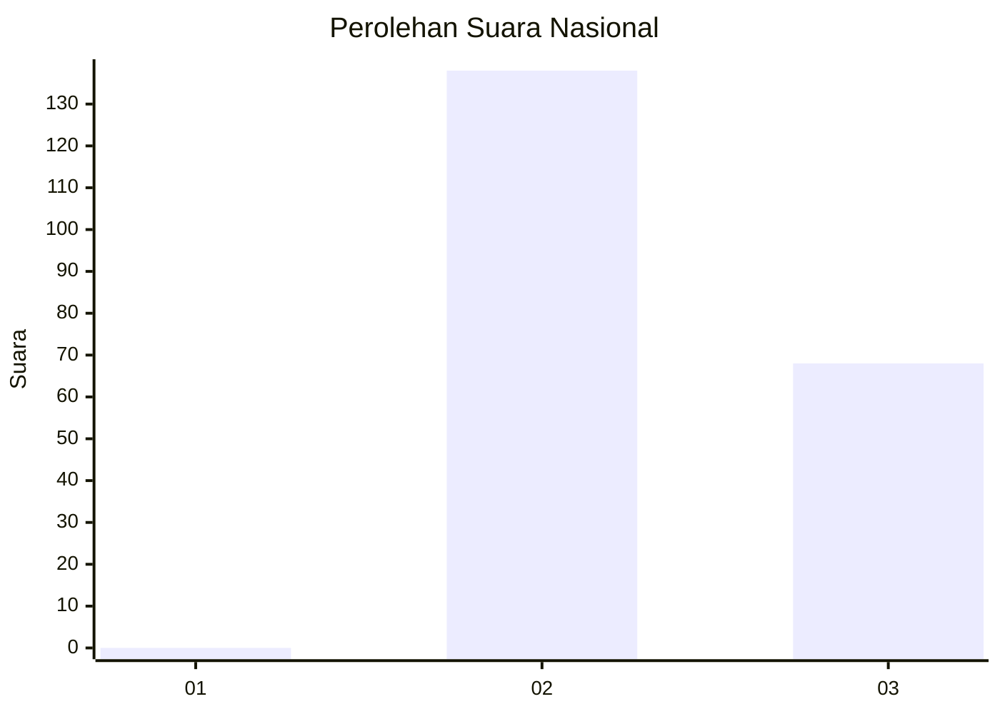
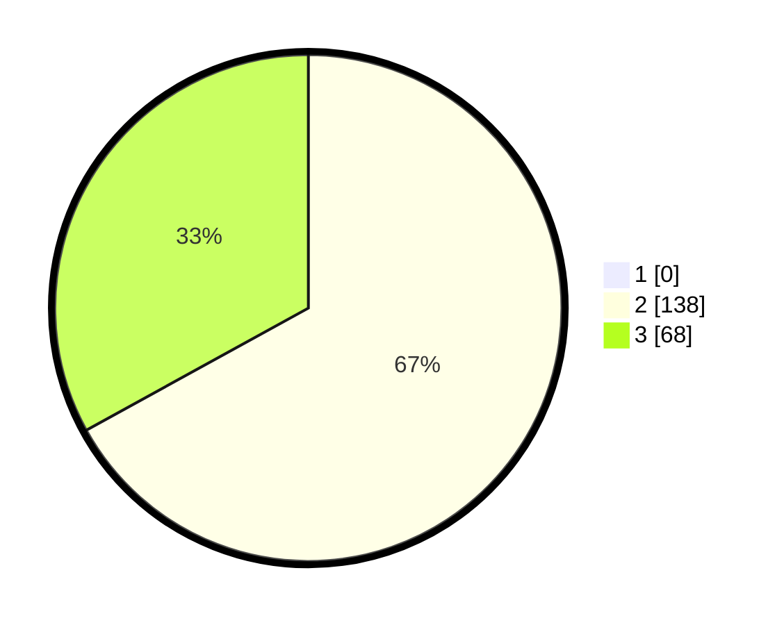

# Hasil

## Grafik

## Tabel

| No. | Nama Paslon    | Suara | Suara (raw) | Persentase |
|:--- |:-------------- | -----:| -----------:| ----------:|
| 1   | ANIES MUHAIMIN | 0     | [0][p-1]    | 0,00       |
| 2   | PRABOWO GIBRAN | 138   | [138][p-2]  | 66,99      |
| 3   | GANJAR MAHFUD  | 68    | [68][p-3]   | 33,01      |

[p-1]: https://github.com/gigit-pemilu/pemilu-2024/blob/main/pilpres/hitung-suara/sub/53-nusa-tenggara-timur/sub/11-sumba-timur/sub/14-kahaungu-eti/sub/2001-kamanggih/sub/001-tps/sub/paslon-1.txt
[p-2]: https://github.com/gigit-pemilu/pemilu-2024/blob/main/pilpres/hitung-suara/sub/53-nusa-tenggara-timur/sub/11-sumba-timur/sub/14-kahaungu-eti/sub/2001-kamanggih/sub/001-tps/sub/paslon-2.txt
[p-3]: https://github.com/gigit-pemilu/pemilu-2024/blob/main/pilpres/hitung-suara/sub/53-nusa-tenggara-timur/sub/11-sumba-timur/sub/14-kahaungu-eti/sub/2001-kamanggih/sub/001-tps/sub/paslon-3.txt

## Foto C Plano

https://sirekap-obj-formc.kpu.go.id/6602/pemilu/ppwp/53/11/14/20/01/5311142001001-20240215-092313--cb980494-cdc5-41fc-951e-8d390fa98783.jpg

https://sirekap-obj-formc.kpu.go.id/6602/pemilu/ppwp/53/11/14/20/01/5311142001001-20240215-092436--86af8f6f-90f6-4b79-856f-fefd202614a8.jpg

https://sirekap-obj-formc.kpu.go.id/6602/pemilu/ppwp/53/11/14/20/01/5311142001001-20240215-092610--8299142f-7dbc-464e-bb90-30a663b7c57e.jpg

## Metadata

| Key        | Value               |
| ---------- | ------------------- |
| Time Stamp | 2024-02-25 16:00:00 |

