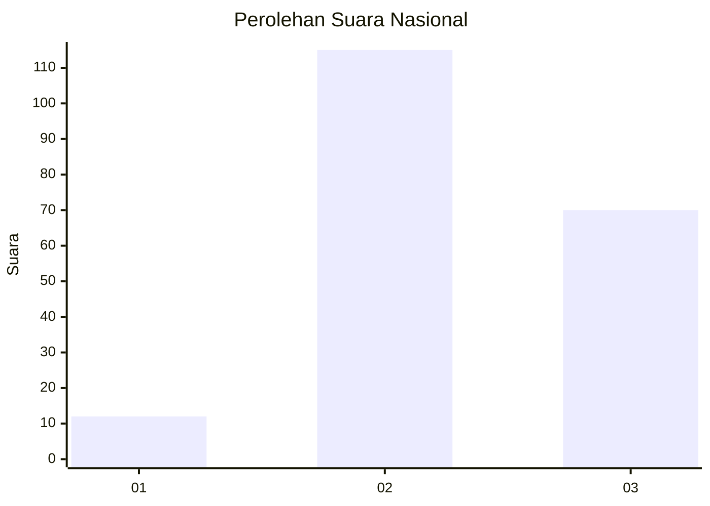
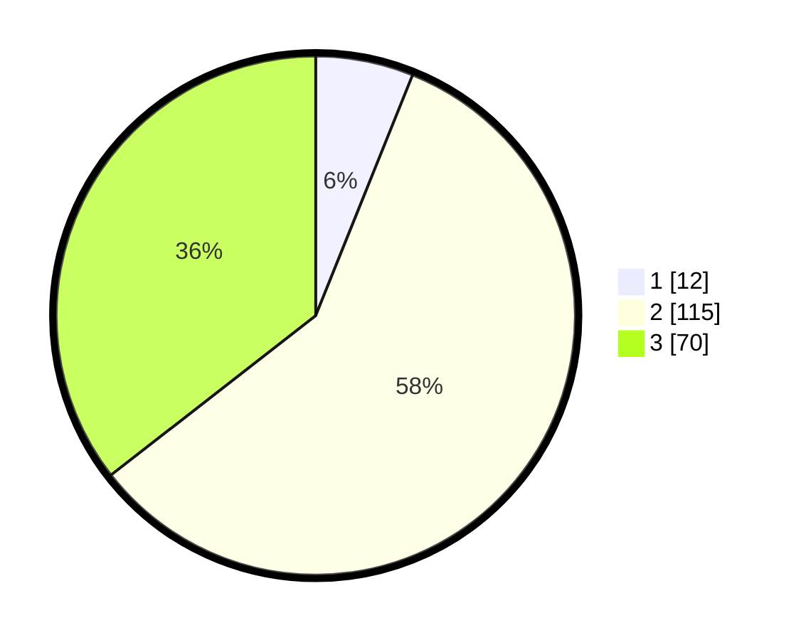

# Hasil

## Grafik

## Tabel

| No. | Nama Paslon    | Suara | Suara (raw) | Persentase |
|:--- |:-------------- | -----:| -----------:| ----------:|
| 1   | ANIES MUHAIMIN | 12    | [12][p-1]   | 6,09       |
| 2   | PRABOWO GIBRAN | 115   | [115][p-2]  | 58,38      |
| 3   | GANJAR MAHFUD  | 70    | [70][p-3]   | 35,53      |

[p-1]: https://github.com/gigit-pemilu/pemilu-2024/blob/main/pilpres/hitung-suara/sub/53-nusa-tenggara-timur/sub/11-sumba-timur/sub/14-kahaungu-eti/sub/2001-kamanggih/sub/002-tps/sub/paslon-1.txt
[p-2]: https://github.com/gigit-pemilu/pemilu-2024/blob/main/pilpres/hitung-suara/sub/53-nusa-tenggara-timur/sub/11-sumba-timur/sub/14-kahaungu-eti/sub/2001-kamanggih/sub/002-tps/sub/paslon-2.txt
[p-3]: https://github.com/gigit-pemilu/pemilu-2024/blob/main/pilpres/hitung-suara/sub/53-nusa-tenggara-timur/sub/11-sumba-timur/sub/14-kahaungu-eti/sub/2001-kamanggih/sub/002-tps/sub/paslon-3.txt

## Foto C Plano

https://sirekap-obj-formc.kpu.go.id/cec3/pemilu/ppwp/53/11/14/20/01/5311142001002-20240215-142455--aedd1c8a-c762-4704-90e6-7371cc22bdce.jpg

https://sirekap-obj-formc.kpu.go.id/cec3/pemilu/ppwp/53/11/14/20/01/5311142001002-20240215-134556--873e2e82-3276-460f-bfa2-7bd6641eefa7.jpg

https://sirekap-obj-formc.kpu.go.id/cec3/pemilu/ppwp/53/11/14/20/01/5311142001002-20240215-172547--cf58fc50-23c7-4447-a242-ee1aad2a4456.jpg

## Metadata

| Key        | Value               |
| ---------- | ------------------- |
| Time Stamp | 2024-02-25 12:00:00 |

