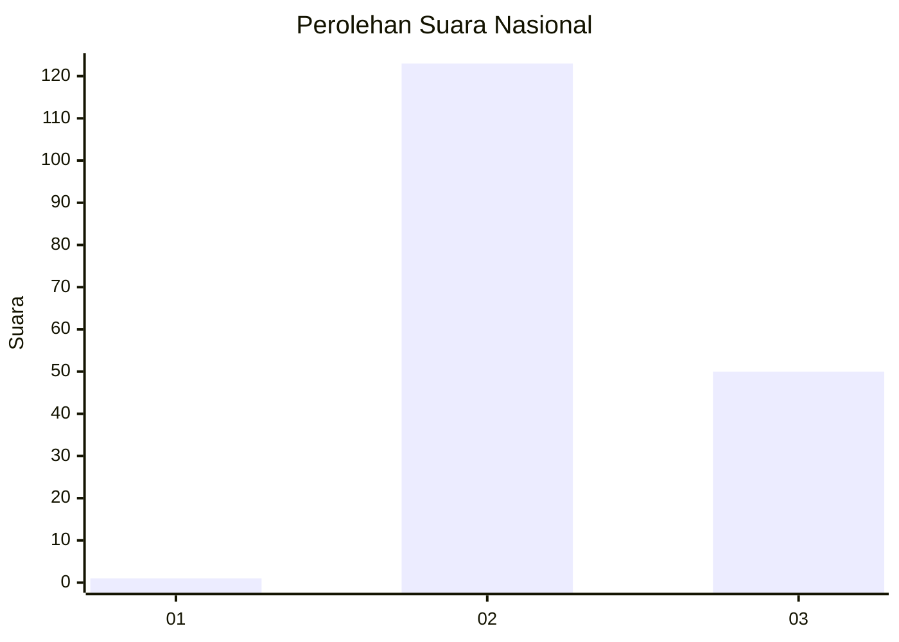
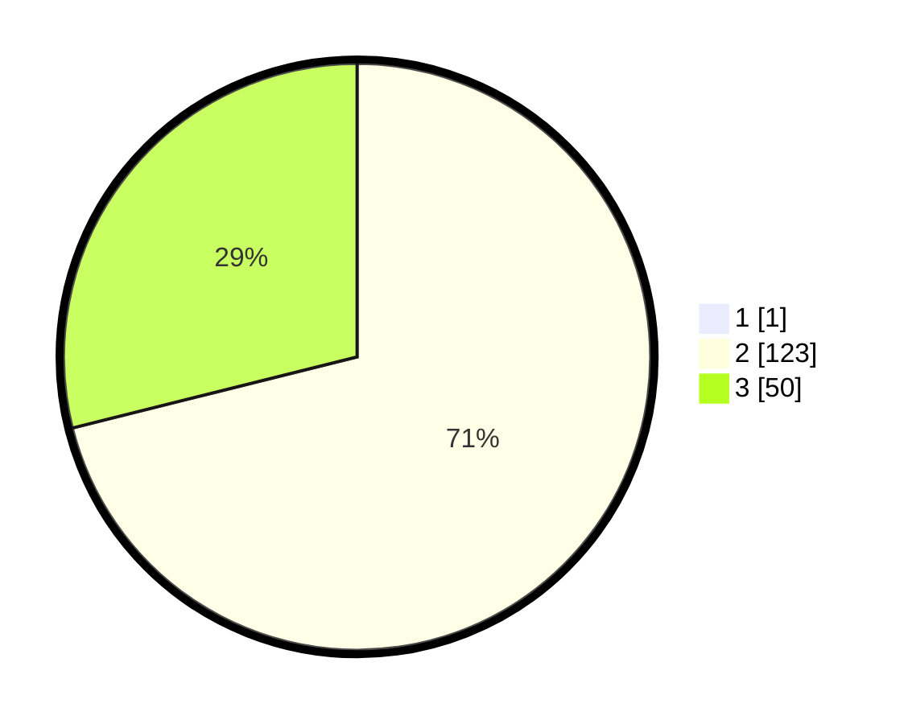

# Hasil

## Grafik

## Tabel

| No. | Nama Paslon    | Suara | Suara (raw) | Persentase |
|:--- |:-------------- | -----:| -----------:| ----------:|
| 1   | ANIES MUHAIMIN | 1     | [1][p-1]    | 0,57       |
| 2   | PRABOWO GIBRAN | 123   | [123][p-2]  | 70,69      |
| 3   | GANJAR MAHFUD  | 50    | [50][p-3]   | 28,74      |

[p-1]: https://github.com/gigit-pemilu/pemilu-2024/blob/main/pilpres/hitung-suara/sub/53-nusa-tenggara-timur/sub/11-sumba-timur/sub/14-kahaungu-eti/sub/2001-kamanggih/sub/004-tps/sub/paslon-1.txt
[p-2]: https://github.com/gigit-pemilu/pemilu-2024/blob/main/pilpres/hitung-suara/sub/53-nusa-tenggara-timur/sub/11-sumba-timur/sub/14-kahaungu-eti/sub/2001-kamanggih/sub/004-tps/sub/paslon-2.txt
[p-3]: https://github.com/gigit-pemilu/pemilu-2024/blob/main/pilpres/hitung-suara/sub/53-nusa-tenggara-timur/sub/11-sumba-timur/sub/14-kahaungu-eti/sub/2001-kamanggih/sub/004-tps/sub/paslon-3.txt

## Foto C Plano

https://sirekap-obj-formc.kpu.go.id/8ff2/pemilu/ppwp/53/11/14/20/01/5311142001004-20240215-082427--10898edc-b42a-4a1c-81ff-946892ab8b3f.jpg

https://sirekap-obj-formc.kpu.go.id/8ff2/pemilu/ppwp/53/11/14/20/01/5311142001004-20240215-082704--5fe56ca6-7ba3-42a4-b9d4-3f5e3121e674.jpg

https://sirekap-obj-formc.kpu.go.id/8ff2/pemilu/ppwp/53/11/14/20/01/5311142001004-20240215-082857--a2a763f4-0623-46b2-aa75-e6dd55af033f.jpg

## Metadata

| Key        | Value               |
| ---------- | ------------------- |
| Time Stamp | 2024-02-25 10:00:00 |

