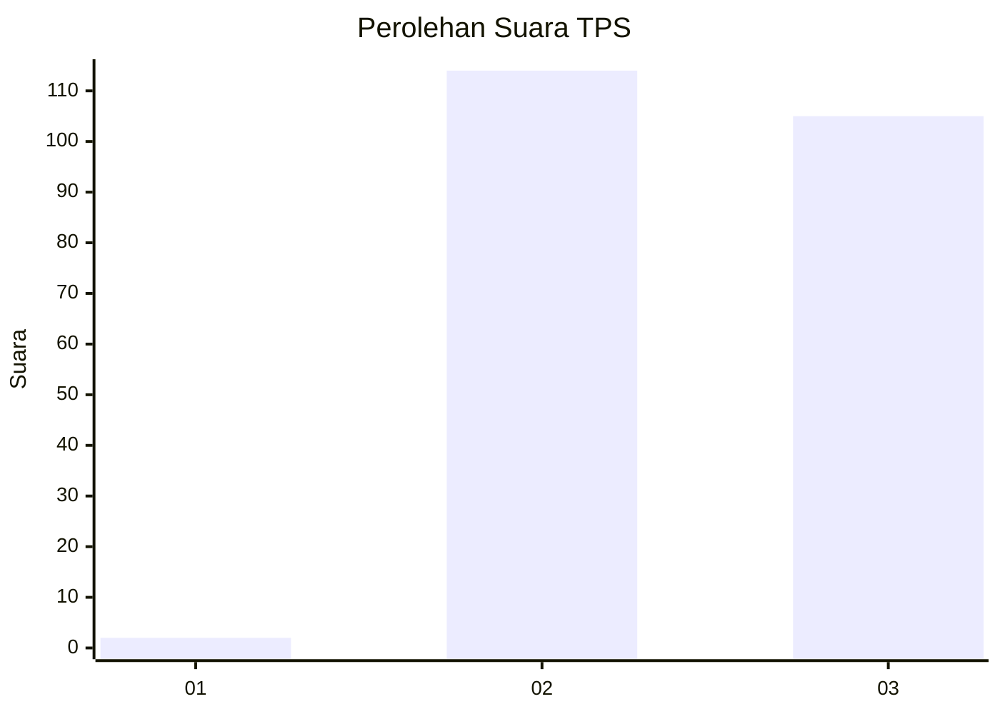
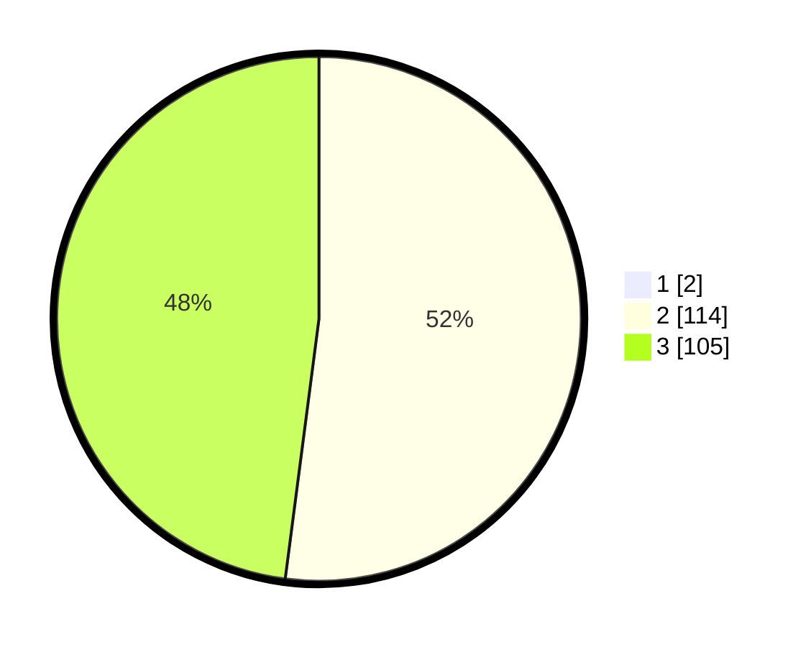

# Hasil

## Grafik

## Tabel

| No. | Nama Paslon    | Suara | Suara (raw) | Persentase |
|:--- |:-------------- | -----:| -----------:| ----------:|
| 1   | ANIES MUHAIMIN | 2     | [2][p-1]    | 0,90       |
| 2   | PRABOWO GIBRAN | 114   | [114][p-2]  | 51,58      |
| 3   | GANJAR MAHFUD  | 105   | [105][p-3]  | 47,51      |

[p-1]: https://github.com/gigit-pemilu/pemilu-2024-53-nusa-tenggara-timur/blob/main/pilpres/hitung-suara/sub/53-nusa-tenggara-timur/sub/11-sumba-timur/sub/14-kahaungu-eti/sub/2001-kamanggih/sub/005-tps/sub/paslon-1.txt
[p-2]: https://github.com/gigit-pemilu/pemilu-2024-53-nusa-tenggara-timur/blob/main/pilpres/hitung-suara/sub/53-nusa-tenggara-timur/sub/11-sumba-timur/sub/14-kahaungu-eti/sub/2001-kamanggih/sub/005-tps/sub/paslon-2.txt
[p-3]: https://github.com/gigit-pemilu/pemilu-2024-53-nusa-tenggara-timur/blob/main/pilpres/hitung-suara/sub/53-nusa-tenggara-timur/sub/11-sumba-timur/sub/14-kahaungu-eti/sub/2001-kamanggih/sub/005-tps/sub/paslon-3.txt

## Foto C Plano

https://sirekap-obj-formc.kpu.go.id/f929/pemilu/ppwp/53/11/14/20/01/5311142001005-20240215-162903--65d20e28-a2fe-44c1-90b8-ba7c3ae0ec3d.jpg

https://sirekap-obj-formc.kpu.go.id/f929/pemilu/ppwp/53/11/14/20/01/5311142001005-20240215-163046--38820a5e-4493-4300-a8e9-a82141a25227.jpg

https://sirekap-obj-formc.kpu.go.id/f929/pemilu/ppwp/53/11/14/20/01/5311142001005-20240215-163024--76305566-451a-40e7-a48f-0897f22a7c4f.jpg

## Metadata

| Key        | Value               |
| ---------- | ------------------- |
| Time Stamp | 2024-02-25 13:00:00 |

