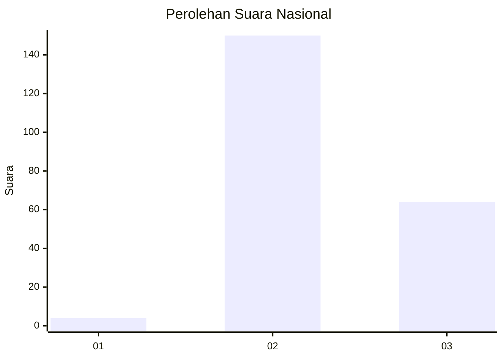

# Hasil

## Grafik

## Tabel

| No. | Nama Paslon    | Suara | Suara (raw) | Persentase |
|:--- |:-------------- | -----:| -----------:| ----------:|
| 1   | ANIES MUHAIMIN | 4     | [4][p-1]    | 1,83       |
| 2   | PRABOWO GIBRAN | 150   | [150][p-2]  | 68,81      |
| 3   | GANJAR MAHFUD  | 64    | [64][p-3]   | 29,36      |

[p-1]: https://github.com/gigit-pemilu/pemilu-2024/blob/main/pilpres/hitung-suara/sub/53-nusa-tenggara-timur/sub/11-sumba-timur/sub/16-kambera/sub/1001-wangga/sub/001-tps/sub/paslon-1.txt
[p-2]: https://github.com/gigit-pemilu/pemilu-2024/blob/main/pilpres/hitung-suara/sub/53-nusa-tenggara-timur/sub/11-sumba-timur/sub/16-kambera/sub/1001-wangga/sub/001-tps/sub/paslon-2.txt
[p-3]: https://github.com/gigit-pemilu/pemilu-2024/blob/main/pilpres/hitung-suara/sub/53-nusa-tenggara-timur/sub/11-sumba-timur/sub/16-kambera/sub/1001-wangga/sub/001-tps/sub/paslon-3.txt

## Foto C Plano

https://sirekap-obj-formc.kpu.go.id/6c50/pemilu/ppwp/53/11/16/10/01/5311161001001-20240226-101056--c26eccf9-62e0-42fd-a3cd-00fac84e353f.jpg

https://sirekap-obj-formc.kpu.go.id/6c50/pemilu/ppwp/53/11/16/10/01/5311161001001-20240226-102426--0a09f904-2bb0-42f4-ae4f-f83529ba87cb.jpg

https://sirekap-obj-formc.kpu.go.id/6c50/pemilu/ppwp/53/11/16/10/01/5311161001001-20240226-101728--9c049c6e-e56f-4362-bac1-9fed2d72ca90.jpg

## Metadata

| Key        | Value               |
| ---------- | ------------------- |
| Time Stamp | 2024-02-26 11:00:00 |

