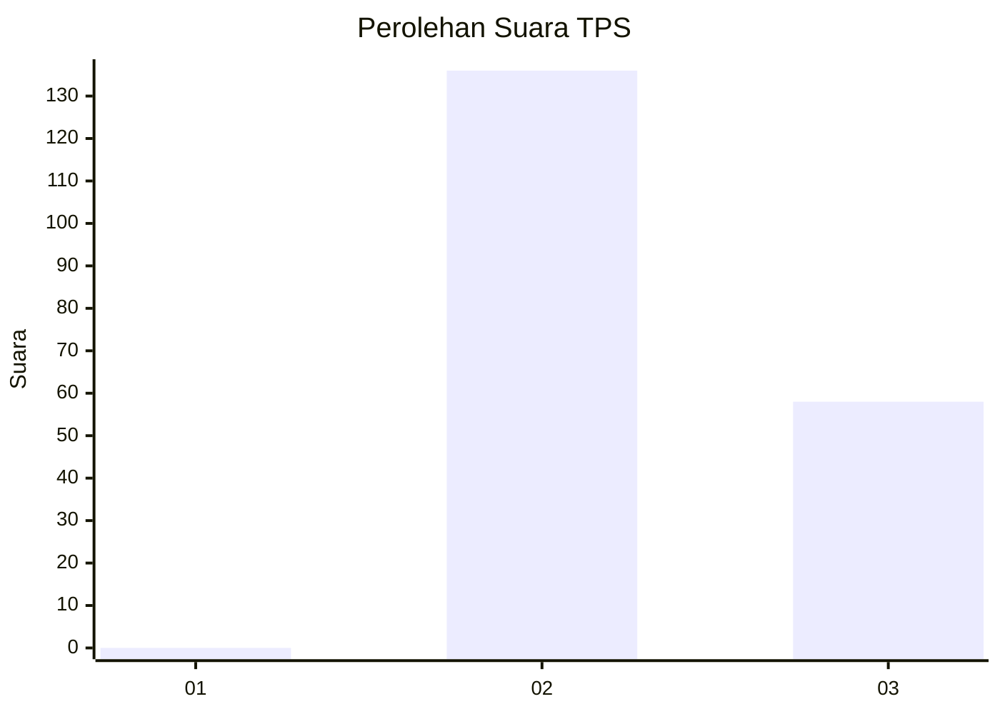
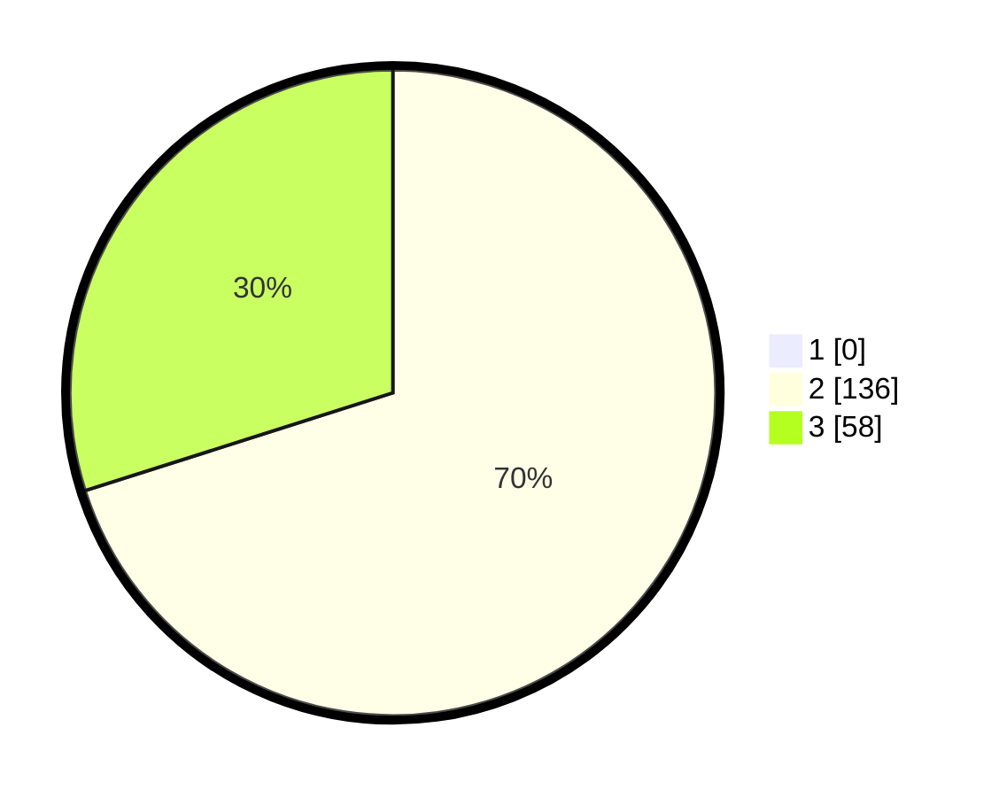

# Hasil

## Grafik

## Tabel

| No. | Nama Paslon    | Suara | Suara (raw) | Persentase |
|:--- |:-------------- | -----:| -----------:| ----------:|
| 1   | ANIES MUHAIMIN | 0     | [0][p-1]    | 0,00       |
| 2   | PRABOWO GIBRAN | 136   | [136][p-2]  | 70,10      |
| 3   | GANJAR MAHFUD  | 58    | [58][p-3]   | 29,90      |

[p-1]: https://github.com/gigit-pemilu/pemilu-2024-53-nusa-tenggara-timur/blob/main/pilpres/hitung-suara/sub/53-nusa-tenggara-timur/sub/11-sumba-timur/sub/16-kambera/sub/1001-wangga/sub/003-tps/sub/paslon-1.txt
[p-2]: https://github.com/gigit-pemilu/pemilu-2024-53-nusa-tenggara-timur/blob/main/pilpres/hitung-suara/sub/53-nusa-tenggara-timur/sub/11-sumba-timur/sub/16-kambera/sub/1001-wangga/sub/003-tps/sub/paslon-2.txt
[p-3]: https://github.com/gigit-pemilu/pemilu-2024-53-nusa-tenggara-timur/blob/main/pilpres/hitung-suara/sub/53-nusa-tenggara-timur/sub/11-sumba-timur/sub/16-kambera/sub/1001-wangga/sub/003-tps/sub/paslon-3.txt

## Foto C Plano

https://sirekap-obj-formc.kpu.go.id/d94d/pemilu/ppwp/53/11/16/10/01/5311161001003-20240215-182632--f8ca09e3-7d22-46aa-b021-d7051f55f5b9.jpg

https://sirekap-obj-formc.kpu.go.id/d94d/pemilu/ppwp/53/11/16/10/01/5311161001003-20240215-155335--af598918-3e46-4f11-91a1-b23f757e7e54.jpg

https://sirekap-obj-formc.kpu.go.id/d94d/pemilu/ppwp/53/11/16/10/01/5311161001003-20240215-072423--5435d514-df24-4775-b426-9e7d6bd59892.jpg

## Metadata

| Key        | Value               |
| ---------- | ------------------- |
| Time Stamp | 2024-02-15 18:30:25 |

