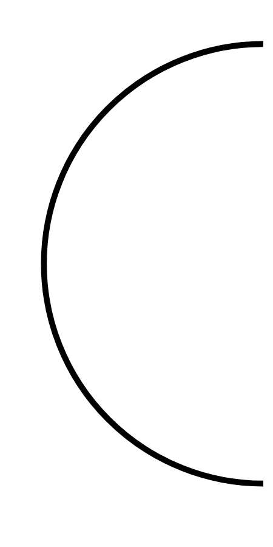

# Hasil

## Grafik

```mermaid
xychart-beta
    title "Perolehan Suara Nasional"
    x-axis []
    y-axis "Suara" 0 --> 0
    bar []
```



## Tabel

| No. | Nama Paslon | Suara | Suara (raw) | Persentase |
|:--- |:----------- | -----:| -----------:| ----------:|


[p-1]: https://github.com/gigit-pemilu/pemilu-2024/blob/main/pilpres/hitung-suara/sub/53-nusa-tenggara-timur/sub/11-sumba-timur/sub/16-kambera/sub/1001-wangga/sub/004-tps/sub/paslon-1.txt
[p-2]: https://github.com/gigit-pemilu/pemilu-2024/blob/main/pilpres/hitung-suara/sub/53-nusa-tenggara-timur/sub/11-sumba-timur/sub/16-kambera/sub/1001-wangga/sub/004-tps/sub/paslon-2.txt
[p-3]: https://github.com/gigit-pemilu/pemilu-2024/blob/main/pilpres/hitung-suara/sub/53-nusa-tenggara-timur/sub/11-sumba-timur/sub/16-kambera/sub/1001-wangga/sub/004-tps/sub/paslon-3.txt

## Foto C Plano

https://sirekap-obj-formc.kpu.go.id/59df/pemilu/ppwp/53/11/16/10/01/5311161001004-20240226-171551--33bba683-c73d-406b-816c-9384a114012d.jpg

https://sirekap-obj-formc.kpu.go.id/59df/pemilu/ppwp/53/11/16/10/01/5311161001004-20240226-193633--557c8c89-6897-434a-b502-291fbbd4d7e6.jpg

https://sirekap-obj-formc.kpu.go.id/59df/pemilu/ppwp/53/11/16/10/01/5311161001004-20240226-193231--034525cc-7553-45b6-b3f6-484b2e01d0cb.jpg


## Metadata

| Key        | Value               |
| ---------- | ------------------- |
| Time Stamp | 2024-02-26 20:00:00 |


## DATA PEMILIH TETAP

Jumlah pemilih dalam DPT: **153**.
 * L: **33**.
 * P: **74**.

## DATA PENGGUNA HAK PILIH

Jumlah pengguna hak pilih dalam DPT: **156**.
 * L: **83**.
 * P: **377**.

Jumlah pengguna hak pilih dalam DPTb: **6**.
 * L: **3**.
 * P: **23**.

Jumlah pengguna hak pilih dalam DPK: **90**.
 * L: **0**.
 * P: **0**.

Jumlah pengguna hak pilih: **152**.
 * L: **86**.
 * P: **76**.

## JUMLAH SUARA SAH DAN TIDAK SAH

JUMLAH SELURUH SUARA SAH: **163**.

JUMLAH SUARA TIDAK SAH: **1**.

JUMLAH SELURUH SUARA SAH DAN SUARA TIDAK SAH: **164**.


