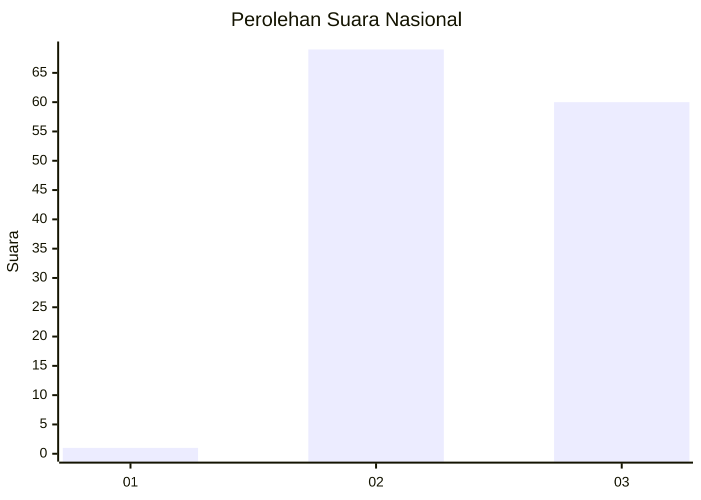
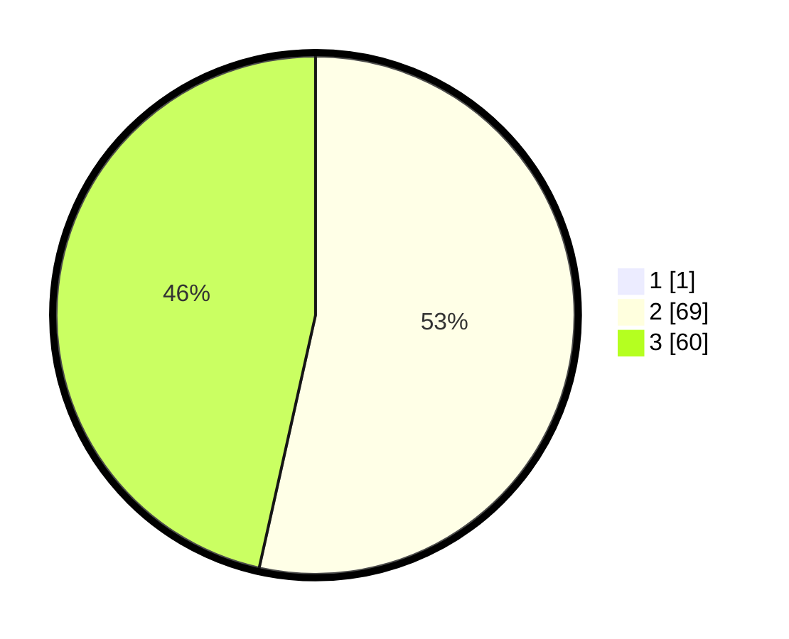

# Hasil

## Grafik

## Tabel

| No. | Nama Paslon    | Suara | Suara (raw) | Persentase |
|:--- |:-------------- | -----:| -----------:| ----------:|
| 1   | ANIES MUHAIMIN | 1     | [1][p-1]    | 0,77       |
| 2   | PRABOWO GIBRAN | 69    | [69][p-2]   | 53,08      |
| 3   | GANJAR MAHFUD  | 60    | [60][p-3]   | 46,15      |

[p-1]: https://github.com/gigit-pemilu/pemilu-2024/blob/main/pilpres/hitung-suara/sub/53-nusa-tenggara-timur/sub/11-sumba-timur/sub/16-kambera/sub/1003-kambaniru/sub/021-tps/sub/paslon-1.txt
[p-2]: https://github.com/gigit-pemilu/pemilu-2024/blob/main/pilpres/hitung-suara/sub/53-nusa-tenggara-timur/sub/11-sumba-timur/sub/16-kambera/sub/1003-kambaniru/sub/021-tps/sub/paslon-2.txt
[p-3]: https://github.com/gigit-pemilu/pemilu-2024/blob/main/pilpres/hitung-suara/sub/53-nusa-tenggara-timur/sub/11-sumba-timur/sub/16-kambera/sub/1003-kambaniru/sub/021-tps/sub/paslon-3.txt

## Foto C Plano

https://sirekap-obj-formc.kpu.go.id/77b6/pemilu/ppwp/53/11/16/10/03/5311161003021-20240215-081237--863394db-f8f4-43d8-8c09-3b8faa32974e.jpg

https://sirekap-obj-formc.kpu.go.id/77b6/pemilu/ppwp/53/11/16/10/03/5311161003021-20240215-081431--7d31eb82-2e80-4cc9-8664-761b4123a0c9.jpg

https://sirekap-obj-formc.kpu.go.id/77b6/pemilu/ppwp/53/11/16/10/03/5311161003021-20240215-081818--deaa18ae-bd4a-4090-ab85-f5688f261455.jpg

## Metadata

| Key        | Value               |
| ---------- | ------------------- |
| Time Stamp | 2024-02-15 22:30:27 |

## DATA PEMILIH TETAP

Jumlah pemilih dalam DPT: **810**.
 * L: **831**.
 * P: **540**.

## DATA PENGGUNA HAK PILIH

Jumlah pengguna hak pilih dalam DPT: **631**.
 * L: **250**.
 * P: **530**.

Jumlah pengguna hak pilih dalam DPTb: **4**.
 * L: **1**.
 * P: **7**.

Jumlah pengguna hak pilih dalam DPK: **20**.
 * L: **20**.
 * P: **0**.

Jumlah pengguna hak pilih: **172**.
 * L: **64**.
 * P: **52**.

## JUMLAH SUARA SAH DAN TIDAK SAH

JUMLAH SELURUH SUARA SAH: **130**.

JUMLAH SUARA TIDAK SAH: **2**.

JUMLAH SELURUH SUARA SAH DAN SUARA TIDAK SAH: **132**.

