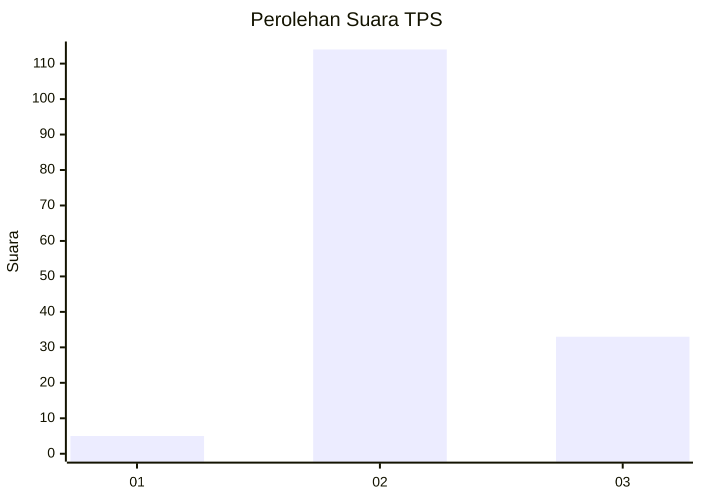

# Hasil

## Grafik

## Tabel

| No. | Nama Paslon    | Suara | Suara (raw) | Persentase |
|:--- |:-------------- | -----:| -----------:| ----------:|
| 1   | ANIES MUHAIMIN | 5     | [5][p-1]    | 3,29       |
| 2   | PRABOWO GIBRAN | 114   | [114][p-2]  | 75,00      |
| 3   | GANJAR MAHFUD  | 33    | [33][p-3]   | 21,71      |

[p-1]: https://github.com/gigit-pemilu/pemilu-2024-53-nusa-tenggara-timur/blob/main/pilpres/hitung-suara/sub/53-nusa-tenggara-timur/sub/11-sumba-timur/sub/20-kanatang/sub/1001-temu/sub/001-tps/sub/paslon-1.txt
[p-2]: https://github.com/gigit-pemilu/pemilu-2024-53-nusa-tenggara-timur/blob/main/pilpres/hitung-suara/sub/53-nusa-tenggara-timur/sub/11-sumba-timur/sub/20-kanatang/sub/1001-temu/sub/001-tps/sub/paslon-2.txt
[p-3]: https://github.com/gigit-pemilu/pemilu-2024-53-nusa-tenggara-timur/blob/main/pilpres/hitung-suara/sub/53-nusa-tenggara-timur/sub/11-sumba-timur/sub/20-kanatang/sub/1001-temu/sub/001-tps/sub/paslon-3.txt

## Foto C Plano

https://sirekap-obj-formc.kpu.go.id/fb4f/pemilu/ppwp/53/11/20/10/01/5311201001001-20240224-124509--145e6772-82e8-4fd2-962e-0d1008a810b6.jpg

https://sirekap-obj-formc.kpu.go.id/fb4f/pemilu/ppwp/53/11/20/10/01/5311201001001-20240224-124557--c87d62a2-e840-4b8d-9286-7aa09a309922.jpg

https://sirekap-obj-formc.kpu.go.id/fb4f/pemilu/ppwp/53/11/20/10/01/5311201001001-20240224-124707--ffcb4da0-eba3-4583-8b9d-4945b40d76d2.jpg

## Metadata

| Key        | Value               |
| ---------- | ------------------- |
| Time Stamp | 2024-02-28 19:00:00 |

