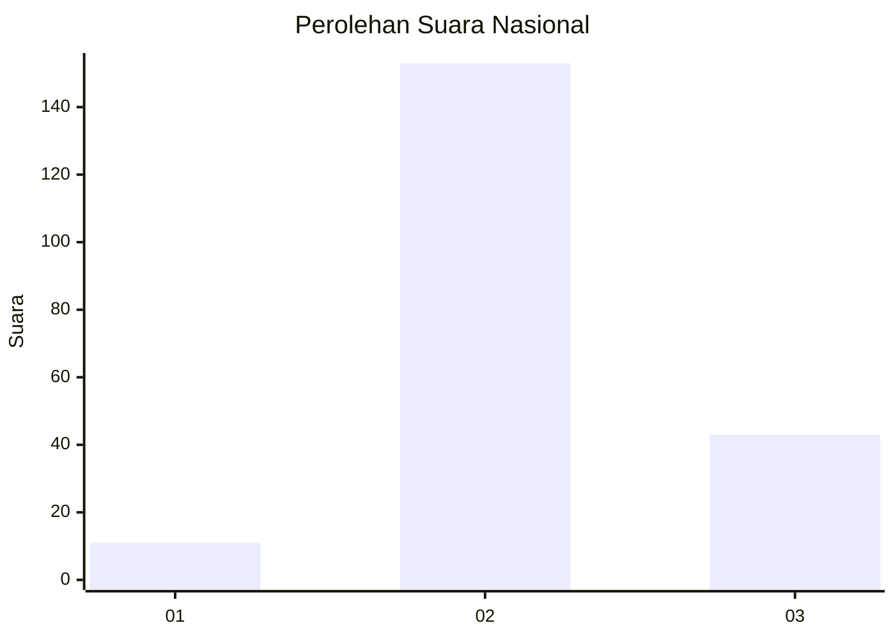

# Hasil

## Grafik

## Tabel

| No. | Nama Paslon    | Suara | Suara (raw) | Persentase |
|:--- |:-------------- | -----:| -----------:| ----------:|
| 1   | ANIES MUHAIMIN | 11    | [11][p-1]   | 5,31       |
| 2   | PRABOWO GIBRAN | 153   | [153][p-2]  | 73,91      |
| 3   | GANJAR MAHFUD  | 43    | [43][p-3]   | 20,77      |

[p-1]: https://github.com/gigit-pemilu/pemilu-2024/blob/main/pilpres/hitung-suara/sub/53-nusa-tenggara-timur/sub/11-sumba-timur/sub/20-kanatang/sub/1001-temu/sub/005-tps/sub/paslon-1.txt
[p-2]: https://github.com/gigit-pemilu/pemilu-2024/blob/main/pilpres/hitung-suara/sub/53-nusa-tenggara-timur/sub/11-sumba-timur/sub/20-kanatang/sub/1001-temu/sub/005-tps/sub/paslon-2.txt
[p-3]: https://github.com/gigit-pemilu/pemilu-2024/blob/main/pilpres/hitung-suara/sub/53-nusa-tenggara-timur/sub/11-sumba-timur/sub/20-kanatang/sub/1001-temu/sub/005-tps/sub/paslon-3.txt

## Foto C Plano

https://sirekap-obj-formc.kpu.go.id/c5f2/pemilu/ppwp/53/11/20/10/01/5311201001005-20240224-113442--84aa2b86-668f-47a6-80c5-94bafb326734.jpg

https://sirekap-obj-formc.kpu.go.id/c5f2/pemilu/ppwp/53/11/20/10/01/5311201001005-20240224-113547--63dad8a9-59a3-4bf5-83d1-fd29280b1610.jpg

https://sirekap-obj-formc.kpu.go.id/c5f2/pemilu/ppwp/53/11/20/10/01/5311201001005-20240224-113639--db5c2581-f2da-4de1-b2aa-822150129aca.jpg

## Metadata

| Key        | Value               |
| ---------- | ------------------- |
| Time Stamp | 2024-02-28 19:00:00 |

